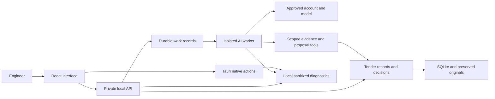

# Quantix project review

9 September 2026 · current working tree · construction field engineer audience

## Recommendation

Keep the current architecture. Quantix needs a smaller visible workflow, reliable AI setup, and better failure records before it needs more features or another framework. The code already preserves many important engineering distinctions: original documents versus extracted evidence, supplied quantities versus proposals, proposed work versus approved work, and draft outputs versus reviewed exports.

The main product problem is the amount of application administration the engineer must understand before doing construction work. The main reliability problem is that several layers hide the cause of failure. More integrations will amplify both problems until the basic path is accepted.

This review combines three independent source audits and a focused investigation in the running Windows app. It is not full MVP acceptance or a line-by-line certification. Broad suites, lint, typechecks and release builds remain deferred under the current project instruction.

## Delivered in this repair

- Grok's real generic access check now passes. The native app displays Ready; the successful exchange used four model rounds. Account/model/spending selections were preserved.
- Local structured diagnostics now cover service, worker, setup, installer, renderer and native/launcher failures under `~/.quantix/logs`, with error references, rotation and retention.
- Settings is shorter: AI accounts remain visible; occasional controls have named disclosures. Actionable mail/restore errors open the affected section. Dialog focus and failed-check step context were repaired.
- A failed automatic Manager handoff after completed work now leaves a durable follow-up notice. Successful work remains completed, and its success log is written after publication commits.
- Eighteen focused Grok tests and separate synthetic diagnostic probes passed. The normal native development launch and focused settings/setup observations are recorded in [acceptance evidence](reports/2026-09-09-acceptance.md). Other providers and full Tender workflows remain unverified.

## Read these in order

| Document | Purpose |
| --- | --- |
| This review | Decisions, priorities and a simple improvement sequence |
| [AI audit](reports/2026-09-09-ai-audit.md) | Grok failure chain, permission/round-limit evidence, provider support and diagnostics |
| [UX audit](reports/2026-09-09-ux-audit.md) | Fourteen prioritized interface findings, engineer journeys and specific source references |
| [Domain audit](reports/2026-09-09-domain-audit.md) | Seven concrete data/workflow defects and later acceptance scenarios |
| [Diagnostic design](diagnostics-design.md) | Local log location, privacy, retention and technical contract |
| [Focused acceptance](reports/2026-09-09-acceptance.md) | Exact synthetic checks, native observations and successful live Grok result |
| [Implementation record](superpowers/plans/2026-09-09-diagnostics-and-ai-repair.md) | Scoped work, ownership and acceptance status for this repair |

## What happened with Grok

In the running native application, Grok was signed in, its models were available, Grok 4.5 was selected, and subscription-only usage was available. The access check failed after three model rounds. The reported model was `grok-4.5-build`, already covered by the explicit existing alias repair; authentication and that known identity mapping were not the current failure.

Reading only event types, tool names, decisions and outcomes from the latest generic check session showed three attempts to call `search_tool`, each denied. No check or submission tool was reached. The provider's pinned source maps that discovery tool to a read operation with no file path. Quantix's bare `Read` deny rule rejects it. A narrowly scoped `Read(**)` rule preserves file-path denial while allowing the required discovery operation under the existing two-meta-tool allowlist and scoped MCP permissions. The exact source chain is in the AI audit.

There is a second defect behind the first: the normal protocol needs discovery, reading the random check value, submitting it, and a final response. The three-round allowance cannot complete that four-stage sequence. Any adjusted allowance must agree across the displayed preview, meter, core host and worker. Success must still require the real check value, exact model identity, valid structured result and a clean terminal outcome.

The interface then displayed “1 Prepare” after the Check failure. That contradicted the actual completed stages and made repeating sign-in look reasonable. The repair must preserve the failed Check stage and show the useful error.

No Tender content, supplier message or spending-preference change was part of this investigation. The original client's private session records are distinct from the new sanitized Quantix diagnostics; they must not be copied into source control or blindly added to a support bundle.

## Architecture: keep these boundaries

Keep SQLite for local work, standard transactions for publishing a result, Pydantic models for the HTTP contract, and generated TypeScript declarations. Keep maintained document libraries and provider SDKs. Preserve the core's approval and source-validation authority outside the AI worker. Do not introduce a distributed queue, microservices, graph database, cloud telemetry account or replacement frontend solely to make the architecture look more sophisticated.

Reduce complexity at real pressure points: smaller feature components, explicit output snapshots, one shared rule for credential identity, one setup state model and one diagnostic vocabulary. A file split is justified when responsibilities differ, not merely when a line-count threshold is crossed.

## The minimal engineer experience

The first screen should answer: **What tender am I working on, what needs my attention, and what should I do next?**

| Current state | Primary guidance | Main action |
| --- | --- | --- |
| No documents | Add the package you received. | Add tender documents |
| Documents saved, AI unavailable | The files are saved. Finish connecting the Tender Manager. | Finish AI setup |
| Ready to review | The Tender Manager can review the available documents and explain gaps. | Review documents |
| Proposed scope available | Review what the Manager proposes to do. | Review work plan |
| Material decision pending | Identify the affected item, evidence, uncertainty and consequence. | Review decision |
| Work running | State the current activity and last completed step. | View progress, with Stop available |
| Drafts prepared | Show what is ready and what still needs review. | Review documents |

The flexible message box remains available. It should not require a novice to invent the right command to start an ordinary workflow. A configured AI account becomes a short status with Change. Provider IDs, team routing, token budgets and component versions belong in clearly named details.

Do not collapse meaningful engineering distinctions to reduce clicks. Approval of a measured quantity, a rate, a supplier send and a final export have different consequences. Simplify how those decisions are explained and reached. Show one decision at a time with its evidence and a clear action.

Prepared technical documents, programmes and submission requirements need a recognizable home. They should not depend on the engineer discovering them below the pricing table. This is a subsequent workflow change, separate from the focused Settings repair.

## Priorities after the current repair

| Priority | Problem and consequence | Smallest useful increment |
| --- | --- | --- |
| Before real supplier mail | Changing/restoring a mail account can reuse a password saved for another endpoint. | Bind SMTP/IMAP credentials to canonical account identity; fail before connecting when the binding differs. |
| Before revision-to-submission acceptance | An analysis output captures old message sources that it does not render, so a new current analysis can remain blocked by invisible history. | Capture exactly the selected result and rendered records; retain historical evidence separately. |
| Next interaction fixes | A sent instruction remains sendable; opening measurement loses the displayed drawing page. | Separate sent text from new drafts; pass the exact source page into measurement. |
| Next import work | Unreadable directories are silently omitted, and concurrent imports share a cache temporary file. | Explicit directory coverage exceptions and unique atomic cache publication. |
| Next source maintenance | Reimport cannot reliably refresh unsupported/partial extraction after a reader improves. | An explicit Read this file again operation with original bytes and evidence history preserved. |
| Before recovery acceptance | A damaged main database can prevent restoration even with a valid staged backup. | Offline recovery that preserves damaged bytes, then installs the inspected backup. |
| Next setup responsiveness work | A metadata request exceeded five seconds during actual preparation; deep receipt hashing runs synchronously inside async setup. | Move expensive integrity verification off the HTTP event loop while retaining cancellation and immutable receipts. |
| Before claiming multiple-platform support | Installed adapters and dependency declarations exceed demonstrated live acceptance. | A dated provider/platform acceptance matrix and reproducible platform locks. |

These are source-supported findings, not claims that customer data was lost or an email credential was disclosed. The detailed reports contain triggers, exact file references, minimal fixes and proposed acceptance scenarios. Do not label them fixed until their increment is implemented and assessed.

## Decisions worth challenging

These questions are for product direction; they do not block the authorized diagnostic and Grok repair.

1. **What single deliverable makes the first session worthwhile?** A source-backed tender brief, a BOQ ready for pricing, or an issue register? Choose one to shape the default next action. My default is a tender brief with coverage gaps and a proposed work plan.
2. **Who owns commercial decisions?** The individual field engineer, a separate estimator, or a Tender Manager? The current product is designed for one accountable engineer; team roles would be a separate scope.
3. **Does supplier email belong in the first accepted release?** It adds credential management, uncertain-delivery recovery and external consequences. Keep draft RFQs available while deciding whether live sending is essential.
4. **Which two AI routes deserve first-class acceptance first?** Keep the adapter inventory, but give the default UI only clearly explained, demonstrated paths. Grok subscription and one chosen API route are a practical starting point; the API route still needs an actual account/model choice.
5. **Should the Manager ask before a long review?** Present source scope and a plain spending/time expectation. Keep detailed routing and token controls secondary.
6. **What does “reviewed” mean in your office?** A read page, a checked requirement, a checked drawing measurement and complete document review must remain different records.
7. **Is DWG interpretation essential, or are PDF drawing companions acceptable for first acceptance?** Current DWG preservation is useful but does not establish drawing analysis.
8. **What should happen when an engineer replaces a drawing?** Show affected findings, measurements, rates and documents as a review list; never silently carry commercial approval forward.
9. **How much source inspection is enough for your actual package?** Large drawings need page navigation and readable zoom; a long specification needs a direct page jump. Prioritize these over decorative dashboard work.
10. **What is the backup promise?** “A backup file exists” and “I restored my office on another machine” are different outcomes. Require a rehearsed recovery before depending on the application for live deadlines.

## Evidence-based acceptance

Accept small complete journeys. For AI: prepare, sign in, discover, check tools and structured output, select the account for a Tender, review a scoped proposal, cancel, and reopen. For engineering: import originals, expose coverage gaps, review sources, revise a file, review affected decisions, prepare a draft, and export only the selected reviewed scope. For recovery: restore a synthetic workspace and prove newer delivery/spending uncertainty remains visible.

Those are future journey checks unless individually recorded as completed in the execution record. A successful generic Grok check demonstrates only that account/model/tool exchange. It does not verify drawing interpretation, pricing, every provider, all operating systems or production packaging.

## External implementation references

- [Python 3.12 rotating log handlers](https://docs.python.org/3.12/library/logging.handlers.html): bounded per-file rotation using the existing runtime.
- [React error boundaries](https://react.dev/reference/react/Component#catching-rendering-errors-with-an-error-boundary): render failures need a recovery boundary; event/async errors need separate capture.
- [WAI modal dialog pattern](https://www.w3.org/WAI/ARIA/apg/patterns/dialog-modal/): visible keyboard focus, contained tab order and return focus.
- [Pinned Grok headless guide](https://raw.githubusercontent.com/xai-org/grok-build/72a61251/crates/codegen/xai-grok-pager/docs/user-guide/14-headless-mode.md): CLI constraints and structured terminal behavior. The AI audit links the specific permission and turn-loop source.
