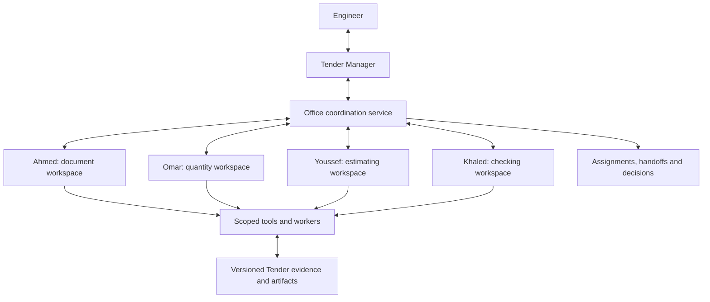

# Quantix's adaptive AI office

Quantix should feel like a capable Tender Office whose team is created live by the Tender Manager for the work at hand. The engineer talks to the Tender Manager, who understands the request, forms an appropriate team, assigns focused work, coordinates exchanges, resolves dependencies and returns a checked result. Only the Manager exists by default. Generated staff gain persistent identities and working styles after creation; their assignments, plans and team structure adapt to the work.

This concept develops the engineer's requested direction on 9 September 2026. It is a product and architecture proposal, not a claim that the named staff or their infrastructure already exist. BIM remains deferred. The broader research and scope are recorded in the [agentic Tender Office report](<D:/AI Work/quantix/docs/reports/2026-09-09-agentic-tender-office-research.md>).

**Accepted scope update:** Ollama and the external integration expansion from section 11 of the broader report are excluded. Public web research, existing approved AI connections, local engineering tools, skills, plugins and MCP infrastructure remain included. No excluded business-system or data-feed connector is authorized by a staff role or plugin.

**Latest staffing direction:** No predefined specialist roster, names, job titles, persona templates or name/role routing is permitted. The Manager generates every staff profile live from the tasks and available capabilities. Its own full personality is customizable by the engineer. The [live office brief](<D:/AI Work/quantix/docs/design/live-dynamic-office.md>) and [replacement first plan](<D:/AI Work/quantix/docs/superpowers/plans/2026-09-09-dynamic-staff-live-office.md>) govern this behavior.

## 1. The experience

The engineer can say:

> Ahmed should check the latest drawings. Ask Omar to review the quantities that changed, and have Youssef explain the pricing impact. Bring me anything they disagree about.

The Tender Manager should understand the named staff, their responsibilities, the current Tender, relevant work already in progress and the intended outcome. It can reuse an existing method or assemble a new plan. The engineer should not have to create a workflow, configure agent connections or manually forward files between colleagues.

The Manager might return a concise progress update:

> Ahmed has identified the revised sheets. Omar is checking the affected measurements. Youssef is waiting for the confirmed change list before preparing the cost comparison.

Such updates must be derived from actual assignments and recorded events. A message claiming that a colleague checked something requires a real attributable work result. Illustrative conversations in this concept are examples of the intended behavior.

The engineer can inspect the team when useful, but the default workspace stays focused on the task, its result and the next decision.

## 2. Staff, specialists, subagents and workers

Initialize only the Tender Manager. It creates complete specialist identities as the task requires, then launches focused execution instances. A generated profile is persistent Tender data; an agent run is a bounded unit of execution. Role and personality come from the Manager, while technical IDs and validated permissions come from the service.

| Concept | Lifetime and responsibility | Example |
|---|---|---|
| Tender Manager | Persistent office identity; accountable for coordination and communication | Forms a team to review a late addendum. |
| Staff specialist | Persistent identity, role profile and approved expertise | Ahmed Hassan, Document Controller. |
| Staff assignment | Tender-scoped responsibility with its own working records | Ahmed's review of the revised architectural package. |
| Task agent | An execution instance carrying out a bounded assignment | Review one drawing revision set with a defined source snapshot. |
| Subagent | A delegated child assignment with narrower scope and inherited limits | Compare door-schedule changes for one building. |
| Worker | A named technical execution unit, often deterministic | OCR worker, worksheet reader or calculation worker. |
| Temporary specialist | A task-specific role assembled from approved skills and tools | A delivery-sequencing analyst for a purchasing comparison. |

Give professional personality to visible reasoning roles. Technical workers need identity, purpose, status, inputs and outputs; adding a fictional biography to a PDF renderer has little engineering value. A reasoning subagent can have a distinct working style and temporary profile, while its technical workers remain clearly identified services.

Do not launch the whole office for every question. A single clause question may need only the Manager and retrieval. A broad package review can benefit from parallel specialist assignments. Anthropic's published research-system account supports separate contexts for parallel research, while also describing coordination costs and substantial additional token consumption. Its findings are not a universal performance guarantee for tendering. [Anthropic multi-agent research system, 13 June 2025](https://www.anthropic.com/engineering/multi-agent-research-system)

## 3. Complete profiles generated by the Manager

There is no default team. Every normal or unusual task can lead the Manager to answer directly, create staff, reuse suitable staff already generated in this Tender or revise their responsibilities. None of these choices depends on predefined names or a closed list of job titles.

The Manager generates the name, role, title, specialisms, persona, personality traits, communication and problem-solving styles, collaboration habits, initiative, uncertainty handling, responsibilities, objectives, methods, deliverables, success criteria, context needs, requested skills/tools and task-based creation reason. The application validates structure and capability access without substituting a canned employee.

Staff profiles are versioned after creation. They persist with their Tender history; another Tender starts with the Manager alone. The Manager can retire, reactivate or adapt generated staff when the actual work warrants it. No employee must remain active to fill an office layout.

The engineer fully customizes the Manager's name, persona, tone, language preferences, initiative, explanations, working habits and collaboration style through freeform and structured controls. One Manager identity serves all projects, with separate Tender contexts. Personality edits do not grant data access or change billing/accepted engineering authority.

Names in the illustrative conversations elsewhere in this report represent possible previously generated colleagues. They are not recommended defaults, seeded data, role presets or implementation constants. Generated AI identities do not assert human credentials or employment history.

## 4. Independent context with shared authoritative records

Each staff member should have a separate working context and workspace. The office still needs one authoritative set of Tender records so that different agents do not quietly work from conflicting copies of accepted quantities or prices.

| Layer | Contents | Sharing rule |
|---|---|---|
| Office rules | Application safeguards, engineer preferences and approved company practices | Explicitly applicable to all staff. |
| Staff profile | Identity, role, style, skills, approved tools and configuration version | Stable across assignments; changes versioned. |
| Staff's Tender workspace | Task history, authored notes, open questions, draft artifacts and relevant decisions | Scoped to that staff member and Tender; inspectable by the engineer. |
| Task context | Current brief, selected source excerpts, received messages and working state | Isolated per task; rebuilt from persisted records when needed. |
| Shared Tender record | Source revisions, accepted values, decisions, official outputs and dependency links | Controlled publication through Quantix's domain service. |
| Approved company knowledge | Reusable methods, templates and lessons | Cross-Tender access only when explicitly approved and applicable. |

An agent does not need every document in its context window. It needs a small starting brief and the ability to retrieve further permitted sources. Context construction should include the goal, constraints, relevant skills, current sources, prior decisions, open issues and the expected output.

“Own context” does not require a permanently running model. A staff member can become idle, release compute and later reconstruct its working context from records. Persisting a staff name alone does not provide memory. Pydantic's documented Dynamic Workflow calls have isolated runs and do not remember prior calls automatically, so Quantix must deliberately supply relevant saved state. [Pydantic Dynamic Workflow](https://pydantic.dev/docs/ai/harness/dynamic-workflow/)

Separate a working notebook from raw model reasoning. Store concise findings, assumptions, calculation methods, decisions, unresolved questions and handoff summaries. The product should expose useful work records and explanations rather than promise a transcript of hidden model reasoning.

Use stable IDs for staff, Tender, assignment, task and artifact. Store application-owned state beneath the managed ~/.quantix home. Namespace separation must be enforced by access checks; a folder name alone is not isolation. Independent model histories likewise do not establish separate filesystem, database or credential access.

## 5. Collaboration through the Manager

Make the Manager the authority for team scope, delegation and resolution. Use a deterministic office coordination service to deliver permitted messages and artifact references. Routine delivery does not need another model invocation or another engineer approval.

The Manager establishes who may collaborate on an assignment. The coordination service checks scope, routes messages, persists delivery, tracks acknowledgements and exposes blockers. The Manager intervenes when work needs reprioritizing, specialists disagree materially, a capability is missing or an engineer decision is needed.

### Types of exchange

| Exchange | Example | Required outcome |
|---|---|---|
| Assignment | Review revised quantities for Building A | Named owner, scope, basis and expected result. |
| Evidence request | Which detail governs this item? | Source reference or explicit missing-evidence status. |
| Artifact handoff | Quantity comparison is ready | Exact artifact ID/version and review status. |
| Calculation handoff | Reuse these quantities in the rate model | Structured values, units, inputs and formula identity. |
| Clarification | Are these quantities net or gross? | Answer with its basis and applicability. |
| Review challenge | This allowance is included twice | Reproducible objection, affected records and resolution. |
| Change notice | The source revision has changed | Dependency invalidation and revalidation of affected work. |
| Work transfer | Move the remaining rate checks to another specialist | Ownership change, completed work and unresolved issues. |
| Escalation | No quotation establishes the delivery charge | Concrete question or supported alternative for the engineer. |

Every exchange should record sender/recipient identity, Tender and task, message type, correlation/reply ID, purpose, relevant artifact versions, status and required response. Messages carrying proposed values must distinguish them from accepted domain records. An inter-agent message cannot grant itself new authority.

Use reliable delivery with duplicate detection. A retried message must not create a duplicate task or publish the same proposal twice. Acknowledgement means received; it does not mean read, checked or accepted. Detect abandoned assignments, circular waits and expired task ownership.

### Share exact work, not only summaries

Calculation sheets, tables, evidence and files should move through references to versioned artifacts. The Manager can summarize their implications without rewriting the original numbers. A receiving agent should be able to open the full artifact and supporting source, validate its applicability and record what it actually inspected.

If Ahmed read a source, that does not mean Omar read or checked it. Track source access and review at the actual task/actor level. A transferred excerpt can be recorded as material received and inspected, with its original source identity, without claiming that the recipient reviewed the whole document.

A2A's distinction between messages, tasks and artifacts is useful inspiration for these contracts. Internal agents can use simpler local service records; A2A interoperability is only needed for an actual independently operated agent integration. [A2A core concepts](https://a2a-protocol.org/latest/topics/key-concepts/)

## 6. How the Manager forms a team

For a new engineer request, the Manager should:

1. Identify the requested outcome, constraints and affected Tender records.
2. Inspect active/completed work so it does not duplicate an assignment.
3. Find useful staff, skills, tools and existing methods.
4. Decide what can run independently and what depends on earlier results.
5. Create focused work orders with explicit inputs, evidence, output and completion criteria.
6. Allocate approved model routes, time, concurrency and spending limits.
7. Start the smallest effective team and monitor actual progress.
8. Re-plan when evidence, a worker result or the engineer's instruction changes the task.
9. Integrate the artifacts, obtain the appropriate checks and return the result.

A work order must state the desired output rather than merely “help the Manager.” For example: “Compare quantities for the listed changed sheets; retain the supplied BOQ as baseline; report each proposed change with measurement, source and unresolved assumptions.”

Every team is generated for the actual work. A normal or unusual request can create a role assembled around permitted capabilities; there is no preset route for familiar requests. For example, comparing purchase timing might require a temporary delivery-sequencing analyst combining quotation, programme and cash-flow tools. Naming a new role does not create a new tool or grant new permissions.

Specialists may request or create bounded child assignments under Manager-delegated authority. All descendants inherit the parent scope and consume a centrally accounted budget. Bound total active tasks and delegation depth. Do not allow a child to regain exhausted spending by spawning another child.

The same staff identity can have several task instances. Keep their histories and notebooks scoped correctly and label concurrent assignments clearly. The system should not imply that a second task saw the first task's intermediate findings unless those findings were actually shared.

Model selection belongs to the approved task route. A staff identity can persist across a deliberately approved model change, while the execution record retains provider, model and relevant configuration versions. Do not imply identical behavior after a model change without evaluation. Preserve the existing direct API and official-client subscription constraints.

## 7. Technical discussions and disagreement

Allow specialists to discuss specific engineering questions through a Manager-convened review. A useful discussion has a question, participating roles, the same source basis, linked artifacts, a bounded effort budget and a required output.

An illustrative review:

- Ahmed reports that the drawing schedule has changed and links the exact revision.
- Omar identifies a resulting quantity discrepancy and publishes the workings.
- Youssef explains which cost items would change if the proposal were accepted.
- Khaled reproduces the calculation and challenges a duplicated allowance.
- The Manager records resolved points and presents the material outstanding decision to the engineer.

Use structured contributions: claim, evidence, calculation or method, uncertainty, impact and proposed next action. Discussion should stop when the question is resolved, more evidence is required, the budget is reached or the engineer needs to decide. Another round of agreement is not proof of correctness.

For independent checks, let the reviewer inspect the original inputs and form an initial conclusion before seeing the author's recommendation when practical. Different names or personalities using the same flawed assumptions do not establish independence. Select different methods or an approved alternative model only when the expected checking value justifies it.

Record disagreement rather than manufacturing consensus. The engineer should see, for example: “Omar and Khaled agree on the measured area; they disagree on the deduction rule because the contract basis is unresolved.”

## 8. Office features worth exploring

| Feature | Experience | Engineering value |
|---|---|---|
| Team directory | Staff cards show role, style, skills and current assignments | Engineers know who owns the work. |
| Staff desk | Inspect a colleague's briefs, outputs, notes and unresolved questions | Persistent accountability and continuity. |
| Named delegation | “Ask Ahmed to check this” in the Manager conversation | Natural task assignment without manual routing. |
| Focused consultation | The Manager opens a short conversation with a specialist for one question | Detailed expertise remains connected to the main Tender. |
| Review room | Invite selected colleagues to assess a concrete issue | Cross-discipline questions receive focused discussion. |
| Assumption register | Staff publish assumptions with affected calculations and expiry conditions | Unsupported assumptions become visible dependencies. |
| Scenario workspaces | Explore alternative quantities, suppliers or sequences on a separate draft basis | Compare options without overwriting accepted work. |
| Independent second opinion | Reassign a specific conclusion for a blind first-pass check | Reduce anchoring and detect methodological errors. |
| Tender submission rehearsal | A clearly labelled reviewer tests the package against supplied criteria | Find missing forms, unclear qualifications and inconsistent totals. |
| Deadline coordination | The Manager reprioritizes work according to remaining dependencies and deadlines | Focus effort on what prevents submission. |
| Shift handover | A task can be resumed or reassigned from its recorded brief, results and open issues | Recovery without restarting all analysis. |
| Change notification | Source owners notify affected staff when a source or accepted decision changes | Prevent stale calculations and drafts. |
| Capability request | A specialist identifies a missing reader, skill or connector with a concrete use case | Extension follows actual engineering needs. |
| Checked-method learning | A successful corrected method can become a versioned proposed skill | Improvements become reusable and testable. |
| Staff quality record | Show verified strengths, failure patterns and recent benchmark results | Team selection uses evidence as well as role labels. |
| Cost-aware staffing | Show what extra review is expected to resolve before adding model work | Spend effort where it changes the decision. |
| Personal working preferences | “Ahmed, be shorter; keep the drawing references” | Consistent communication without weakening checks. |
| Company method packs | Activate approved company templates, terminology and review rules | The office adapts to the engineer's organization. |

These features should be optional views inside the office. Do not require engineers to manage an artificial HR department, keep agents socially entertained or follow internal chatter. The default remains a useful response from the Tender Manager.

### Live shared-office presentation

The shared work area creates staff cards only from committed generation events. Actual messages build the conversation; artifact handoffs carry exact sender, recipient and version. Purposeful arrival, relationship and state motion makes the team visible without inventing work. The engineer can inspect any complete profile and its desk, filter conversations, or return immediately to the Manager. Reduced motion, keyboard navigation, honest disconnected states and event reconciliation are required. See the [detailed UI brief](<D:/AI Work/quantix/docs/design/live-dynamic-office.md>).

## 9. Responsiveness and changes during work

Separate acknowledgement and coordination from long-running engineering execution. The Manager should answer a status question from persisted records while workers continue. This should not launch a new full engineering analysis.

Classify a new instruction against active work: independent question, added constraint, replacement instruction, urgent change or cancellation. Apply it at a safe boundary, preserve completed artifacts and explain material scope/cost consequences. Do not mutate an in-flight calculation halfway through publication.

When priorities change, task owners receive a versioned instruction. Completed results retain the brief they answered. If they no longer fit the new request, label them accordingly rather than silently presenting them as current work.

A failed worker should become a precise task state with a recovery option. Continue independent assignments where valid. The Manager should not keep reporting that someone is “working” after the execution has stopped.

## 10. Implementation direction for the existing application

The current source has Manager/specialist consultation, but it does not establish the complete staff architecture above. In [office.py](<D:/AI Work/quantix/backend/quantix/office.py:338>), a shared OfficeContext is constructed for the run and used by nested execution; the consultation path is bounded. [OfficeContext](<D:/AI Work/quantix/backend/quantix/office_tools.py:27>) tracks run-scoped source access and other state. Persistent staff identity, per-assignment workspaces, addressed office messages and staff-specific provenance need explicit implementation.

Preserve the existing domain publication and authority boundaries. Extend them with a few focused concepts:

| Component | Responsibility |
|---|---|
| Staff registry | Stable identity, profile/version, role, skills and allowed capabilities. |
| Assignment service | Work orders, ownership, task dependencies and instruction revisions. |
| Context builder | Assemble the minimum relevant profile, decisions, notes and evidence for each task. |
| Coordination service | Manager-authorized messages, artifact handoffs, acknowledgements and escalation. |
| Execution scheduler | Launch, wait, cancel, checkpoint, resume and account for all descendants. |
| Artifact service | Versioned draft outputs, exact references, authorship and dependency links. |
| Review service | Independent checks, disagreements and engineer decisions. |

These can begin as Python modules and SQLite records. Separate service deployments, a distributed message platform or a graph database are not prerequisites for an individual engineer's desktop office. Generic renderers can show new draft tables/documents; accepted commercial records continue to use their established typed schemas.

Pydantic AI documents named subagent delegation with independent message histories, shared dependencies and usage behavior. This is useful execution plumbing, but dependency forwarding is not a security boundary. Its documented per-delegation budget option changes how usage aggregates into the parent, so Quantix needs to preserve central accounting across every task. Pin and verify the actual installed API rather than assuming current online examples match it. [Pydantic Subagents](https://pydantic.dev/docs/ai/harness/subagents/)

The Manager should not need to read every full artifact or invoke a model for every delivery. Its context holds the work map, compact evidence-linked findings, unresolved decisions and links to details. Raw files and numerical datasets move through the coordination/artifact services with permissions and provenance intact.

Technical staff messages are internal application records. External emails, supplier messages and submissions still use the existing separately authorized communication paths. Private notebooks are not credentials stores. Skills and received source documents cannot override the core authority model.

## 11. A focused first increment

Start with the Tender Manager alone. Submit the task and have it generate the complete profiles and assignments it judges necessary. Verify the generated staff have separate contexts, persistent Tender workspaces and real attributable outputs. Do not seed a document controller, surveyor, estimator or reviewer in application code.

Use this acceptance story:

> Review this revised drawing package, identify affected quantities, and tell me what needs an engineering decision.

Demonstrate all of the following:

1. The Manager creates an appropriate team without requiring a matching saved workflow.
2. The Manager generates complete staff profiles for the request; arbitrary valid names and roles work without preset registration.
3. The assigned specialist produces a versioned revision schedule and requests further review through the Manager's coordination service.
4. A Manager-created colleague receives the exact schedule and evidence references, performs the permitted check and records actual sources read.
5. If independent checking is warranted, the Manager creates or assigns a suitably scoped reviewer and records its actual findings and disagreement.
6. The Manager returns a concise result with attributable findings and a clear engineer decision.
7. An engineer instruction changing the scope updates remaining work without losing completed outputs.
8. A stopped or failed worker resumes/reassigns without duplicate publication.
9. Staff contexts cannot access unrelated Tender data, overwrite accepted values or exceed aggregate spending authority.
10. Reported staff actions, messages and review status correspond to real execution records.
11. The dynamic team and actual handoffs/messages appear in the live office with reduced-motion and reconnect behavior.
12. The engineer's full Manager personality customization persists across projects without mixing Tender context.

Then add market research, procurement, programmes and proposal writing using the same mechanisms. BIM remains outside this scope.

## 12. Evaluation and evidence

Evaluate personality separately from competence. Check whether each role communicates consistently and follows its working habits, then independently measure source accuracy, useful findings, correct calculations, recovery, collaboration overhead and cost per accepted result. A persuasive personality should not hide a weak engineering result.

Include unseen requests, adversarial source instructions, contradictory colleague findings, stale artifact versions, duplicate messages, abandoned work, circular dependencies and context reconstruction after restart. Measure whether extra agents improve the result relative to a single appropriately equipped agent on the same task.

Current sources consulted on 9 September 2026:

- Anthropic, [How we built our multi-agent research system](https://www.anthropic.com/engineering/multi-agent-research-system), 13 June 2025. Supports the research architecture discussion and its limits; no reported performance number is adopted as a Quantix forecast.
- Pydantic, [Multi-agent applications](https://pydantic.dev/docs/ai/guides/multi-agent-applications/). Delegation patterns and dependency handling.
- Pydantic, [Subagents](https://pydantic.dev/docs/ai/harness/subagents/). Named delegation, separate histories and execution/accounting behavior.
- Pydantic, [Dynamic Workflow](https://pydantic.dev/docs/ai/harness/dynamic-workflow/). Composed execution and the absence of automatic cross-call memory.
- A2A, [Core concepts](https://a2a-protocol.org/latest/topics/key-concepts/). Separation of messages, tasks, artifacts and agent discovery; optional interoperability reference.
- Local source: [office.py](<D:/AI Work/quantix/backend/quantix/office.py>), [office_tools.py](<D:/AI Work/quantix/backend/quantix/office_tools.py>), [specification](<D:/AI Work/quantix/docs/spec.md>) and [shared contracts](<D:/AI Work/quantix/docs/contracts.md>). Source inspection establishes the current baseline, not live acceptance of this proposed office.
