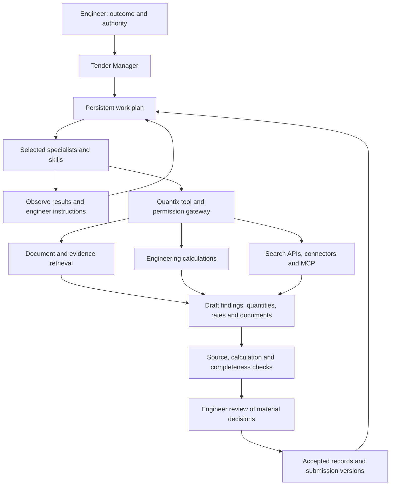

# Quantix: an agentic Tender Office

Quantix should develop into a persistent Tender Manager that can carry an approved engineering assignment through document review, research, calculations, drafting, checking and follow-up. Its defining advantage should be the connection between an engineering conclusion, its source, its calculation, its commercial consequence and the engineer's decision.

**Current product direction, clarified by the engineer:** Quantix is an adaptive workspace and Tender Office. Saved workflows are optional reusable methods, not a fixed catalogue of requests the application can accept. The Manager must handle new requests by composing and revising a plan from available context, skills and tools. BIM/IFC is deferred outside the current implementation scope; PDF, spreadsheets, Word and supported 2D CAD work remain relevant. Retained BIM research below is future reference only.

**Latest accepted exclusions:** Ollama and all proposed external integrations formerly listed in section 11 are excluded. Existing approved model connections, public web research, local file processing, skills, plugins and MCP capability infrastructure remain in scope. Dedicated business-system, supplier-system, tender-portal and third-party data-feed connectors are not part of the implementation. Existing application mail functions are preserved; no new external account integration is implied.

**Latest staffing/UI clarification:** Only the Tender Manager exists by default. It creates all other staff profiles live from the engineer's request and running tasks; names, roles, titles, personas, personality and responsibilities are never seeded. The engineer fully customizes the Manager personality. The [live office brief](<D:/AI Work/quantix/docs/design/live-dynamic-office.md>) requires actual dynamic staff, conversations, handoffs and state motion.

The subsequent [adaptive AI office concept](<D:/AI Work/quantix/docs/reports/2026-09-09-adaptive-ai-office-concept.md>) develops the engineer's proposed named staff, professional personalities, separate contexts, Manager-coordinated communication and dynamic delegation. It extends the team model below as a proposal; it does not claim those capabilities are implemented.

The recommended direction is to extend the existing Python, FastAPI, React, Tauri and SQLite application. Add a governed skill library, installable capability packs, a shared tool gateway, stronger retrieval, reproducible engineering calculations and durable workflows. Retain the application’s authority over Tender data, spending, accepted quantities, rates and release.

This is a research and product recommendation report, assessed against the working source and official documentation available on 9 September 2026. It is a proposed direction, not an amendment to the approved specification. The source review establishes implementation patterns; it does not establish that every existing workflow passes live acceptance. Existing audit reports include historical findings that subsequent work may have resolved. No current market quotations, customer files, credentials or runtime databases form part of this report.

The priorities are:

1. Complete the trustworthy document-to-decision workflow already being built.
2. Introduce versioned skills and tools around useful, repeatable Tender tasks.
3. Upgrade RAG into an evidence service that understands revisions, tables, drawings and engineering relationships.
4. Build market research and supplier quotation workflows with explicit commercial bases.
5. Add reliable recovery, independent checking and measured acceptance.
6. Expand supported 2D CAD and office capabilities in complete increments. Keep BIM/IFC deferred and the section 11 integrations excluded.

## 1. What the application already provides

| Area | Evidence in the working source | Recommended next step |
|---|---|---|
| Local architecture | Python 3.12 service, FastAPI/Pydantic boundary, React/Tauri interface, SQLite domain records. See [architecture](<D:/AI Work/quantix/docs/architecture.md>) and [dependencies](<D:/AI Work/quantix/backend/pyproject.toml>). | Preserve the separation between the domain service, model execution and desktop lifecycle. |
| Function tools | [ai_tools.py](<D:/AI Work/quantix/backend/quantix/ai_tools.py>) defines typed tool schemas and validates arguments. [office_tools.py](<D:/AI Work/quantix/backend/quantix/office_tools.py>) exposes scoped document access. | Extend the existing abstraction with capability permissions, result schemas, execution receipts and dependency identity. |
| Manager and specialists | [office.py](<D:/AI Work/quantix/backend/quantix/office.py>) coordinates approved routes and bounded specialist consultation; publication occurs outside the model loop. | Add explicit task dependencies and durable intermediate results, while retaining one accountable Tender Manager. |
| MCP | [ai_runtime_mcp.py](<D:/AI Work/quantix/backend/quantix/ai_runtime_mcp.py>) implements a scoped local bridge for original-client execution. | Add a distinct outbound MCP client capability for selected external services. An internal bridge is not yet a general plugin ecosystem. |
| Retrieval | [semantic.py](<D:/AI Work/quantix/backend/quantix/semantic.py>) uses a pinned multilingual E5 model, FastEmbed, local vectors and current-source/Tender joins. Exact search is separately exposed. | Add deliberate hybrid retrieval, reranking, structural chunks and retrieval evaluation. |
| Source validation | [office_tools.py](<D:/AI Work/quantix/backend/quantix/office_tools.py>) checks that cited evidence was read and is current. | Add claim-to-passage support checks. An existing source identifier alone does not prove that the source supports the claim. |
| Web research | [office_research.py](<D:/AI Work/quantix/backend/quantix/office_research.py>) records provider-returned URLs and dates; the direct engine has approved native search support. | Preserve captured passages and structured observations, then assess applicability, freshness and commercial completeness. |
| Restart handling | [jobs.py](<D:/AI Work/quantix/backend/quantix/jobs.py>), particularly resume(), creates a new run linked to the previous run. | Add step-level continuation where valuable. Current run restart is not equivalent to resuming after the last completed tool step. |
| Tender domain | Source modules cover estimates, proposals, measurements, requirements, quotes, correspondence, outputs, submissions and backups. | Connect these records through shared dependencies and state transitions instead of creating duplicate parallel modules. |
| Extension system | The reviewed application modules do not establish a general skill catalogue, plugin lifecycle or general isolated Python execution service. | Introduce them explicitly, with small initial scope and measurable workflows. |

These are substantial foundations. A framework migration would introduce integration work before proving an engineering benefit. Pydantic AI’s current documentation already covers typed agents, toolsets, skills and durable execution, making it the first framework to evaluate for extensions. Its latest online APIs must still be checked against Quantix’s pinned dependencies before use. [Pydantic AI](https://pydantic.dev/docs/ai/overview/)

Commercial products provide useful workflow benchmarks. RIB CostX documents linked takeoff and estimates, revisions, supplier comparisons and reporting; Autodesk documents package-based 2D/3D takeoff followed by inventory review; Togal documents assisted detection, measurement and comparison. These establish capabilities worth studying, not independently verified accuracy or productivity gains. Quantix can distinguish itself through evidence-linked coordination across the whole tender rather than optimizing only drawing measurement. [CostX](https://www.rib-software.com/en/rib-costx), [Autodesk takeoff workflow](https://help.autodesk.com/cloudhelp/ENU/Takeoff-Takeoff/files/Performing_Takeoff.html), [Togal features](https://www.togal.ai/features)

## 2. What “fully agentic” should mean

A useful acceptance definition is: the engineer states an outcome, the Manager establishes the scope and authority, chooses appropriate skills and tools, completes permitted work, checks the result, recovers from interruptions and returns a reviewable deliverable with clear remaining decisions.

| Building block | Meaning in Quantix | Example |
|---|---|---|
| Model | Language/vision reasoning service | Interpret a specification clause. |
| Agent | A role with a task, context, tools and execution state | Quantity Surveyor prepares a measurement proposal. |
| Skill | Reusable instructions, references, examples and checks | Compare subcontractor quotations on an equal scope. |
| Tool | A typed executable operation | Read a worksheet range or calculate a measured area. |
| MCP | A protocol for exposing tools and contextual resources | Access a permitted external document service. |
| Connector | An integration with a particular system and account | Synchronize one selected SharePoint Tender folder. |
| Plugin | A versioned Quantix package that bundles capabilities | A research pack with search adapters, evidence capture and comparison skills. |
| RAG | Retrieve relevant evidence before generating an answer | Find the applicable clause and its linked BOQ item. |
| Workflow | A reusable method or dynamically composed set of persistent steps, dependencies, waits and checks | Adapt an addendum review to the actual changes, evidence and engineer's request. |
| Memory | Saved decisions and approved reusable knowledge | Remember the company's approved report format. |

MCP defines hosts, clients, servers, resources, prompts and tools. It does not itself supply Tender authority or engineering judgment. Agent Skills defines a portable skill folder and progressive loading. These standards can support Quantix, but neither replaces its domain model. [MCP specification](https://modelcontextprotocol.io/specification/2026-07-28), [Agent Skills specification](https://agentskills.io/specification)

Proposed flow:

The permission gateway must apply equally to a direct model tool call, an MCP call, a skill script and a nested code-mode call. Otherwise each new integration becomes a separate route around the application’s safeguards.

### Adaptive workspace and handling requests without a saved workflow

The engineer should be able to ask for any engineering task in ordinary language without first choosing a workflow, mode or specialist. The Manager interprets the desired outcome against the current Tender and active work. It may answer directly, apply an existing method, adapt parts of several methods or compose a new plan. Workflow matching is a helpful planning input, never the gate that determines whether a request is accepted.

Keep the workspace persistent: source documents, working artifacts, calculations, conversations, decisions, research, active tasks and resumable plans belong to the Tender. A request can concern any combination of them and can produce a new work product without requiring a new product screen or predefined workflow.

| Situation | Required Manager behavior |
|---|---|
| A relevant saved workflow exists | Use only applicable steps; adapt order, scope and outputs to the request. |
| No saved workflow exists, but tools and evidence are sufficient | Compose a task-specific plan and execute within existing authority. |
| Several skills cover parts of the request | Combine the relevant methods and validate their shared inputs and outputs. |
| No specialist skill exists, but the task can be reasoned through and checked | Use general planning with available tools, record assumptions and apply proportionate checks. |
| A required fact or file is missing | Ask for the specific missing input and continue independent useful work. |
| A technical capability is missing | Explain the precise gap, evaluate an available supported tool/connector or a bounded analysis method, and complete the supported portion. Do not pretend the capability exists. |
| An external permission, spending change or commercial decision is required | Prepare the concrete result for the engineer's decision; preserve existing authority elsewhere. |
| The engineer changes direction during work | Acknowledge the change, pause or adjust at a safe boundary, preserve completed artifacts and show material effects on scope, cost or outputs. |

For example, an engineer might request: “Use these quotations and our cash limit to compare buying the materials together versus in stages, show what must arrive first, and prepare questions for the suppliers.” There need not be a matching workflow. The Manager can compose quotation extraction, unit/commercial normalization, cash-flow calculations, programme dependency review, a custom comparison and correspondence drafting. Unstated payment dates, lead times or capacity remain visible questions instead of invented inputs.

The adaptive loop is: understand the outcome → inspect current state → discover relevant capabilities → make a proportionate plan → execute a bounded step → check the result → revise the remaining plan → deliver or explain the specific blocker. Persist plan revisions and checkpoints. Do not force straightforward questions through a long planning exercise, and do not seek routine reapproval merely because a plan was newly composed.

Support general draft work products—tables, calculation sheets, research notes, charts and documents—with provenance and versioning. This lets unfamiliar requests produce useful artifacts while accepted BOQ, rate, decision and release records retain their typed domain rules. A newly generated artifact does not automatically become an accepted commercial record.

Separate flexible planning from fixed invariants. The Manager may change the method and tool sequence; it must still preserve originals, respect Tender scope and account authority, calculate correctly, identify unsupported findings and obtain required engineer decisions. Adaptive planning cannot create unavailable data, software access or verified engineering competence by itself.

After a successful novel task, the Manager may suggest saving the method as a reusable workflow or skill. Keep one-off plans as normal work history; do not accumulate a permanent workflow for every request. Evaluate reusable methods before promoting them.

Acceptance must include unseen tasks, combinations of unrelated skills, changed instructions, failed tools and incomplete inputs. Success means completing a supported new request without requiring a developer to pre-author its workflow, or returning a precise capability/input gap with useful partial work. Tests should also verify that familiar workflows adapt rather than impose unnecessary steps.

## 3. Make the application friendly to engineers

The existing approved navigation—Manager, Documents, Work, Estimate, Submission and Settings—is a suitable starting structure. Expand capabilities inside these familiar work areas. Avoid putting “RAG,” “MCP,” “agent graph” or “token settings” into ordinary engineering tasks. The [workspace redesign](<D:/AI Work/quantix/docs/design/workspace-redesign.md>) and [product context](<D:/AI Work/quantix/PRODUCT.md>) remain the reference for the current interface.

| Recommendation | Concrete behavior |
|---|---|
| One useful next action | “Review the three missing specification items” opens the relevant decisions. |
| A short Tender brief | Show scope, location, deadline, current revision, major unknowns and current work. |
| Outcome-based requests | Offer “Check this BOQ,” “Compare these quotes,” “Review this revision” and “Prepare the submission.” |
| Direct actions beside conversation | Engineers can edit quantities, filters and document selections without composing a prompt. |
| Evidence beside conclusions | Selecting a finding opens the exact page, highlighted passage, drawing region or cells. |
| Explain each number | Show quantity, unit, formula, inputs, source dates, rounding and acceptance status. |
| Clear status language | Use “Not read,” “Read with missing pages,” “Proposed,” “Needs your decision,” “Accepted” and “Out of date.” |
| Separate coverage measures | Display imported, extracted, analysed and reviewed coverage separately, with denominators and exceptions. |
| A decision inbox | Group material questions by effect on scope, price, programme and submission. |
| Useful comparisons | Present existing value, proposed value, reason, evidence and affected outputs together. |
| Approval by meaningful scope | Approve a displayed research or review plan once; return only for material changes or separately controlled actions. |
| Visible work and recovery | Say which files or packages are being checked, what has completed and how to stop or resume. |
| Structured More options | Keep advanced controls organized by task; active errors and missing authority stay visible. |
| Excel-like working | Keyboard navigation, copy/paste, bulk classification, saved filters, frozen identifiers and visible units. |
| Context-sensitive drawing work | Keep selected measurement, scale, relevant BOQ item and calculation together. |
| Arabic/English support | Preserve original wording; show translation beside it; test mixed direction text, numerals and engineering abbreviations. |
| Laptop and tablet adaptation | Adjustable density, touch-sized actions, readable zoom, light/dark themes and stable source navigation. |
| User-controlled alerts | Show material addenda, expiring quotations and approaching deadlines; suppress repeated unchanged notices. |

The Manager should default to: **result, engineering implication, evidence, next action**. For example, a hypothetical result might say: “Two door items have no confirmed fire rating. They affect the supplier comparison. Review the specification clauses.” Detailed reasoning and processing logs should remain available separately.

Tablet access requires a delivery and synchronization design. A responsive desktop renderer alone does not establish remote tablet access. Likewise, a desktop watcher cannot promise continuous monitoring while the device is asleep or the service is stopped.

## 4. Capability catalogue across the tender lifecycle

The following catalogue describes example outcomes, not a closed menu of supported requests. Some have existing foundations and need integration or acceptance; others are new. Supply composable capabilities and reusable methods with defined inputs, evidence, outputs and checks. The Manager must also combine them for requests absent from this catalogue. BIM/IFC entries are explicitly deferred.

### Opportunity and tender setup

1. **Opportunity monitoring:** find relevant notices by geography, trade, project scale and deadline.
2. **Tender qualification:** check submission eligibility, required experience, certificates and compulsory attendance against supplied company records.
3. **Bid/no-bid brief:** summarize fit, estimating effort, missing capability, commercial exposure and reasons for management review.
4. **Company capability library:** approved project sheets, CVs, certificates, equipment and financial documents, with expiry dates and controlled reuse.
5. **Tender calendar:** closing time and timezone, clarifications, site visits, bonds and internal review dates.
6. **Project profile:** contract type, scope, country, currencies, measurement rules, working languages and permitted data destinations.

### Package intake and document control

7. **Package register:** preserve originals, paths, content hashes, received dates and exceptions.
8. **Document classification:** identify drawing, specification, BOQ, addendum, schedule, form and correspondence, with editable classification.
9. **Drawing register:** extract title blocks, drawing numbers, discipline, area, revision and issue purpose.
10. **Missing-document checks:** compare transmittals, drawing lists and references against received files.
11. **Duplicate management:** reuse extraction of identical content while preserving each occurrence and its project meaning.
12. **Reader recovery:** reprocess a preserved file when a better OCR engine or converter becomes available.
13. **Spreadsheet integrity review:** detect formula errors, missing caches, merged headers, hidden content, subtotal duplication and ambiguous quantity/unit columns.
14. **Cross-document links:** connect BOQ rows to specifications, schedules, details, drawings and supplier documents.

### Scope, requirements and clarifications

15. **Scope breakdown:** buildings, levels, zones, systems, trades and work packages.
16. **Responsibility matrix:** main contractor, subcontractor, supplier, employer and nominated-party boundaries.
17. **Specification compliance matrix:** requirement, evidence, proposed compliance, gap and accountable reviewer.
18. **BOQ/specification/drawing reconciliation:** identify mismatched descriptions, quantities, ratings, finishes and referenced details.
19. **Interface review:** flag builder's work, penetrations, supports, power supplies, controls, testing and reinstatement gaps between trades.
20. **Clarification drafting:** turn unresolved conflicts into concise questions with citations and requested decisions.
21. **Assumptions and exclusions register:** track origin, cost effect, programme effect, approval and where each appears in the submission.
22. **Revision impact assessment:** determine which requirements, quantities, rates, quotes and outputs need reconsideration after an addendum.

### Quantities and engineering calculations

23. **BOQ baseline:** retain the supplied quantity as the default commercial basis.
24. **Measurement proposals:** calibrated lengths, areas, volumes and counts, separately linked to BOQ items.
25. **Drawing scale checks:** calibration per sheet or viewport; detect conflicts with stated dimensions.
26. **Assisted repetition detection:** propose similar doors, fixtures, rooms or symbols for visual confirmation.
27. **Assembly takeoff:** build composite quantities from rooms, walls, slabs, foundations or service systems.
28. **Deductions and allowances:** record openings, overlaps, laps, wastage and measurement rules explicitly.
29. **IFC quantity extraction — deferred:** future research only; excluded from current implementation.
30. **DXF/DWG-derived takeoff:** use supported conversion and layer/entity inspection with clear coverage limits.
31. **Cross-checks:** compare drawing measurements and BOQ quantities without silently replacing either basis. Model-based comparison is deferred with BIM.
32. **Calculation sheets:** generate reproducible workings with units, method, inputs, assumptions and review status.

### Estimating and commercial development

33. **Resource rate build-ups:** material, labour, plant, subcontract and productivity inputs.
34. **Preliminaries:** duration-dependent staff, facilities, mobilization, temporary services and project-specific allowances.
35. **Commercial basis:** currency, delivery, tax treatment, discounts, waste, overhead, margin and contingency as distinct fields.
36. **Rate provenance:** distinguish observed market prices, supplier quotations, historical accepted rates, allowances and analyst estimates.
37. **Missing-price register:** prioritize unresolved rates by likely exposure and Tender importance.
38. **Estimate scenarios:** baseline, compliant alternative and engineer-defined sensitivity cases.
39. **Cost movement explanation:** separate quantity, specification, supplier, currency and duration effects.
40. **Estimate completeness:** identify scope omissions, duplicate pricing, incompatible units and unpriced mandatory work.
41. **Value engineering:** compare savings with compliance, warranty, programme, maintenance and approval requirements.
42. **Cash-flow scenarios:** model stated payment, retention and procurement assumptions for commercial review.

### Market and supplier work

43. **Material market research:** current product-specific evidence for the relevant location and supply basis.
44. **Supplier discovery:** find manufacturers, authorized distributors and potential subcontractors by capability.
45. **Supplier verification:** record evidence for product scope, contact details, certifications and service area; unknowns remain unknown.
46. **RFQ scope builder:** select the correct BOQ items, drawings, specifications, questions and return schedule.
47. **Authorized correspondence:** prepare and send only the reviewed recipients, content and attachments under explicit scope.
48. **Reply intake:** associate emails, quotations and attachments with the correct request and revision.
49. **Technical comparison:** compare proposed products against the same compliance dimensions.
50. **Commercial levelling:** normalize coverage, quantities, delivery, exclusions, validity, payment and taxes before comparing totals.
51. **Long-lead review:** connect quoted lead times to required-on-site dates and programme assumptions.
52. **Expiry and follow-up:** identify missing replies, expiring offers and required refreshes without duplicate sending.

### Programme and bid documents

53. **Tender programme:** derive a draft work breakdown and dependencies from scope and stated methods.
54. **Productivity-based durations:** link quantities, crews, calendars and stated productivity to durations.
55. **Procurement programme:** include submittal, approval, manufacture, delivery and installation dependencies.
56. **Programme checks:** missing logic, circular dependencies, calendar conflicts and unrealistic resource assumptions.
57. **Method statement drafts:** use the selected method and actual project constraints; expose missing inputs.
58. **Technical proposal drafts:** project understanding, methodology, organization, resources and compliance responses.
59. **Project-specific quality/HSE submissions:** assemble relevant approved company material and identify required specialist review.
60. **Client-form filling:** preserve workbook/document structure and show each populated field's source.
61. **Bilingual document preparation:** maintain terminology, original contract references and layout quality.
62. **Sustainability options:** compare documented embodied-carbon factors and product EPDs where required by the Tender.

### Submission, post-tender and handover

63. **Submission matrix:** every required form, attachment, signature, format and deadline linked to an output or explicit exception.
64. **Cross-document consistency:** totals, project names, dates, qualifications and proposed methods agree across the package.
65. **Release review:** distinguish technical readiness, commercial acceptance and final release authority.
66. **Submission manifest:** exact output versions, hashes and included/excluded files.
67. **Transmission assistance:** prepare portal steps or approved transfer; retain confirmation and resolve uncertain outcomes.
68. **Post-tender clarification:** respond using the exact submitted baseline and preserve changes separately.
69. **Negotiation scenarios:** show effects of requested discounts, exclusions, alternatives and revised scope for engineer decisions.
70. **Award handover:** transfer accepted scope, quantities, rates, suppliers, risks, assumptions and commitments to delivery teams.
71. **Win/loss review:** record known reasons and distinguish evidence from speculation.
72. **Estimated-versus-actual learning:** compare matched work and cost bases, then propose reusable lessons for approval.

Measurement methods should be selectable by project and contract, with edition and source recorded. For example, RICS NRM distinguishes cost planning, detailed building measurement and maintenance work; it must not be assumed to govern every Tender or geography. [RICS NRM](https://www.rics.org/profession-standards/rics-standards-and-guidance/sector-standards/construction-standards/nrm)

## 5. Skills: reusable engineering methods

Use Agent Skills-compatible folders for portable instructions and references. Keep Quantix-specific execution permissions, outputs and commercial authority in a separate validated manifest. The standard's experimental allowed-tools metadata must not become an application permission grant. [Agent Skills specification](https://agentskills.io/specification)

A proposed skill package should contain:

| Component | Purpose |
|---|---|
| SKILL.md | When to use the skill, method, stop conditions and required checks. |
| References | Approved measurement guidance, terminology and project-specific rule references, with lawful access. |
| Scripts | Reviewed deterministic routines executed through the tool gateway. |
| Templates | BOQ layouts, rate sheets, comparison schedules and report structures. |
| Evaluation cases | Synthetic or authorized examples with expected outputs and difficult cases. |
| Quantix manifest | Stable ID/version, publisher, input/output schemas, applicable trades, jurisdiction, tool needs and runtime requirements. |

Recommended initial skill library:

| Skill family | Specific skills to build |
|---|---|
| Intake | Package triage; drawing register; missing-document check; spreadsheet integrity check. |
| Scope | Scope breakdown; BOQ mapping; scope interface review; requirements extraction. |
| Revisions | Addendum comparison; impact tracing; stale-output review. |
| Quantities | Calibrated drawing measurement; drawing-to-BOQ reconciliation; unit and deduction checking. IFC methods are deferred. |
| Rates | Resource build-up; market evidence collection; historical-rate revalidation; preliminaries. |
| Procurement | Supplier research; RFQ preparation; technical comparison; commercial levelling. |
| Risk | Assumptions/exclusions; contract-clause issue spotting; long-lead review. |
| Programme | Quantity-to-duration; dependency checking; procurement scheduling. |
| Documents | Client-form completion; technical proposal; method statement; bilingual quality check. |
| Review | Evidence checking; arithmetic checking; scope completeness; submission readiness. |
| Reuse | Approved company information; lessons learned; estimated-versus-actual comparison. |

Load only skill descriptions initially, then the selected method and relevant references. Apply the same skill version across direct APIs and supported subscription execution. Save the exact version used on each run so an estimate remains explainable after a skill update.

Pydantic AI now documents a Skills capability with deferred instruction loading. Its documented loader does not automatically load bundled resources or execute scripts, and its configured directory is not a filesystem security boundary. Quantix therefore still needs scoped reference access and an execution broker. [Pydantic Skills](https://pydantic.dev/docs/ai/harness/skills/)

Allow the Manager to suggest a reusable skill after observing repeated corrections—for example, a company-specific concrete rate template. Present a draft, run its evaluation cases, and activate a version through the app's governance. Do not let generated skills silently modify accepted calculation methods or install executable code.

## 6. Plugins and the capability library

Create a small curated Quantix plugin catalogue first. In ordinary UI call it “Add capabilities” or “Tools and connections.” Advanced users can inspect plugin and MCP details.

| Proposed plugin pack | Bundled value | Initial priority |
|---|---|---|
| Document Intelligence | OCR, layout/table extraction, provenance and reprocessing | Early |
| Estimating | Unit-aware build-ups, preliminaries, scenarios and checks | Early |
| Market Research | Search adapters, source capture, observations and refresh rules | Early |
| Supplier Procurement | RFQs, reply parsing, levelling and follow-up | Early |
| Submission | Forms, templates, compliance checks and release manifest | Early |
| Company Knowledge | Approved credentials, templates, preferences and lessons | Early |
| BIM/IFC | Future reference: model inspection, quantities, model revisions and IDS checking | Deferred; outside current scope |
| CAD | Supported conversion, DXF inspection and takeoff assistance | Next |
| Planning | Schedule import/export, calendars, durations and resource checks | Next |
| Regional Methods | Approved local terminology, currencies and measurement references; no portal connector | By target market |
| Sustainability | EPD evidence and scoped carbon calculations | When required |

Each plugin needs identity, publisher, version, compatibility, dependencies, content hashes, declared capabilities, licenses, permission scopes and a migration policy. Installation should have a reviewed preview; updates should explain changed permissions. Support disable, rollback and uninstall without deleting the Tender records produced through the plugin.

Separate signed/pinned executable packages from editable company skills and templates. Protect extraction against path traversal and symlinks, constrain dependency resolution and avoid executing installation hooks supplied by arbitrary Tender packages. Record which plugin supplied every tool and artifact.

Keep plugin-owned state beneath the managed application home, with clear per-plugin ownership. Provide a health check that demonstrates the actual reader, account, endpoint or executable works. “Installed,” “connected,” “authorized for this Tender” and “successfully checked” are different states.

The plugins available inside Codex are not automatically distributable Quantix integrations. Quantix needs its own supported adapters, package lifecycle and account permissions. Similarly, installing an MCP server does not prove it is official or appropriate for confidential Tender data.

## 7. RAG: build a Tender evidence service

The current semantic search is a useful local baseline. In the inspected search method, candidate vectors are retrieved and scored using NumPy dot products. That is a straightforward implementation; no latency failure is inferred from source inspection. Benchmark realistic corpus sizes before adding a separate vector service.

The larger quality improvement is in what gets retrieved, how revisions and relationships are handled, and whether the answer is supported.

### Recommended retrieval pipeline

1. **Preserve and identify:** retain the original object, every source occurrence, document revision and extraction version.
2. **Extract structure:** recover headings, clauses, tables, cells, page coordinates, drawing regions and model elements.
3. **Normalize carefully:** resolve units, identifiers and terminology while preserving original strings and numeric representations.
4. **Create structural chunks:** keep clauses with their headings; keep table rows with units and column headings; retain parent document context.
5. **Apply access and revision filters:** select the Tender, allowed knowledge collection, discipline, area and relevant revision before retrieval.
6. **Retrieve by several methods:** exact identifiers/keywords, semantic similarity, structured queries and explicit relationships.
7. **Fuse ranked results:** combine exact and semantic candidates without pretending their raw scores share a scale.
8. **Rerank a bounded set:** evaluate which passages actually answer the engineering question.
9. **Expand relevant context:** retrieve adjacent clauses, table headers, referenced details and linked records.
10. **Inspect visual evidence when needed:** open the page or region; visual interpretation remains a proposal unless checked.
11. **Generate an evidence-linked answer:** cite the specific passage, cell range, element or calculation used for each material finding.
12. **Validate and record gaps:** check source validity, support, contradictions, completeness and uncertainty.

Hybrid search and multi-stage retrieval are documented by Qdrant, including rank fusion and reranking patterns. These ideas can first be tested against the existing exact and semantic searches without migrating storage. [Qdrant hybrid queries](https://qdrant.tech/documentation/search/hybrid-queries/)

### Retrieval modes worth adding

| Mode | Engineering use | Boundary |
|---|---|---|
| Exact identifier search | Drawing A-101, item 4.2.1, clause number, product code | Preserve punctuation and distinguish near matches. |
| Hybrid text search | Find different wording for the same construction requirement | Show when semantic retrieval is unavailable. |
| Table-aware retrieval | Quantities, dimensions, rates and comparison schedules | Keep row/column context; do not flatten everything into prose. |
| Structured data queries | Sum all unpriced items in a selected package | Use scoped typed queries over domain records. |
| Relationship traversal | BOQ → specification → drawing → quotation → output | Store relationships with their evidence and status. |
| Visual retrieval | Find a detail, symbol or schedule that text extraction missed | Validate against the rendered source and scale. |
| Revision comparison | Explain what changed between two selected issues | Historical revisions are explicit comparison inputs. |
| Cross-Tender retrieval | Find an approved analogous method or historical rate | Explicit library permission; revalidate scope, dates and conditions. |
| Bilingual retrieval | Arabic question against English specification and vice versa | Test terminology and numerals, not only conversational fluency. |

### Keep four knowledge collections distinct

- **Current Tender evidence:** original documents and traceable extractions.
- **Current Tender working knowledge:** proposals, assumptions, decisions, calculations and generated outputs.
- **Approved company knowledge:** reusable methods, templates, credentials and lessons.
- **External research evidence:** dated observations, supplier documents and official publications.

Source documents should not be treated as trusted instructions. A clause telling an agent to send files or change settings has no operational authority. External text, OCR content and supplier email bodies remain evidence inputs, even when they imitate system or skill instructions.

Build an explicit dependency chain: source revision → requirement → quantity → rate → estimate → deliverable. When a source changes, mark dependent records as needing review and show the impact. Preserve accepted history. Recompute drafts only inside the approved scope.

Do not equate recent with authoritative. A newer informal email may not supersede a contract drawing. Record issue status, contractual precedence, applicability and the engineer's resolution of conflicts. Likewise, identical documents repeated across buildings may share extracted text but still represent different scope occurrences.

A graph database is optional. The existing relational model can represent typed relationships and dependency edges first. Consider dedicated graph retrieval only if benchmark questions require deeper traversals that materially outperform the simpler implementation.

Docling is a strong candidate for a document-processing increment because it documents layout, table structure, OCR, local execution and a common document representation. Preserve Quantix’s precise spreadsheet/formula and original-file handling alongside it. [Docling](https://docling-project.github.io/docling/)

## 8. Market searches and research

Provide reusable research methods for **opportunities**, **engineering/products**, and **commercial rates/suppliers**. They need different source criteria and outputs, and the Manager can combine or adapt them to a new request.

### A research assignment should have a brief

Record the question, Tender/package, geography, required specifications, date range, preferred sources, output format and search budget. The Manager can break it into subquestions, search, read original sources, compare findings and stop when further work is unlikely to affect the decision. Unresolved gaps should become RFQ questions or explicit assumptions.

Use the existing provider-native search where permitted. OpenAI, Anthropic, Google and xAI document search/grounding tools, but supported models, controls, pricing, returned metadata and deployment restrictions differ. Preserve account-specific capability checks and the approved billing route. [OpenAI search](https://developers.openai.com/api/docs/guides/tools-web-search), [Anthropic search](https://platform.claude.com/docs/en/agents-and-tools/tool-use/web-search-tool), [Google grounding](https://ai.google.dev/gemini-api/docs/google-search), [xAI search](https://docs.x.ai/developers/tools/web-search)

Add one provider-independent search adapter first, selected by a small benchmark of relevant Tender queries. Tavily documents search results and optional raw content; Exa documents search plus content extraction; Brave provides its own search API. Compare actual source coverage, language, freshness, content rights, result provenance and cost rather than choosing by popularity. [Tavily](https://docs.tavily.com/documentation/api-reference/endpoint/search), [Exa](https://exa.ai/docs/reference/search), [Brave](https://brave.com/search/api/)

Firecrawl can be evaluated for extracting selected web pages when simpler fetching is insufficient. Browser automation is useful for permitted interactive pages, but should remain a controlled fallback. Access restrictions, CAPTCHA, paywalls and provider terms must be respected; a browser tool is not evidence of permission to automate a portal. [Firecrawl](https://docs.firecrawl.dev/introduction), [Microsoft Playwright MCP](https://github.com/microsoft/playwright-mcp)

### Store observations with enough context to price work

| Required field group | Examples |
|---|---|
| Product identity | Material, manufacturer, model, grade, dimensions, rating, specification compatibility. |
| Commercial amount | Original price, currency, unit, pack size, minimum order and quantity break. |
| Supply basis | Supply-only or installed, delivery point, freight, unloading, wastage and relevant exclusions. |
| Tax and payment | Stated tax basis, payment terms, discount conditions and validity. |
| Time | Published date, observed date, retrieval date, quote expiry and stated lead time. |
| Location | Country, region, city, supplier origin and destination applicability. |
| Evidence | Original URL or quotation file, captured relevant passage, locator, source identity and permitted snapshot/hash. |
| Assessment | Observed/quoted/estimated status, missing terms, comparability and reviewer decision. |

The existing URL provenance check is valuable. Extend it to claim-level evidence: a returned URL can be real while the cited page says nothing about the proposed price. Search snippets should support discovery; material pricing decisions should use the original page, document or supplier response whenever available.

### Recommended market intelligence features

- Watch lists for high-exposure materials, key suppliers, long-lead products and quotation expiries.
- Product equivalence proposals tied to required performance, approvals and warranties.
- Separate price series for comparable products and commercial bases; no blending unrelated grades or installed/supply-only prices.
- Source refresh priorities based on volatility, expiry, project importance and procurement date.
- Geographic and currency normalization with visible formulas and dated inputs.
- Procurement timing scenarios and quote-validity versus expected order-date checks.
- Supplier coverage maps by package, with unanswered questions and missing quotations.
- A short market brief explaining changes, likely Tender effects and recommended actions.
- Research reuse that preserves the original observation date and requires revalidation before acceptance.

Official commodity indices are useful for market context and explicit escalation scenarios. They do not establish a delivered project quotation. The World Bank publishes commodity-market material; it is one candidate reference. CBE provides a historical exchange-rate page, but its page rejected direct retrieval during this review, so no operational CBE integration or current rate was verified. [World Bank commodity markets](https://www.worldbank.org/en/research/commodity-markets), [CBE historical rates](https://www.cbe.org.eg/en/economic-research/statistics/cbe-exchange-rates/historical-data)

### Opportunity research within the included scope

The Manager may research public opportunities through the approved web-research capability and preserve source links, dates and limitations. Dedicated tender-portal APIs, automated feeds and submission connectors from the former section 11 are excluded. Public availability of a portal does not itself establish permitted automation. An unfamiliar engineering request can still produce a source-backed research note using available, permitted tools.

## 9. Tool calling and MCP architecture

Extend the existing tool definition into a registry of stable operations. Each definition should specify:

- Name, namespace, version and clear engineering purpose.
- Input and output schemas, including units and record identifiers.
- Tender scope, source revision and relevant record preconditions.
- Required capabilities, network destinations and data categories.
- Whether it reads, creates a draft, changes an accepted record or has an external side effect.
- Timeout, cancellation, resource limits and retry policy.
- Idempotency behavior and whether an uncertain outcome can be reconciled.
- Evidence, artifact references, usage and safe error details returned in its receipt.

Make the authenticated execution context supply Tender identity and authority. Model-generated arguments must not choose a different Tender, mint an approval, grant a credential scope or alter an accepted commercial basis.

Useful additional tool families include:

| Tool family | Example operations |
|---|---|
| Evidence | Search a filtered corpus; read a clause; inspect a table; open a drawing region; compare revisions. |
| Quantities | Measure drawing geometry; apply a selected deduction rule; reconcile a BOQ quantity; publish a proposal. |
| Calculations | Validate units; compute a rate build-up; recalculate a scenario; check subtotals. |
| Research | Search approved sources; fetch a source; capture a price observation; compare evidence. |
| Procurement | Prepare an RFQ; inspect replies; normalize a quotation; draft a clarification. |
| Planning | Calculate durations; validate dependencies; identify long-lead constraints. |
| Outputs | Populate a controlled template; render a draft; inspect output; build a submission manifest. |
| Work control | Read task state; create permitted subtasks; save a checkpoint; request a material decision. |

A useful tool result contains a status such as completed, partial, needs_input, blocked, failed or uncertain_external_outcome; it also includes evidence references, artifact IDs, changed-record IDs and actionable limitations. Do not turn a partial extraction into an unqualified success string.

### Use MCP in two directions

**Quantix as a host/client:** connect selected local or remote MCP servers through the same permission gateway. Scope each account and server to the current task. Load only the relevant tools, validate schemas, namespace collisions and pin trusted implementations.

**Quantix as a server:** expose a narrow, separately authorized set of Tender tools to supported official clients or, later, another approved engineering application. Keep the existing private client bridge private. Broad access to the catalogue, database or filesystem should not be a default integration.

The specification's latest endpoint resolved to the 2026-07-28 revision during this review. Negotiate and test actual client/server capabilities; do not assume every installed SDK or server supports the latest lifecycle or extensions. Application workflow persistence must work even when an MCP server exposes only ordinary calls. [MCP specification](https://modelcontextprotocol.io/specification/2026-07-28)

For authenticated remote integrations, use the documented authorization flow and resource/audience checks. Tokens issued for one service must not be forwarded as credentials for another. Treat server annotations as declarations to assess, not enforcement. [MCP authorization security](https://modelcontextprotocol.io/specification/2026-07-28/basic/authorization/security-considerations)

A2A is a separate interoperability option for delegating work to independently operated agents. It is unnecessary for internal Python specialists. Consider it only when a real partner service requires agent-to-agent tasks with explicit data and authority boundaries. [A2A](https://a2a-protocol.org/latest/)

## 10. Python and engineering libraries

Python is already Quantix’s backend language. The key addition is a governed execution surface that makes engineering libraries available to agents while keeping inputs, calculations and outputs inspectable.

### Three execution levels

1. **Native deterministic tools:** first choice for commercial arithmetic, unit conversion, measurement and approved templates. Reviewed Python functions receive typed inputs and return typed results.
2. **Bounded code composition:** an agent writes a small program that calls approved tools to filter, compare or batch work. Every nested call retains the same permissions and budget checks.
3. **Isolated full Python analysis:** for tasks requiring libraries and generated scripts, use a separately validated worker/container/VM boundary. Mount only the selected input snapshot and an output directory; deny ambient credentials, unrelated files and network by default.

A virtual environment separates dependencies; it is not a security sandbox. A child process with the same user permissions also does not by itself protect the user's data. For the first increment, prefer reviewed tools. Add arbitrary generated Python only once the actual isolation mechanism is validated on supported operating systems.

Pydantic Code Mode uses Monty and exposes selected tools as callables. Its documented execution language is a Python subset without third-party imports, so it cannot directly substitute for a full pandas, NumPy or IfcOpenShell environment. Host tools can perform those operations under Quantix control. Treat adoption as a measured pilot, especially around deferred approvals and restart behavior. [Pydantic Code Mode](https://pydantic.dev/docs/ai/harness/code-mode/)

Each calculation should save its method/version, code or formula identity, input records and hashes, unit system, assumptions, precision/rounding policy, result and checks. Arithmetic checks should run independently of the prose that describes the result. Currency calculations should retain the existing Decimal approach, while geometry and numerical methods need explicit tolerances.

### Recommended library shortlist

These are integration candidates, not a request to install every package. Existing dependency versions should be preserved until a concrete compatibility or capability reason justifies a change.

| Library or tool | Role in Quantix | Recommendation and limitation |
|---|---|---|
| Pydantic AI + existing provider SDKs | Typed agents, tool execution and structured outputs | Keep as the primary runtime; evaluate current capabilities against the pinned installation. [Docs](https://pydantic.dev/docs/ai/overview/) |
| Pydantic Skills capability | On-demand skill instructions | Useful loader; Quantix still owns resources, script execution and authority. [Docs](https://pydantic.dev/docs/ai/harness/skills/) |
| Pydantic deferred tools | Pauses for external work or human decisions | Integrate with existing decision records instead of creating a second approval system. [Docs](https://pydantic.dev/docs/ai/tools-toolsets/deferred-tools/) |
| Docling | Layout, tables, OCR and common document structure | Pilot on difficult Tender documents; retain original locators and exact spreadsheet reading. [Docs](https://docling-project.github.io/docling/) |
| PaddleOCR | OCR/document recognition | Benchmark scanned drawings and mixed Arabic/English pages; model support is not an accuracy guarantee. [Docs](https://www.paddleocr.ai/main/en/index.html) |
| OCRmyPDF | Searchable OCR derivatives | Evaluate deployment dependencies; preserve the original PDF separately. [Docs](https://ocrmypdf.readthedocs.io/en/latest/) |
| Existing PDFium, openpyxl, python-docx | Page rendering, cells/formulas, Word structure | Keep established responsibilities. Spreadsheet reading is not a formula recalculation engine; preserve client OOXML/VBA handling. See [architecture](<D:/AI Work/quantix/docs/architecture.md>). |
| Pint | Physical units and dimensional checks | Add unit validation to quantities/build-ups; commercial meanings such as bag size remain domain data. [Docs](https://pint.readthedocs.io/en/stable/) |
| Polars | Structured table transformations | Candidate for large BOQ/quote normalization; choose one primary dataframe approach. [Docs](https://docs.pola.rs/) |
| DuckDB | Analytical SQL over tabular datasets | Optional for historical analysis; keep accepted Tender transactions in the current domain store. [Docs](https://duckdb.org/docs/current/clients/python/overview) |
| NumPy/SciPy | Numerical analysis and sensitivity | Use for explicit engineering models and uncertainty scenarios, with assumptions and validation. [SciPy](https://docs.scipy.org/doc/scipy/) |
| Shapely | Planar geometry | Areas, intersections and deductions after coordinate/scale validation; not a general 3D BIM kernel. [Docs](https://shapely.readthedocs.io/en/stable/) |
| ezdxf | DXF entities, layers and geometry | Good candidate for CAD-derived workflows; native DXF support does not itself establish DWG processing. [Docs](https://ezdxf.readthedocs.io/en/stable/) |
| ODA File Converter or licensed CAD route | DWG conversion | Evaluate supported versions, fidelity and redistribution/commercial rights before bundling. [ODA](https://www.opendesign.com/guestfiles/oda_file_converter) |
| IfcOpenShell/IfcTester — deferred | Future IFC quantities, properties and IDS checks | Outside current scope; retain as future research. [IfcTester](https://docs.ifcopenshell.org/ifctester.html), [quantity tooling](https://docs.ifcopenshell.org/ifcedit.html) |
| OR-Tools | Constraint scheduling and optimization | Useful once duration/resource inputs are credible; does not invent reliable productivity. [Docs](https://developers.google.com/optimization) |
| MPXJ | Schedule interoperability | Java library with Python wrapper; read/write support varies by format. Validate each target format and runtime dependency. [Docs](https://www.mpxj.org/) |
| Existing FastEmbed; optional Qdrant | Local embeddings; larger hybrid retrieval | Keep current baseline, benchmark first, introduce Qdrant only when justified. [Qdrant](https://qdrant.tech/documentation/search/hybrid-queries/) |
| Pydantic Evals; optional Ragas | Regression datasets and retrieval/answer evaluation | Add targeted engineering evaluators; LLM judges supplement deterministic and human checks. [Pydantic Evals](https://pydantic.dev/docs/ai/evals/evals/), [Ragas metrics](https://docs.ragas.io/en/stable/concepts/metrics/available_metrics/) |
| OpenTelemetry | Correlated execution traces and metrics | Prefer local/redacted telemetry; detailed external traces require explicit data permission. [Docs](https://opentelemetry.io/docs/languages/python/) |

For each candidate, check maintenance, exact API, license, transitive dependencies, model weights, native binaries, Windows/macOS/Linux behavior, resource requirements and a representative success/failure fixture. Model and dataset licenses may differ from the Python package license.

## 11. External integrations excluded

The engineer excluded this entire integration expansion. Do not implement Microsoft 365, Google Workspace, Autodesk, Procore, Speckle, CostX, live scheduling-system, supplier-system, ERP/accounting, dedicated TED/SAM/OCDS feed, EC3 or company-automation integrations from this research.

Use local imported files and existing application outputs for engineering work. Public web research and approved model-provider access remain separately included. Generic skills/plugins/MCP infrastructure must not automatically install or authorize any excluded connector. Sources retained in the register document the historical research, not implementation scope.

## 12. Agent organization and reliable execution

Use one default Tender Manager that generates the entire professional profile of each needed AI colleague live. There is no default specialist roster or fixed job-title vocabulary. Give each assignment a separate context and Tender workspace, with shared authoritative records accessed through the core service. Activate specialists and bounded workers according to the engineer's request. The detailed [office concept](<D:/AI Work/quantix/docs/reports/2026-09-09-adaptive-ai-office-concept.md>) covers staff identity, communication, artifact exchange, discussion and review.

The responsibilities below are examples of work to allocate dynamically, not seeded staff roles or a closed routing table.

| Example responsibility | Work | Main output |
|---|---|---|
| Document Controller | Package completeness, revisions and source organization | Register and coverage exceptions. |
| Scope/Compliance Reviewer | Requirements and cross-document conflicts | Compliance and clarification proposals. |
| Quantity Surveyor | BOQ reconciliation and measurement methods | Attributable quantity proposals. |
| Discipline Specialist | Civil, architectural, structural or MEP-specific interpretation | Bounded technical findings. |
| Estimator | Resource rates, preliminaries and cost scenarios | Reproducible build-ups. |
| Market Researcher | Dated product and supplier evidence | Source-backed observations and gaps. |
| Procurement Coordinator | RFQ scope, replies and levelling | Comparable quotation schedule. |
| Planner | Durations, logic and procurement dependencies | Draft programme and constraints. |
| Commercial Reviewer | Qualifications, assumptions and commercial consistency | Issues for engineer/commercial decision. |
| Document Author | Controlled forms and technical submissions | Traceable draft outputs. |
| Independent Checker | Sources, arithmetic and completeness | Check report and unresolved issues. |

Do not invoke the whole team for every message. A question about a clause might require one retrieval operation and one answer. An addendum affecting several trades may justify parallel read-only review, followed by a single controlled integration of proposals.

The Manager must bound delegation depth, concurrent tasks, tool calls, elapsed time and total spending. Subtasks share the parent authority and budget. They receive the minimum relevant source snapshot and return structured findings, not unrestricted access to other Tender records. Use deterministic checks before paying for an additional model reviewer.

### Durable work design

Extend the existing run ledger with explicit steps, prerequisites, input fingerprints, outputs, retries, waits and cancellation. Checkpoint successful work before starting the next expensive step. Persist artifact identity and provider/tool version so recovery can explain what has already happened.

Separate three outcomes: safe to retry, must revalidate before retry, and external outcome uncertain. For a timed-out email or portal submission, reconcile with the external system before retrying. Checkpointing does not create exactly-once execution across an arbitrary external API.

Keep the existing approval/publication transaction as the sole owner of accepted domain changes. A workflow engine should coordinate steps and wakeups around that boundary. Avoid two competing systems deciding whether a rate, plan or submission is approved.

| Execution choice | Assessment for Quantix |
|---|---|
| Existing ledger plus explicit checkpoints | Recommended first increment when workflows remain local and bounded. Build only the missing persistence semantics. |
| Pydantic AI with DBOS | Strong pilot candidate for durable Python work. DBOS documents SQLite as its default and recommends PostgreSQL for production; validate the intended desktop deployment and recovery guarantees rather than assuming the tutorial database choice is sufficient. |
| Pydantic AI with Temporal | Consider for a separately operated team service, long waits and distributed workers. Added service operations need a real business requirement. |
| LangGraph | Credible alternative when graph/checkpoint primitives justify migration. It documents checkpoint and long-term stores; this does not justify a second agent runtime by itself. |

Pydantic AI documents durable-execution integrations; DBOS and Temporal document their Python workflows. LangGraph documents persistence and interrupts. These are architecture options to evaluate, not cumulative dependencies. [Pydantic durable execution](https://pydantic.dev/docs/ai/capabilities/durable_execution/overview/), [DBOS](https://docs.dbos.dev/python/programming-guide), [Temporal](https://docs.temporal.io/develop/python), [LangGraph](https://docs.langchain.com/oss/python/langgraph/persistence)

### Proactive operation

Useful triggers include a newly received addendum, a supplier reply, approaching deadline, expired quotation, changed market observation, failed reader and a completed prerequisite. Each watcher needs its scope, schedule, permissions, budget, last successful check, deduplication key and stop condition.

Default to notifying on meaningful changes. An approved watcher can collect evidence or prepare a draft; it does not inherit permission to change accepted quantities, send new correspondence or release a bid. Provide a visible pause control and report checks missed while the application was unavailable.

For continuous operation across sleeping laptops, consider a separately authorized office service or hosted worker later. Preserve the local edition as a complete product. Team operation also requires user identity, roles, shared-record concurrency, audit ownership and secure synchronization; placing SQLite in a shared cloud folder is not a sufficient collaboration design.

## 13. Authority, privacy and controlled autonomy

The application's existing control model is an asset. Extend it in plain language:

| Work | Normal authority |
|---|---|
| Read/index approved Tender files and run deterministic checks | Routine work inside approved scope. |
| Research approved public sources | Approved destinations and bounded search spending. |
| Draft findings, measurements, rates or documents | Approved plan; results retain proposal status. |
| Adopt material assumptions or change accepted quantities/rates | Engineer decision tied to the displayed basis. |
| Send correspondence | Explicit recipient, content and attachment scope; durable delivery record. |
| Final bid release or commercial commitment | Explicit engineer/commercial authority. |
| Add executable plugins, expand network access or change billing | Separate capability/account change with clear scope. |

Keep direct API access for OpenAI, Anthropic, Google, xAI and compatible custom endpoints, and preserve the supported ChatGPT/Codex and Grok original-client subscription routes in the current project contract. Do not replace official-client authentication with extracted OAuth credentials or route an exhausted subscription to a paid API silently. Missing cost telemetry remains unknown, not zero. See [subscription connections](<D:/AI Work/quantix/docs/subscription-connections.md>).

Other implementation requirements:

- Per-Tender and per-account data permissions, enforced below the model loop.
- Separate credentials for models, MCP servers, search APIs, email and project systems.
- Prompt-injection handling at document, tool-result, skill and external-source boundaries.
- File and network allowlists for execution, including redirects and private-address restrictions where relevant.
- Exact input/output validation and resource limits for OCR, archives, model files and plugins.
- Sanitized diagnostic records with trace IDs; private business content remains in controlled Tender records.
- A user-visible record of external data sent and costs/usage reported.
- Version-bound approvals and revalidation when sources, route authority or output content changes.
- Tested backup/restore behavior that does not resurrect expired credentials, approvals or duplicate sends.
- Export and deletion controls that distinguish originals, derived artifacts, retained audit history and external copies.

These controls should be enforced through the core service and reflected in the review UI. A prompt saying “ask first” is not enough. Remote MCP APIs also expose tool selection and approval controls, but Quantix remains responsible for its own engineering scope. [OpenAI MCP controls](https://developers.openai.com/api/docs/guides/tools-connectors-mcp)

## 14. Evaluation: demonstrate engineering usefulness

Build a versioned benchmark before expanding autonomy. Use synthetic and specifically authorized examples with independently checked answers. Include digital/scanned PDFs, mixed languages, duplicate specifications, revised drawings, ambiguous BOQ headers, spreadsheet formula errors, missing documents, expired quotes and deliberately misleading source text.

| Area | What to measure |
|---|---|
| Intake | File coverage, correct exceptions, preserved hashes, recoverable reader failures. |
| Extraction | Field/row accuracy, locators, table structure, scale/geometry fidelity and OCR error patterns. |
| Retrieval | Recall/precision on labelled questions, correct revision, exact identifier recovery and cross-Tender isolation. |
| Answers | Claim support, contradictions exposed, appropriate abstention and actionable engineering language. |
| Quantities | Correct units, calibration, deductions, matching scope and tolerance appropriate to the method. |
| Pricing | Complete commercial basis, faithful observation extraction, reproducible arithmetic and no unsupported rates marked observed. |
| Agents | Task completion on familiar and unseen requests, plan adaptation, changed instructions, avoidable steps, recovery, tool-selection accuracy and escalation quality. |
| Integrations | Sync completeness, duplicate handling, expired credentials, version mapping and uncertain external outcomes. |
| Outputs | Requirements covered, totals reconciled, preserved client format, visual rendering and correct submission contents. |
| Authority | Rejected cross-Tender access, stale approvals, unauthorized sends and unapproved billing/model changes. |
| Experience | Time to first useful finding, clicks to evidence, time spent reviewing, interruption recovery and user corrections. |
| Economics | Total cost per accepted output, including search, OCR, model calls, retries, compute and review effort. |

Use deterministic checks for money, dimensions, record identity and authority. Use engineering review for method and applicability. Pydantic Evals can organize cases and evaluators; Ragas supplies retrieval, faithfulness and tool-use metrics that can supplement the benchmark. Neither establishes contractual accuracy without representative cases and expert validation. [Pydantic Evals](https://pydantic.dev/docs/ai/evals/evals/), [Ragas](https://docs.ragas.io/en/stable/concepts/metrics/available_metrics/)

Suggested release gates are normative targets, not measured results: no unauthorized mutation in the acceptance corpus; every accepted monetary result reproducible from its inputs; every material claim linked to a valid source or explicitly labelled assumption; correct handling of incomplete coverage; no duplicate external action after interruption. Set numerical retrieval and extraction targets per document type and risk after measuring the baseline.

Measure outcome improvements against the existing application on the same tasks. “More agents,” “more tools” and longer answers are not success metrics.

## 15. Delivery roadmap

The phases below are ordered by dependency and value. Effort bands describe relative scope, not a staffing or calendar estimate.

| Phase | Complete increment | Exit condition | Relative effort |
|---|---|---|---|
| 0. Establish the baseline | Current workspace journey, capability inventory and representative evaluation set | Known working paths, honest coverage and recorded failure modes | Medium |
| 1. Dynamic staff and live office | Manager-only startup, engineer-customizable Manager, full generated staff profiles, isolated assignments and real live-office events | Unseen requests create an appropriate team without presets; profiles, actual messages and handoffs are visible | Large |
| 2. Evidence service | Structural chunks, hybrid retrieval, reranking pilot, source support checks and revision dependencies | Representative questions retrieve the right evidence; addenda identify affected work | Large |
| 3. Research and estimating | Search adapter, captured observations, rate build-ups and quotation levelling | A sourced comparison produces a reviewable estimate with explicit missing terms | Large |
| 4. Reliable adaptive execution | Versioned dynamic plans, step checkpoints, bounded delegation, waits, recovery and approved watchers | Interrupted work resumes and changed instructions revise remaining work without losing results or duplicating side effects | Large |
| 5. Controlled plugins and MCP | Curated local capability installation and scoped MCP tool access; no excluded connector | Installation, permissions, execution, errors and rollback demonstrated | Large |
| 6. 2D CAD and planning | Supported DXF/conversion capability, drawing measurement checks and validated schedule exchange; BIM excluded | Traceable drawing quantities/programme outputs pass engineering review | Large |
| 7. Team and continuous operation | Shared identity, concurrency, service hosting and controlled cross-Tender knowledge | Multiple users can work with clear ownership, permissions and recovery | Very large |

Independent pieces can be developed earlier when they support a concrete acceptance story. For example, a small OCR reader may be needed during phase 1; a simple checkpoint may be necessary before phase 3. The phases are not a requirement to delay essential reliability or acceptance testing.

### The first five end-to-end acceptance stories

**1. Check this tender package.** Import a synthetic package; preserve all originals; identify missing/unreadable sources; produce a short scope brief and reviewable plan; open every cited source from the result.

**2. Check and price this BOQ package.** Resolve header ambiguity; retain supplied quantities; identify missing specifications; compute selected rate build-ups from dated evidence; return separate quantity/rate proposals and a reproducible estimate.

**3. Review this addendum.** Preserve old and new issues; compare clauses/drawings; identify affected measurements, quotes, rates and outputs; prepare only the necessary revisions; retain accepted history.

**4. Compare these supplier quotations.** Extract line items and terms; normalize only supported units and commercial bases; identify scope gaps; prepare clarification drafts; leave a ready decision schedule.

**5. Prepare the submission.** Map requirements to outputs; complete approved templates; check consistency and rendering; create a local package manifest; present release and transmission as distinct decisions.

These stories exercise the product’s connected behavior. Add crash, cancellation, expired-permission and stale-source variants rather than testing only the successful path. Use synthetic recipients and records for acceptance mutations; real Tender approval and commercial sending remain the engineer’s decisions. No release packaging is required for this research or current redesign verification.

### Architecture extensions to prepare

Extend existing domain records rather than declaring every item a new subsystem. The useful concepts are EvidenceReference, SourceRevision, Requirement, ScopeItem, Calculation, MarketObservation, QuoteComparison, DependencyEdge, WorkflowStep, SkillVersion, PluginVersion, ConnectorScope and ExecutionReceipt. Read the existing [contracts](<D:/AI Work/quantix/docs/contracts.md>), evolve Pydantic schemas and regenerate frontend declarations together when implementation begins.

### What to postpone

- A public plugin marketplace before curated packs work reliably.
- BIM/IFC processing, model-based takeoff and BIM connectors, as explicitly deferred by the engineer.
- A closed workflow catalogue or mandatory wizard that prevents unfamiliar requests.
- A wholesale replacement of the current runtime or database without measured benefit.
- Multiple orchestration frameworks managing the same task.
- An always-active large specialist team for simple requests.
- Fine-tuning as a substitute for current documents, retrieval and source validation.
- Unrestricted shell access or autonomous dependency installation from model output.
- Autonomous changes to accepted quantities, commercial assumptions or final release.
- A graph/vector service chosen solely because the application uses agents.
- Unverified portal automations or community MCP servers presented as official integrations.
- A generic ERP, design-authoring or site-management suite before Tender workflows are complete.

## 16. Source register and evidence limits

The source register below records the principal official publications used for recommendations. Unless a date is stated, the source is a living documentation page without a stable publication date recorded here; it was consulted on 9 September 2026. Documentation establishes advertised interfaces and constraints, not successful integration with Quantix. Product pages are vendor descriptions, not independent benchmarks. No paid account entitlements, negotiated API prices or production integration performance were verified.

| ID | Publisher and source | Used for |
|---|---|---|
| S01 | Pydantic, [AI overview](https://pydantic.dev/docs/ai/overview/) | Existing-runtime extension options. |
| S02 | Pydantic, [Skills](https://pydantic.dev/docs/ai/harness/skills/) | Instruction loading and its limitations. |
| S03 | Pydantic, [Deferred tools](https://pydantic.dev/docs/ai/tools-toolsets/deferred-tools/) | Approval/external-work waits. |
| S04 | Pydantic, [Durable execution](https://pydantic.dev/docs/ai/capabilities/durable_execution/overview/) | Engine integration choices. |
| S05 | Pydantic, [Code Mode](https://pydantic.dev/docs/ai/harness/code-mode/) | Tool composition and Python-subset limits. |
| S06 | Pydantic, [Evals](https://pydantic.dev/docs/ai/evals/evals/) | Evaluation framework. |
| S07 | Agent Skills, [Specification](https://agentskills.io/specification) | Portable skill format and progressive loading. |
| S08 | MCP, [2026-07-28 specification](https://modelcontextprotocol.io/specification/2026-07-28) | Roles, protocol and capability negotiation. |
| S09 | MCP, [Authorization security considerations](https://modelcontextprotocol.io/specification/2026-07-28/basic/authorization/security-considerations) | Audience binding and separate upstream tokens. |
| S10 | OpenAI, [Function calling](https://developers.openai.com/api/docs/guides/function-calling) | Typed model/tool boundary. |
| S11 | OpenAI, [MCP and connectors](https://developers.openai.com/api/docs/guides/tools-connectors-mcp) | Tool selection and approval controls. |
| S12 | OpenAI, [Web search](https://developers.openai.com/api/docs/guides/tools-web-search) | Provider-native research. |
| S13 | Anthropic, [Web search](https://platform.claude.com/docs/en/agents-and-tools/tool-use/web-search-tool) | Provider-native research and controls. |
| S14 | Google, [Search grounding](https://ai.google.dev/gemini-api/docs/google-search) | Provider-native grounding. |
| S15 | xAI, [Web search](https://docs.x.ai/developers/tools/web-search) | Provider-native research. |
| S16 | Docling, [Documentation](https://docling-project.github.io/docling/) | Structured document processing. |
| S17 | PaddleOCR, [Documentation](https://www.paddleocr.ai/main/en/index.html) | OCR candidate. |
| S18 | OCRmyPDF, [Documentation](https://ocrmypdf.readthedocs.io/en/latest/) | OCR derivative candidate. |
| S19 | Qdrant, [Hybrid queries](https://qdrant.tech/documentation/search/hybrid-queries/) | Hybrid retrieval and rank fusion. |
| S20 | Tavily, [Search API](https://docs.tavily.com/documentation/api-reference/endpoint/search) | Independent search/content adapter. |
| S21 | Exa, [Search API](https://exa.ai/docs/reference/search) | Independent search/content adapter. |
| S22 | Brave, [Search API](https://brave.com/search/api/) | Independent search adapter. |
| S23 | Firecrawl, [Introduction](https://docs.firecrawl.dev/introduction) | Selected-page extraction. |
| S24 | Microsoft, [Playwright MCP](https://github.com/microsoft/playwright-mcp) | Controlled browser integration candidate. |
| S25 | Pint, [Documentation](https://pint.readthedocs.io/en/stable/) | Unit handling. |
| S26 | Polars, [User guide](https://docs.pola.rs/) | Tabular processing. |
| S27 | DuckDB, [Python API](https://duckdb.org/docs/current/clients/python/overview) | Local analytics. |
| S28 | SciPy, [Documentation](https://docs.scipy.org/doc/scipy/) | Numerical analysis. |
| S29 | Shapely, [Documentation](https://shapely.readthedocs.io/en/stable/) | Planar geometry. |
| S30 | ezdxf, [Documentation](https://ezdxf.readthedocs.io/en/stable/) | DXF and optional ODA bridge. |
| S31 | Open Design Alliance, [File Converter](https://www.opendesign.com/guestfiles/oda_file_converter) | DWG conversion candidate. |
| S32 | IfcOpenShell, [IfcTester](https://docs.ifcopenshell.org/ifctester.html) and [IfcEdit](https://docs.ifcopenshell.org/ifcedit.html) | IFC/IDS and quantity tooling. |
| S33 | RICS, [NRM](https://www.rics.org/profession-standards/rics-standards-and-guidance/sector-standards/construction-standards/nrm), 2021 documents reissued in 2022 | Measurement-method distinctions. |
| S34 | Google, [OR-Tools](https://developers.google.com/optimization) | Constraint/optimization tooling. |
| S35 | MPXJ, [Introduction](https://www.mpxj.org/) | Schedule formats and Python/Java relationship. |
| S36 | Microsoft, [Graph overview](https://learn.microsoft.com/en-us/graph/overview), updated 15 April 2026 | Microsoft 365 integration scope. |
| S37 | Microsoft, [Delta queries](https://learn.microsoft.com/en-us/graph/delta-query-overview) | Incremental synchronization. |
| S38 | Google, [Drive change tracking](https://developers.google.com/workspace/drive/api/guides/about-changes) | Incremental document synchronization. |
| S39 | Autodesk, [Data Management API](https://aps.autodesk.com/data-management-api) | Project files and versions. |
| S40 | Procore, [Developer introduction](https://procore.github.io/documentation/introduction), [Agentic APIs](https://procore.github.io/documentation/agentic-apis), [usage guidance](https://procore.github.io/documentation/api-usage-guidelines) | Transactional integration versus restricted agentic pilot access. |
| S41 | Speckle, [Developer documentation](https://docs.speckle.systems/developers/introduction), modified 29 August 2026 | BIM interoperability and 2026.9 migration notice. |
| S42 | EU Publications Office, [TED Search API](https://docs.ted.europa.eu/api/latest/search.html) | Public procurement discovery. |
| S43 | GSA, [SAM.gov opportunities API](https://open.gsa.gov/api/get-opportunities-public-api/) | Opportunity API requirements/limits. |
| S44 | Open Contracting Partnership, [OCDS primer](https://standard.open-contracting.org/latest/en/primer/how/) and [data registry](https://data.open-contracting.org/en/search/) | Procurement mapping and dataset discovery. |
| S45 | World Bank, [Commodity markets](https://www.worldbank.org/en/research/commodity-markets) | Market context and escalation inputs. |
| S46 | CBE, [Historical exchange rates](https://www.cbe.org.eg/en/economic-research/statistics/cbe-exchange-rates/historical-data) | Candidate only: page request rejected, no live values verified. |
| S47 | UNGM, [Procurement opportunities](https://www.ungm.org/Public/Notice) | Official portal candidate; API not established. |
| S48 | Etimad, [Tender section](https://portal.etimad.sa/ar-sa/home/gettenderssection) | Official portal candidate; automation/API not established. |
| S49 | Building Transparency, [EC3 API access](https://www.buildingtransparency.org/api-access-pricing/), modified 29 July 2026 | Carbon-data integration, production access and advance-notification requirement. |
| S50 | DBOS, [Python guide](https://docs.dbos.dev/python/programming-guide) | Durable steps and database choices. |
| S51 | Temporal, [Python SDK guide](https://docs.temporal.io/develop/python) | Distributed durable-workflow option. |
| S52 | LangChain, [LangGraph persistence](https://docs.langchain.com/oss/python/langgraph/persistence) | Alternative checkpoint/store architecture. |
| S53 | A2A, [Protocol documentation](https://a2a-protocol.org/latest/) | Optional external agent interoperability. |
| S54 | Ragas, [Metrics](https://docs.ragas.io/en/stable/concepts/metrics/available_metrics/) | Retrieval, answer and agent metrics. |
| S55 | OpenTelemetry, [Python](https://opentelemetry.io/docs/languages/python/) | Execution telemetry. |
| S57 | n8n, [Sustainable Use License](https://docs.n8n.io/sustainable-use-license) | Embedding/deployment constraints. |
| S58 | RIB, [CostX](https://www.rib-software.com/en/rib-costx) | Workflow benchmark and advertised REST integration. |
| S59 | Autodesk, [Performing quantity takeoff](https://help.autodesk.com/cloudhelp/ENU/Takeoff-Takeoff/files/Performing_Takeoff.html) | Package, measurement and inventory workflow benchmark. |
| S60 | Togal, [Features](https://www.togal.ai/features) | Assisted takeoff workflow benchmark. |

Local evidence: AGENTS.md; docs/spec.md; docs/contracts.md; docs/architecture.md; docs/progress.md; docs/subscription-connections.md; docs/design/workspace-redesign.md; PRODUCT.md; backend/pyproject.toml; package.json; and the implementation modules cited in section 1. Existing audit reports were used as historical context only. Current code paths were inspected for the baseline findings; a live engineering acceptance session remains separate.
