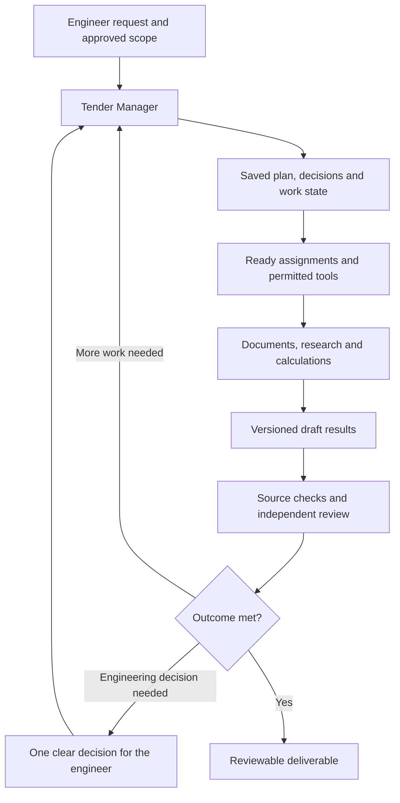

# Quantix: a more capable Tender Manager

Quantix has a sound direction: one persistent Tender Manager, colleagues created for the actual work, preserved originals, source references, separate proposed and accepted quantities, and explicit engineering and spending authority. Its next major improvement should be the ability to carry an unfamiliar tendering request through several verified steps, recover from interruptions and produce a useful result with little supervision.

The recommendation is to strengthen the existing application and progressively complete its engineering tools. Keep the current Python, Pydantic AI, SQLite, React and Tauri foundation. Introduce additional libraries where a measured trial establishes a benefit. A wholesale agent-framework migration is not justified by the evidence currently available.

“Fully agentic” should mean that the Manager can decide how to accomplish an authorised outcome, use tools, create suitable assignments, inspect the results, revise its approach and continue until it has met explicit completion criteria or identified a real blocker. There is no verifiable universal state called “fully max”. Quality must be demonstrated on representative tenders, including difficult and unfamiliar cases.

## Scope and evidence

This assessment covers the supported desktop Tender Office. BIM/IFC and model-based takeoff remain deferred. Ollama/local general-purpose model expansion and the previously excluded external business connectors remain outside scope. Existing provider connections, supported official-client subscriptions, application mail, public web research and local file import/export are preserved. Local OCR and embedding improvements remain within the previously accepted document-processing scope.

Recommendations are proposed design decisions, not claims of implementation or acceptance. The source baseline is the current working tree and the corrected progress record. Public information was checked on 12 September 2026. Official documentation and original research support technical claims; community material supplies first-hand workflow concerns and reported failure cases, not representative accuracy statistics.

The existing [master plan](../superpowers/plans/2026-09-09-adaptive-office-master.md) already contains much of the required domain scope. This report refines that plan's priorities and acceptance criteria; it does not replace the approved specification or mark its tasks complete.

## What Quantix already gets right

Several existing choices should be preserved through every upgrade:

- The Manager is the main contact; specialists exist only when their work is useful.
- Reading source material, performing analysis and obtaining an engineer's review are separate events.
- Original files and historical decisions survive subsequent processing and revisions.
- BOQ quantities stay effective until a separately reviewed proposal changes them.
- Prices carry commercial conditions and uncertainty rather than silently becoming accepted rates.
- AI account identity, billing, approved models, Tender data access and spending limits stay separate.
- Routine authorised work can continue without asking for permission at every step.
- Commercial sending, material engineering decisions and final release retain their own authority.

These choices align with professional emphasis on output assurance and accountability. RICS' responsible-AI standard addresses governance, due diligence, output reliability and transparency, and took effect on 9 March 2026 for its members and regulated firms. That is a useful professional reference; it does not establish that Quantix is certified or that RICS rules govern every Tender. [1](https://www.rics.org/profession-standards/rics-standards-and-guidance/conduct-competence/responsible-use-of-ai)

## The important gaps in the current implementation

| Source finding | Why it matters | Recommended response |
|---|---|---|
| Work review writes `max_depth=1` and `max_concurrency=1`; routing rejects concurrency other than one. | A concurrency implementation exists, but the approved execution path still limits simultaneous colleagues. | Complete admission, scheduling, ownership and cancellation together before raising the limit. |
| Manager calls receive the combined source, staff-generation and coordination tool lists. | Some tools are irrelevant to a particular turn; the common list even contains operations restricted to staff contexts. | Expose applicable tools progressively, keeping server-side permission checks authoritative. |
| The default prompt includes the latest 16 messages and 40 findings, with tools available for older records. | Recency alone is a weak basis for reconstructing a long tender assignment. Older binding decisions can matter more than recent discussion. | Add a compact, persistent working brief with current decisions, open questions, artifact references and next steps. |
| `OfficeOutput` contains bounded lists of different proposal types; draft requests are tied to completion of the run. | A long assignment needs intermediate results it can inspect, correct and reuse before its final response. | Add versioned draft work products and small validated save operations; retain final publication checks. |
| The semantic index uses fixed character chunks and a small multilingual embedding model. | Clause boundaries, table headers, footnotes and drawing identifiers need more structure than text similarity alone. | Improve structural extraction and retrieval evaluation before replacing the embedding model. |
| A deterministic calculation service exists, while the shared Manager tool list exposes drawing calculation rather than a general engineering calculation interface. | Existing arithmetic infrastructure cannot provide its full benefit until it is available through an approved, usable tool. | Expose typed calculation and checking tools, extending supported methods deliberately. |
| Only package triage and quantity reconciliation are bundled as reviewed methods. | A method system exists, but the wider tendering method library is not delivered. | Develop evaluated methods around completed domain tools and real workflows. |
| The corrected progress record leaves full handoffs, continuation, broader reviews and end-to-end acceptance open. | Module names and historical test totals do not prove whole-office behaviour. | Close observable user journeys rather than declaring another infrastructure layer complete. |

Source locations: [work review](../../backend/quantix/plan_review.py), [routing](../../backend/quantix/staff_routing.py), [Manager runtime](../../backend/quantix/office.py), [output schema](../../backend/quantix/office_types.py), [source tools](../../backend/quantix/office_tools.py), [semantic index](../../backend/quantix/semantic.py), [calculations](../../backend/quantix/calculations.py), and [corrected progress](../progress.md).

## What current agent research supports

**Use more agents when the work can actually be divided.** Google Research's controlled study found that architecture mattered: parallelisable tasks benefited from coordination, while sequential tasks could become worse. These are benchmark-specific findings, not a forecast of Quantix's accuracy. A separate supplier investigation for each trade is a reasonable candidate for parallel work; calculating one dependent cash-flow chain may be better kept together. [2](https://research.google/blog/towards-a-science-of-scaling-agent-systems-when-and-why-agent-systems-work/)

**Make assignments precise and scale effort to the request.** Anthropic's research-system account describes objectives, output formats, boundaries and tool guidance for each colleague, and warns about unnecessary delegation and high token use. For Quantix, every assignment should identify the deliverable, source scope, dependencies, budget and required checks. Different professional personalities do not establish independent expertise. [3](https://www.anthropic.com/engineering/multi-agent-research-system)

**Treat delegation as accountable work.** The 2026 research paper *Intelligent AI Delegation* considers responsibility, authority, boundaries, trust and adaptation as part of delegation. It is a proposed framework, not proof that a particular scheduler works. Quantix can apply the useful distinction by recording who owns an unresolved question and what a receiving colleague must verify. [4](https://arxiv.org/abs/2602.11865)

**Save useful state between turns.** Current Pydantic AI documentation describes durable execution and a public backend integration interface. LangGraph distinguishes checkpoints for a running conversation from stores for longer-lived information. Quantix should preserve that separation while keeping Tender records and recovery state local. Documentation establishes an available design pattern; compatibility with the pinned installed versions still needs testing. [5](https://pydantic.dev/docs/ai/capabilities/durable_execution/overview/), [6](https://pydantic.dev/docs/ai/capabilities/durable_execution/backends/), [7](https://docs.langchain.com/oss/python/langgraph/persistence)

**Keep the model's working context relevant.** Anthropic's context-engineering guidance supports selective retrieval and compact working state. The practical application is a task brief containing current constraints and references to exact records, with detailed evidence loaded when needed. A summary must never replace the original clause, spreadsheet row or drawing region. [8](https://www.anthropic.com/engineering/effective-context-engineering-for-ai-agents)

**Measure the whole job.** OpenAI's current evaluation guidance separates trace-based diagnosis from repeatable dataset evaluation. Anthropic likewise distinguishes an agent's sequence of actions from the resulting outcome. Quantix should score whether the correct quantities, sources, unresolved issues and deliverables were produced, and whether the process respected authority and recovered correctly. [9](https://developers.openai.com/api/docs/guides/agent-evals), [10](https://www.anthropic.com/engineering/demystifying-evals-for-ai-agents)

## Recommended execution architecture

Keep one Manager, generate colleagues as required, and put execution control in a small application-owned runtime. The model proposes and reasons; deterministic services calculate, validate, persist and enforce permissions. Each work item has an explicit completion test.

Three approaches are worth distinguishing:

| Approach | Strength | Cost or limitation | Decision |
|---|---|---|---|
| Extend the existing local controller with carefully selected libraries | Preserves Tender authority, original-client routing, storage and existing UI | Requires disciplined ownership of scheduling and recovery | Recommended foundation |
| Integrate an appropriate Pydantic durable-execution backend behind the existing boundary | Could reduce repeated persistence/retry work | Engine deployment, serialization and version compatibility need a focused trial | Evaluate when it solves a demonstrated recovery problem |
| Replace orchestration with LangGraph or Deep Agents | Offers established graph or harness abstractions | Migrating authority, billing, records and desktop recovery is substantial; correctness is not inherited automatically | Keep as a comparison option, not the first upgrade |

LangGraph and Deep Agents are credible reference implementations; Deep Agents bundles planning, context management and delegation. Their availability does not imply that Quantix should adopt both or duplicate its existing state store. [11](https://github.com/langchain-ai/langgraph), [12](https://github.com/langchain-ai/deepagents)

Recent Anthropic architecture work also separates session history, the agent loop and the execution environment. That separation is applicable locally. Adopting its hosted service would be a different storage and operating decision and is not recommended here. [13](https://www.anthropic.com/engineering/managed-agents)

## Priority capabilities

### 1. Persistent work with reliable continuation

The Manager should maintain the requested outcome, completion criteria, current plan, dependencies, decisions, open questions, remaining allowance and exact draft references. Save progress after a useful unit of work, such as completing one supplier comparison or one measured area.

Recovery must recheck the current document revisions, permissions, method versions and account eligibility before reusing a checkpoint. A completed local calculation can be reused if its inputs are unchanged. A supplier send with an uncertain delivery result needs reconciliation, not an automatic repeat.

Completion test: interrupt a multi-step synthetic tender at several points; restart; preserve correct completed work; invalidate stale work; publish no duplicate outputs; send no duplicate messages. Existing plan: T007–T011 and T062.

### 2. A Manager that selects the next useful action

The Manager should distinguish a quick question, a review task, a calculation, a comparison and a long assignment without imposing fixed modes. It should identify the smallest missing input that changes the decision and continue independent work while that input is pending.

Give each task a short expected result and stop condition. Detect repeated searches with no new evidence, duplicated assignments, recurring tool errors and a growing plan that is not producing artifacts. Offer a concrete repair or a clearly bounded continuation rather than endless activity.

Completion test: the same Manager answers a single clause question directly, develops a new comparison for an unfamiliar request and stops an unproductive search with a useful partial result. Existing plan: T007, T010, T017; stronger acceptance emphasis.

### 3. Controlled parallel colleagues

Complete shared resource accounting, per-account serialization where needed, cancellation, prerequisite checks and exact task ownership. Start with a deliberately small configurable cap in synthetic verification, then justify higher limits with actual quality, latency and cost results. This is an implementation starting point, not a universal optimal team size.

Use parallelism for independent source reviews, separate trades, alternative market searches or a genuinely independent check. Keep tightly dependent calculations together. A colleague should return a concise finding plus exact artifact references, rather than copying its whole conversation into the Manager's context.

Completion test: one branch fails, one waits for a question and another finishes; each keeps its own state and allowance; Stop reaches all active work. Existing plan: T005–T009.

### 4. Better tools and progressive discovery

Tools should match engineering intentions: find a clause, reconcile quantities, compare quote terms, check a rate or inspect revision impact. Return a useful summary, explicit completeness/currentness, exact record references and a way to retrieve the full result. Add examples for ambiguous units, partial tables, missing calibration and unavailable sources.

The model should discover a permitted capability's description before loading its full schema or method references. Discovery cannot grant access. Mutating tools require a fresh authority check regardless of whether they were reached from a normal turn, a retry, a resumed task or a colleague.

Anthropic's tool-design guidance supports distinct purposes, clear boundaries, useful return context and evaluation with actual agents. Quantix's tool changes should be judged by successful task completion and fewer erroneous calls, not by the number of functions added. [14](https://www.anthropic.com/engineering/writing-tools-for-agents)

Completion test: a Manager does not receive staff-only operations, finds the right permitted tool for an unfamiliar task and handles a partial result without claiming full coverage. Existing plan: T013–T015 and T060.

### 5. A document reader that understands structure

Preserve the original file and create separate extraction versions. Retain paragraph and clause hierarchy, table headers, merged cells, footnotes, page coordinates, drawing titles and revisions. For spreadsheets, preserve cell addresses, formulas, cached values, hidden content and warnings alongside any interpreted BOQ table.

Benchmark Docling for document layout and tables, and PaddleOCR for difficult scans and Arabic/English recognition. Docling documents layout/table parsing and local execution; its code license does not automatically cover every model. PaddleOCR documents multilingual recognition including Arabic. Neither repository proves accuracy on Quantix's drawings or workbooks. [15](https://github.com/docling-project/docling), [16](https://github.com/PaddlePaddle/PaddleOCR)

Completion test: a mixed synthetic package includes scanned pages, rotated text, bilingual tables, repeated specifications, reversed BOQ headers and broken formulas; extraction exposes every exception and preserves exact source locations. Existing plan: T023–T025 and T035.

### 6. Evidence search with a completeness check

Combine exact identifiers and words, structured filters and semantic retrieval. Add a reranking stage only if it improves a labelled evaluation. Retrieve adjacent clause text and relevant table headers, and expand to referenced documents when necessary. Keep interpretation, observed evidence and conflicting evidence separate.

Provide a coverage view answering: which required sections were searched, which sources were read, which pages remain unreadable, and which claims still lack support? A top-five search result cannot establish that an exclusion or requirement is absent from the package.

Anthropic's contextual-retrieval work combines contextualised chunks, lexical retrieval and embeddings. FastEmbed already offers a cross-encoder interface, making it a suitable first place to evaluate reranking within the existing dependency family. Language suitability and local performance still need testing. [17](https://www.anthropic.com/engineering/contextual-retrieval), [18](https://github.com/qdrant/fastembed)

Completion test: Arabic and English questions find the same applicable clause; a wrong revision is rejected; a table value retains its header; an unanswerable question remains unanswered. Existing plan: T026–T029.

### 7. Revision impact that reaches the estimate and submission

Match old and new sheets or documents, align drawing pages, highlight visual and textual changes and identify affected measurements. Link each change to requirements, BOQ items, rates, quotes, programme activities, assumptions and outputs. Differentiate a changed input, an affected calculation and an impact that remains uncertain.

Bluebeam's documented overlays provide a useful interaction reference for visual comparison. Quantix's distinctive addition should be tracing the change through the commercial and submission records. Visual differences alone do not establish an engineering quantity change. [19](https://support.bluebeam.com/user-manual/menus/document/overlay-pages.html)

Completion test: revising one wall detail identifies the affected quantity and related outputs while retaining the accepted baseline and avoiding unnecessary recalculation elsewhere. Existing plan: T030, T033 and T054.

### 8. Reproducible engineering calculations

Expose the existing calculation service through reviewed tools. Extend it with unit conversion, geometry, assemblies, deductions, material/labour/plant build-ups, productivity, preliminaries, currency basis, markup versus margin and explicit tax treatment. Keep monetary arithmetic decimal-based and preserve intermediate values and rounding rules.

Pint is a candidate for physical-unit handling. It should be evaluated behind Quantix's typed calculation contract, with custom units and decimal behaviour checked. A unit library cannot determine which construction measurement rule applies. RICS NRM distinguishes estimating/cost planning from detailed measurement; Quantix should record the applicable method and edition, not impose one standard globally. [20](https://github.com/hgrecco/pint), [21](https://www.rics.org/profession-standards/rics-standards-and-guidance/sector-standards/construction-standards/nrm)

Completion test: incompatible dimensions fail; calculations reproduce after restart; changing waste or productivity gives an attributable delta; unknown tax treatment prevents a false inclusive total. Existing plan: T032–T037.

### 9. Review that can disagree and prove why

Check numerical work by recomputing it. Check factual findings against exact source passages. Check scope against a requirement or responsibility list. Use a separate reviewer context for material outputs, initially without the author's conclusion when that helps avoid anchoring.

A second model agreeing with the first is insufficient. The review should identify the method, checked inputs, actual coverage, disagreements and unresolved conditions. Use another approved model only where measured results justify it; diversity of provider names is not itself proof of independent reasoning.

Completion test: a deliberately wrong quantity and an unsupported supplier claim are detected; a disagreement remains visible; the reviewer cannot approve the commercial outcome. Existing plan: T012, T029 and T068.

### 10. Scope, responsibility and clarification management

Build a source-linked compliance matrix and trade scope sheets. Identify missing items, duplicated pricing, provisional quantities, design responsibility and gaps between disciplines. Track clarification questions through draft, sent, answered, partially answered and unresolved states using existing mail or local records.

When a clarification is unanswered, the Manager should show the affected scope, the options available and the assumption requiring a decision. Contractual precedence must come from the actual contract and approved interpretation; do not hard-code that drawings or specifications always prevail.

Completion test: a specification requirement absent from the BOQ appears as an unresolved scope item; two trades cannot silently exclude the same interface work. Existing plan: T029–T031 and T044.

### 11. Comparable supplier quotations and purchasing choices

Extract quote lines with their original wording, units, pack sizes, exclusions, delivery charges, taxes, payment terms, lead times, validity, warranties and technical qualifications. Normalise only where the basis is known. Separate the supplier's stated price from Quantix's adjustments and assumptions.

Compare total usable supply cost and technical suitability. Show an apparently cheaper quote's omitted work and unresolved terms. Connect manufacture and delivery dates to the required-on-site programme. Prepare negotiation questions and follow-ups without changing sending authority.

Completion test: quotes for different pack sizes and delivery bases become comparable only after explicit adjustments; an expired or technically unsuitable offer cannot appear as an unconditional preferred option. Existing plan: T040–T047.

### 12. Estimate alternatives, cash flow and programme consequences

Create separate draft scenarios for supplier choice, quantity changes, value engineering, purchasing stages, productivity and programme duration. Preserve the accepted baseline and explain the movement by quantity, rate, currency, scope and time-related cost. Report any unexplained residual.

Add payment, advance, retention, purchasing and receipt assumptions to dated cash-flow scenarios. Use sensitivity ranges before probabilistic claims; a probability distribution requires justified inputs and correlations. Scheduling should first have correct calendars and dependency logic. OR-Tools is a candidate for later constrained resource or purchasing optimisation, not a source of durations or a complete construction scheduler. [22](https://github.com/google/or-tools)

Completion test: a cheaper purchase causes a visible cash shortfall or late arrival; each scenario reproduces from its saved inputs; no scenario silently replaces the live estimate. Existing plan: T018, T038–T039 and T047–T049.

### 13. Complete document production and submission rehearsal

Generate useful technical proposals, method statements, programme narratives, quality/HSE drafts, comparisons and registers from saved work. Preserve client templates and unmapped content. Validate formulas, totals, names, dates, references, required signatures and attachment versions across the complete selected package.

Render the actual draft files for visual checking. Give the Manager structured findings about clipped tables, broken references, blank mandatory fields and inconsistent totals. Rehearse the submission against the source-backed requirements before requesting final release.

Completion test: a missing mandatory attachment or changed price basis blocks a false ready state; the final manifest names the exact reviewed files; local export is not described as external submission. Existing plan: T050–T055.

### 14. Proactive attention and controlled learning

Use approved local watchers for new revisions, unanswered enquiries, expiring quotes, deadlines, changed methods and work stalled on a dependency. Consolidate related issues and rank them by actionable consequence. Show when the computer was asleep or checks were missed; remain quiet when nothing useful changed.

Turn corrected work into a proposed reusable method or lesson with origin, applicability, method version and a regression case. Keep temporary working notes, accepted Tender facts, company guidance and procedural methods in separate scopes. Revalidate dated commercial information before reuse.

Completion test: one quote expiry creates one useful action; a correction from one Tender does not leak its private evidence into another; changing a method runs its evaluation before activation. Existing plan: T004, T014–T016, T019, T021 and T057.

### 15. Broader tender lifecycle assistance

Complete public opportunity research and bid/no-bid briefs using explicit company capability evidence, qualification requirements and estimating effort. Maintain the tender calendar, site-visit obligations, deadlines and certificate validity. Dedicated portal feeds remain excluded.

After submission, prepare clarifications against the fixed submitted baseline, compare negotiation proposals and assemble an award handover with unresolved risks and commitments. Record known win/loss reasons separately from speculation. Compare estimated and actual outcomes only where scope, units, currency and commercial bases match.

Add bilingual terminology checks and sustainability comparisons using supplied, applicable factors. These are engineering outputs supported by local records, not an excuse to introduce the excluded business-system connectors. Existing plan: T020–T022, T052–T053 and T056–T057.

### 16. A simple interface backed by honest state

The main view should answer what the Manager is doing, what is ready, what needs attention and what happens next. Show source-linked decisions in a short queue, with the consequence and recommended action. Let the engineer open the exact evidence and return without losing their place.

Expose genuine activity and results. Keep technical route details, full exchanges, traces and advanced controls under More options. A colleague portrait or animation must be driven by actual saved activity. Capability labels should distinguish available, configured, checked on a sample and blocked, with dates and relevant limitations.

Completion test: an interrupted or disconnected office cannot look actively productive; light/dark, keyboard use, narrow layouts and native scaling preserve the decision journey. Existing plan: T062–T067.

## Proposed tool additions and refinements

The following names are illustrative design proposals, not existing API contracts. Reuse or extend an existing operation where it already serves the purpose. Keep a small set of composable operations in each capability group and expose them only when relevant and permitted.

| Plain-English tool | Possible operation | Result or boundary |
|---|---|---|
| Save the current working brief | `save_work_brief` | Outcome, constraints, decisions, open questions and referenced drafts; no new authority |
| Inspect remaining work | `inspect_work_graph` | Actual dependencies, owners, blockers and completion criteria |
| Revise the remaining plan | `propose_plan_revision` | Change the unfinished work within the grant; escalate only changes that require a new decision |
| Save a useful intermediate result | `save_work_product` | Versioned table, calculation sheet, note or document with source bases |
| Continue from valid saved work | `resume_work_step` | Revalidate current inputs and avoid repeating confirmed effects |
| Find a relevant permitted tool | `discover_capabilities` | Task-relevant descriptions and limitations without granting access |
| Check document-processing coverage | `inspect_extraction_coverage` | Readable, unreadable, partial and unprocessed sections with reasons |
| Read a spreadsheet table precisely | `read_table_region` | Rows, headers, units, formulas, cached values and cell locations |
| Find linked evidence | `follow_evidence_links` | Referenced clauses, drawings, BOQ rows and decisions in this Tender |
| Check support for a claim | `check_claim_support` | Supporting, conflicting or insufficient evidence; scoped coverage |
| Compare document revisions | `compare_source_versions` | Text, table or drawing changes with alignment uncertainty |
| Trace a change through the tender | `trace_change_impact` | Affected quantities, rates, quotes, activities, assumptions and outputs |
| Reconcile scope and responsibilities | `check_scope_coverage` | Missing, duplicate and unassigned work linked to source requirements |
| Calculate engineering quantities | `calculate_engineering` | Typed inputs, units, formula, rounding, result and reproducibility record |
| Calculate an assembly | `calculate_assembly` | Components, dimensions, counts, deductions and allowances |
| Check a saved calculation | `verify_calculation` | Independently recomputed results and specific discrepancies |
| Query the BOQ | `query_boq` | Typed filters, totals and rows; no arbitrary database access |
| Check an estimate's completeness | `check_estimate_coverage` | Missing rates, incompatible units, duplicate scope and unresolved bases |
| Collect current public evidence | `research_public_sources` | Approved search/fetch route with attribution, dates and outgoing-data controls |
| Save a market observation | `save_market_observation` | Exact product, source, date, location, currency and commercial terms |
| Extract a supplier quotation | `extract_quote_lines` | Original lines plus proposed structured interpretation |
| Compare quotations fairly | `normalise_quote_comparison` | Visible adjustments and explicit reasons for non-comparability |
| Check procurement timing | `check_delivery_dates` | Order, approval, manufacture and delivery dates against programme needs |
| Create a separate estimate option | `create_estimate_scenario` | Explicit overrides and a preserved baseline |
| Explain a cost change | `explain_estimate_delta` | Quantity, price, scope, currency and duration contributions plus residual |
| Calculate cash requirements | `calculate_cashflow` | Dated assumptions, receipts, payments and incomplete periods |
| Compare technical alternatives | `compare_value_options` | Cost, compliance, programme, maintenance and evidence gaps |
| Check a programme | `check_programme` | Calendars, dependencies, duration bases and resource conflicts |
| Ask for an independent review | `request_work_review` | Exact result version, review scope and review criteria |
| Inspect a produced document | `inspect_output_render` | The actual rendered draft and actionable visual/content checks |
| Rehearse the submission | `rehearse_submission` | Required contents, consistency, unresolved decisions and exact versions |
| Propose a meaningful watch | `propose_local_watch` | Trigger, checked records, bounds, notification rules and last-check status |
| Propose a reusable lesson | `propose_reusable_method` | Scoped, versioned correction with evidence and an evaluation case |
| Run bounded transformations | `run_reviewed_composition` | Optional restricted interpreter over explicitly allowed data/functions |

None of these operations should let the model approve its own quantities, prices, material assumptions, supplier sends or release. Approval must refer to the exact current object. A broad tool such as “finish tender” would hide too many distinct consequences to be a useful execution contract.

## GitHub and library shortlist

Repository activity and documented capabilities were checked separately from Quantix compatibility. Eleven candidate/reference repositories were inspected through their official pages and public GitHub metadata. All were unarchived at inspection, but unarchived status and recent commits are not proof of quality, security or fit. Pinned releases, transitive dependencies, model licences, Windows operation and workload tests remain necessary before adoption.

| Project | Recommendation | Concrete benefit and qualification |
|---|---|---|
| [Pydantic AI](https://github.com/pydantic/pydantic-ai) | Keep; evaluate selected current public capabilities | Fits the existing typed Python/provider layer. Trial durable operations and progressive tool discovery without importing unrelated harness features. Current online documentation is not proof of compatibility with Quantix's pinned package. |
| [LangGraph](https://github.com/langchain-ai/langgraph) | Use as a persistence/orchestration reference | Study checkpoint, interruption and subgraph behaviour. A replacement needs a measured migration advantage. |
| [Deep Agents](https://github.com/langchain-ai/deepagents) | Study its planning, context and delegation design | Useful comparison for a general-purpose harness. Do not add a second independent planner and memory system beside the Manager. |
| [Docling](https://github.com/docling-project/docling) | Trial on difficult documents | Compare table/layout accuracy, source coordinates and local resource use with existing readers. Preserve the dedicated Excel path. Check model licences separately from MIT-licensed code. |
| [PaddleOCR](https://github.com/PaddlePaddle/PaddleOCR) | Trial as an OCR adapter | Evaluate Arabic, English, numbers and rotated annotations. Measure CPU/memory cost and model size; do not bundle every pipeline. Code is Apache-2.0; review selected model terms. |
| [FastEmbed](https://github.com/qdrant/fastembed) | Extend the already-used family first | Compare multilingual retrieval and reranking on labelled Tender questions. A Qdrant server is not required merely to use FastEmbed. |
| [Pint](https://github.com/hgrecco/pint) | Trial behind the calculation contract | Improve physical-unit parsing and dimensional checks. Validate decimal behaviour and custom construction units. GitHub's automated licence classification was inconclusive, so inspect the actual chosen release's licence before adoption. |
| [OR-Tools](https://github.com/google/or-tools) | Add when constraint optimisation is a real requirement | Resource allocation or purchasing schedules with explicit constraints. Preserve readable inputs and an explainable solution; no fabricated productivity or price inputs. |
| [OpenTelemetry Python](https://github.com/open-telemetry/opentelemetry-python) | Consider for local structured traces | Common API/SDK for observing work across components. Configure local/redacted output and explicit retention; no automatic hosted transmission of Tender content. |
| [Monty](https://github.com/pydantic/monty) | Research pilot for bounded code composition | A restricted Python interpreter with explicit host access and resource limits. Check subset compatibility and maturity. It is not full CPython and does not establish the full-Python isolation gate. |
| [AutoGen](https://github.com/microsoft/autogen) | Do not choose as a new foundation | Its official repository states maintenance mode and directs new users toward Microsoft Agent Framework. This illustrates why old “best agent framework” lists need verification. |

The OpenTelemetry API/SDK is a building block for instrumentation; the recommendation to keep traces local and redact Tender content follows Quantix's own storage/privacy requirements. [23](https://github.com/open-telemetry/opentelemetry-python)

Monty's current repository documents a Python subset, serialisable paused execution, explicit host-provided functions and enforced resource limits. Treat its security claims as a qualification target. Start with harmless table transformations and calls to already-reviewed calculations, and test denial of filesystem, network, environment and resource abuse. Full Python with scientific packages needs its own validated isolation design. [24](https://github.com/pydantic/monty)

On Windows, Microsoft documents configurable networking and read-only mapped folders for Windows Sandbox. This makes it a candidate isolation primitive, not a completed cross-platform Quantix runner. Availability, lifecycle, cancellation, host storage and output collection must be validated before enabling general code execution. Quantix-managed host files should remain beneath `~/.quantix`. [25](https://learn.microsoft.com/en-us/windows/security/application-security/application-isolation/windows-sandbox/windows-sandbox-configure-using-wsb-file)

## What GitHub and communities added

The useful community findings are workflow and failure examples, with their limits preserved:

| Source | First-hand concern or discussion | Consequence for Quantix |
|---|---|---|
| [Estimators discussing AI estimating](https://www.reddit.com/r/estimators/comments/1wa3fuz/has_anyone_actually_had_success_with_an_ai/) | Contributors report benefits for scope sheets and specification checks alongside unreliable quantities, pricing and unresolved drawing/specification conflicts. | Measure missed scope, bad line items and correction time. Do not grade only the grand total or the appearance of the report. |
| [Estimators discussing plan revisions](https://www.reddit.com/r/estimators/comments/1tjjbuk/how_do_you_handle_estimate_revisions_when_plans/) | A practitioner describes retaining the original takeoff, hiding unaffected layers and comparing changed totals. | Preserve baseline work and make selective revision updates easy to inspect. |
| [LangGraph issue 6792](https://github.com/langchain-ai/langgraph/issues/6792) | An open report describes prior outputs being repeated around a subgraph interruption. | Include nested interruption and side-effect reuse in Quantix's acceptance cases. This is a version-specific report, not proof of a universal LangGraph defect. |
| [LangGraph issue 6626](https://github.com/langchain-ai/langgraph/issues/6626) | A closed report describes identical interruption identities in parallel tools. | Test exact assignment/question identity and simultaneous replies. Do not present a closed report as a current unresolved bug. |
| [Hacker News discussion of agent scaling](https://news.ycombinator.com/item?id=46847958) | Readers challenge generalisation of benchmark results; one contributor describes specialised evaluation as useful in their system. | Benchmark Quantix's own tasks. Do not copy reported percentage gains or provider rankings into product claims. |

These are self-selected public discussions. Contributor identities and experiences are not independently verified, and product promotion can appear in replies. The report therefore uses the original repositories and research for technical capabilities, and the discussions to identify cases worth testing.

LangGraph's own interruption documentation explains that a resumed node restarts from its beginning, so preceding code may execute again. The general lesson is to design deliberate operation boundaries, stable identifiers and repeat-safe effects, regardless of the selected framework. [26](https://docs.langchain.com/oss/python/langgraph/interrupts)

## Authority, security and model selection

Autonomy should grow inside a clearly stated work allowance: permitted sources, outputs, tools, methods, models, online research, duration and spending. The Manager may rearrange authorised work and save draft artifacts. A changed billing route, additional data disclosure or material engineering commitment remains a distinct decision.

Place those checks in the application services and each tool boundary. A prompt, persona, plugin description or model-generated plan cannot grant permission. Recheck the exact current basis before consequential changes. Preserve separate API and official-client subscription execution, with no credential copying or silent paid fallback.

Documents, supplier replies, web pages and installed method content can contain instructions that conflict with the engineer's request. OpenAI's agent-safety guidance describes that prompt-injection risk and recommends structured handling and isolation; it also makes clear that these techniques do not remove the risk completely. [27](https://developers.openai.com/api/docs/guides/agent-builder-safety)

For MCP, official security guidance identifies token passthrough, audience validation and confused-deputy risks. Apply these principles to existing and future permitted tools without enabling excluded connectors. Tool annotations are descriptions, not a replacement for policy enforcement. [28](https://modelcontextprotocol.io/docs/2026-07-28/tutorials/security/security_best_practices), [29](https://blog.modelcontextprotocol.io/posts/2026-03-16-tool-annotations/)

Use the OWASP Agentic Applications guidance as a source of failure scenarios for tool misuse, unsafe delegation and excessive access. Incorporate those scenarios into normal implementation testing rather than presenting the engineer with a security checklist before each ordinary task. [30](https://genai.owasp.org/resource/owasp-top-10-for-agentic-applications-for-2026/)

Select models using measured task performance: clause extraction, bilingual table reading, drawing inspection, long comparisons, structured tool use and review. The Manager can propose suitable configured routes, but the approved alternatives and budget remain binding. Do not hard-code a provider as permanently best at a trade, use every provider for every result, or choose an expensive model only because it is newer.

A failed capability probe should remove that capability from the relevant route until repaired. Record which model/account/version was actually checked and whether the check covered text, images, tools, structure, research or continuation. Original clients may expose less detailed usage or internal execution than direct APIs; unavailable measurements must remain unavailable rather than being presented as exact.

## Delivery sequence

Complete working increments in the existing master plan. Avoid a second disconnected backlog of infrastructure names.

| Increment | Deliverable | Required proof before broadening |
|---|---|---|
| **A. Reliable Manager execution** | Working brief, versioned intermediate drafts, correct continuation, scoped discovery and traceable checks | An unfamiliar multi-step request survives interruption, preserves prior decisions and completes without duplicate effects. Maps primarily to T007–T017, T062 and T068. |
| **B. Evidence and revision review** | Structural reading, bilingual retrieval, coverage, source comparison and downstream impact | An addendum changes the correct linked items; unreadable and missing evidence stay visible. Maps to T023–T031 and T033–T035. |
| **C. Quantities and commercial work** | Reviewed calculation tools, scope reconciliation, comparable quotations, scenarios and cash flow | Every important number reproduces; incompatible offers and unknown commercial bases remain explicit. Maps to T032–T047. |
| **D. Complete tender package** | Programme checks, technical drafts, client forms and submission rehearsal | The actual generated files satisfy the selected requirements and survive visual/content review. Maps to T048–T055. |
| **E. Proactivity and learning** | Bounded watches, approved methods, company evidence, handover and matched outcome learning | Changes create useful actions without noise, duplicate sending or cross-Tender leakage. Maps to T016, T019–T022 and T056–T059. |

Controlled concurrency should be introduced during Increment A only after state and Stop behaviour pass, and then exercised throughout later increments. Restricted code composition is a contained trial around reviewed tools; full Python remains dependent on validated isolation. Tablet and voice retain their later delivery position.

The first concrete upgrade should join **persistent work state, intermediate draft artifacts and reliable continuation** into one user journey. These make the Manager useful for larger tasks immediately and create the foundation on which additional engineering tools can work reliably.

## Acceptance and measurement

Start with a manageable set of engineer-labelled synthetic cases spanning common and adversarial conditions, then expand it as failures reveal new cases. Hold back unfamiliar combinations to check generalisation. Repeat nondeterministic runs; preserve the model and tool versions, input hashes and actual results. Do not let an agent modify the expected answers of the evaluation it is trying to pass.

| Measure | What should be recorded |
|---|---|
| Task completion | Fraction of cases that achieve the requested outcome, including correct handling of genuinely missing information |
| Source support | Whether every sampled material claim is supported by the cited current source; incorrect and absent citations counted separately |
| Requirement coverage | Found mandatory requirements divided by the known applicable requirements in the labelled fixture |
| Quantity/rate correctness | Exact or justified-tolerance comparison with independently calculated answers, using the declared units and rounding |
| Revision impact | Correctly identified affected items, missed effects and unnecessary invalidations |
| Recovery | Completed work retained, stale work rejected and effects reconciled after injected interruption |
| Authority | Attempts and actual occurrences of unauthorised quantity/rate acceptance, data transmission, billing changes, sending or release |
| Efficiency | Time to first useful draft, total completion time, repeated tool calls, known provider usage and engineer correction time |
| User experience | Number of material decision interruptions, source-navigation success and actual native scaling/accessibility results |

Pass/fail controls such as cross-Tender access and duplicate sending need zero observed violations in the required cases; this is a test gate, not a mathematical guarantee of universal safety. Accuracy and productivity targets should be agreed after a baseline is measured. No percentage improvement or benchmark result is claimed for the proposed upgrades.

Five whole-job stories should anchor the release evidence:

1. **Unfamiliar tender review:** import a mixed package, detect its meaningful omissions, answer a source-backed question and propose useful work without a predefined specialist roster.
2. **Quantity reconciliation:** inspect dimensions, calculate a proposed assembly, explain a BOQ difference and obtain a separate decision before it affects the estimate.
3. **Late addendum:** compare revisions, retain unaffected work, recalculate dependent drafts and prevent an outdated submission from appearing ready.
4. **Supplier decision:** compare technically and commercially different quotations, show delivery and cash consequences and prepare the exact unsent clarification request.
5. **Interrupted final preparation:** stop during document production, resume valid work, inspect the generated files and produce a reviewable package with outstanding decisions clearly stated.

## Practices to avoid

- A permanently active roster of dozens of colleagues or unlimited recursive delegation.
- Counting chat messages, tool calls or animations as completed engineering work.
- Using an LLM's arithmetic or a second model's agreement as the final check of a material number.
- Repeatedly loading the whole Tender or retaining every conversation turn in the active prompt.
- Replacing the existing framework, database or provider layer without a demonstrated improvement and migration proof.
- Installing an unrestricted plugin catalogue or giving the Manager arbitrary shell/database access as a shortcut to flexibility.
- Allowing generated methods to change permissions, live production code or evaluation answers automatically.
- Treating source similarity, retrieved snippets or a plausible total as proof of full coverage.
- Optimising the estimate's headline price while ignoring exclusions, delivery, validity, payment and technical compliance.
- Claiming a complete Tender Office from fixture counts, module presence or marketing descriptions.

## Source register

The following original sources support the cited findings. Living documentation and repository pages were accessed on 12 September 2026; their advertised capabilities require separate Quantix integration testing. Dates below are publication dates where clearly available, otherwise the source is identified as living documentation. Community pages display relative dates and can be re-crawled at different times; exact dates are not inferred from inconsistent relative labels.

| Ref. | Publisher and original source | Date or status | Use |
|---|---|---|---|
| 1 | RICS, [Responsible use of artificial intelligence in surveying practice](https://www.rics.org/profession-standards/rics-standards-and-guidance/conduct-competence/responsible-use-of-ai) | Effective 9 March 2026; living guidance | Professional assurance, governance and transparency |
| 2 | Kim and Liu, Google Research, [Towards a science of scaling agent systems](https://research.google/blog/towards-a-science-of-scaling-agent-systems-when-and-why-agent-systems-work/) | 28 January 2026 | Task-dependent benefits and costs of multi-agent coordination |
| 3 | Anthropic, [How we built our multi-agent research system](https://www.anthropic.com/engineering/multi-agent-research-system) | 13 June 2025 | Scoped delegation, adaptive effort and evaluation |
| 4 | Tomašev, Franklin and Osindero, [Intelligent AI Delegation](https://arxiv.org/abs/2602.11865) | Submitted 12 February 2026; research proposal | Responsibility, authority and adaptation |
| 5 | Pydantic, [Durable Execution](https://pydantic.dev/docs/ai/capabilities/durable_execution/overview/) | Living documentation | Durable agents and supported integration choices |
| 6 | Pydantic, [Building a durable execution backend](https://pydantic.dev/docs/ai/capabilities/durable_execution/backends/) | Living documentation | Public runtime integration interface |
| 7 | LangChain, [Persistence](https://docs.langchain.com/oss/python/langgraph/persistence) | Living documentation | Checkpoint versus longer-term store |
| 8 | Anthropic, [Effective context engineering for AI agents](https://www.anthropic.com/engineering/effective-context-engineering-for-ai-agents) | 29 September 2025 | Relevant context and compact working state |
| 9 | OpenAI, [Evaluate agent workflows](https://developers.openai.com/api/docs/guides/agent-evals) | Living documentation | Traces, graders and repeatable datasets |
| 10 | Anthropic, [Demystifying evals for AI agents](https://www.anthropic.com/engineering/demystifying-evals-for-ai-agents) | 9 January 2026 | Agent outcomes and evaluation design |
| 11 | LangChain, [LangGraph repository](https://github.com/langchain-ai/langgraph) | Maintainer repository | Orchestration reference |
| 12 | LangChain, [Deep Agents repository](https://github.com/langchain-ai/deepagents) | Maintainer repository | Planning, context and delegation harness |
| 13 | Anthropic, [Scaling Managed Agents](https://www.anthropic.com/engineering/managed-agents) | 8 April 2026 | Separation of history, execution loop and environment |
| 14 | Anthropic, [Writing effective tools for agents](https://www.anthropic.com/engineering/writing-tools-for-agents) | 11 September 2025 | Tool boundaries, return context and evaluation |
| 15 | Docling project, [Docling](https://github.com/docling-project/docling) | Maintainer repository | Document conversion, table/layout structure and licence distinction |
| 16 | PaddlePaddle, [PaddleOCR](https://github.com/PaddlePaddle/PaddleOCR) | Maintainer repository | Multilingual OCR candidate |
| 17 | Anthropic, [Contextual Retrieval](https://www.anthropic.com/engineering/contextual-retrieval) | 19 September 2024 | Lexical and semantic retrieval with contextual chunks |
| 18 | Qdrant, [FastEmbed](https://github.com/qdrant/fastembed) | Maintainer repository | Existing dependency family and reranking interface |
| 19 | Bluebeam, [Overlay pages](https://support.bluebeam.com/user-manual/menus/document/overlay-pages.html) | Living product documentation | Drawing-comparison interaction reference |
| 20 | Pint maintainers, [Pint](https://github.com/hgrecco/pint) | Maintainer repository | Physical-unit handling candidate |
| 21 | RICS, [New Rules of Measurement](https://www.rics.org/profession-standards/rics-standards-and-guidance/sector-standards/construction-standards/nrm) | 2021 suite; 2022 category reissue noted by RICS | Method/edition distinction for estimating and measurement |
| 22 | Google, [OR-Tools](https://github.com/google/or-tools) | Maintainer repository | Constraint optimisation candidate |
| 23 | OpenTelemetry, [Python API and SDK](https://github.com/open-telemetry/opentelemetry-python) | Maintainer repository | Instrumentation candidate |
| 24 | Pydantic, [Monty](https://github.com/pydantic/monty) | Maintainer repository; pre-V1 status visible | Restricted interpreter pilot and limits |
| 25 | Microsoft, [Use and configure Windows Sandbox](https://learn.microsoft.com/en-us/windows/security/application-security/application-isolation/windows-sandbox/windows-sandbox-configure-using-wsb-file) | Living documentation | Isolation configuration candidate |
| 26 | LangChain, [Interrupts](https://docs.langchain.com/oss/python/langgraph/interrupts) | Living documentation | Resume semantics and repeated pre-interrupt code |
| 27 | OpenAI, [Safety in building agents](https://developers.openai.com/api/docs/guides/agent-builder-safety) | Living documentation | Untrusted-input handling and residual risk |
| 28 | Model Context Protocol, [Security Best Practices](https://modelcontextprotocol.io/docs/2026-07-28/tutorials/security/security_best_practices) | Protocol documentation dated 28 July 2026 | Authentication, token handling and tool boundaries |
| 29 | Model Context Protocol, [Tool Annotations as Risk Vocabulary](https://blog.modelcontextprotocol.io/posts/2026-03-16-tool-annotations/) | 16 March 2026 | Limits of descriptive hints |
| 30 | OWASP, [Top 10 for Agentic Applications for 2026](https://genai.owasp.org/resource/owasp-top-10-for-agentic-applications-for-2026/) | 2026 edition | Agent-specific failure scenario reference |
| 31 | Microsoft, [AutoGen repository](https://github.com/microsoft/autogen) | Maintenance mode stated by maintainer | Avoiding an outdated new-foundation recommendation |
| 32 | Pydantic, [Pydantic AI repository](https://github.com/pydantic/pydantic-ai) | Maintainer repository | Existing stack and public capability reference |
| 33 | r/estimators, [AI estimating experience discussion](https://www.reddit.com/r/estimators/comments/1wa3fuz/has_anyone_actually_had_success_with_an_ai/) | Community discussion; date labels inconsistent | Qualitative scope, quantity and correction concerns |
| 34 | r/estimators, [Estimate revisions discussion](https://www.reddit.com/r/estimators/comments/1tjjbuk/how_do_you_handle_estimate_revisions_when_plans/) | Community discussion | Baseline preservation and selective updates |
| 35 | LangGraph contributor, [Issue 6792](https://github.com/langchain-ai/langgraph/issues/6792) | Opened 12 February 2026; open at inspection | Reported subgraph continuation failure case |
| 36 | LangGraph contributor, [Issue 6626](https://github.com/langchain-ai/langgraph/issues/6626) | Opened 25 December 2025; closed at inspection | Historical parallel interruption-identity case |
| 37 | Hacker News, [Agent-scaling discussion](https://news.ycombinator.com/item?id=46847958) | Community discussion | Challenges to benchmark generalisation |

Relevant local authorities are the [product specification](../spec.md), [accepted adaptive scope](../design/adaptive-office-scope.md), [live office brief](../design/live-dynamic-office.md), [connection contract](../subscription-connections.md), [interface contracts](../contracts.md), [corrected progress](../progress.md) and [master implementation plan](../superpowers/plans/2026-09-09-adaptive-office-master.md). The source findings in this report are a focused architecture assessment, not a new end-to-end acceptance run.
