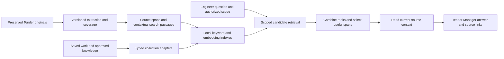

# Quantix embedding and retrieval analysis

Date: 13 September 2026. Status: analysis complete; proposed changes are not implemented by this report.

## Recommendation

Retain `intfloat/multilingual-e5-small` as the baseline and improve the system around it. Quantix already runs the model locally through FastEmbed/ONNX on the CPU. The largest immediate opportunities are reliable preparation, permission-aware combined search, better source context, and retrieval of saved work. There is no evidence from this audit that adding another embedding model, hosted vector service or generative model is the first useful step.

The desired experience is: the engineer imports documents and asks an ordinary question; the Tender Manager finds the right current passages, checks their context, reuses applicable saved work, and answers with inspectable sources. Search preparation and technical controls should sit behind that experience, with one clear action when something needs attention.

This analysis covers the current working tree, including existing uncommitted work. It follows `spec.md`, `contracts.md`, `progress.md` and the existing source/approval/storage boundaries. It is not a claim that all proposed improvements have been approved as completed software.

## What is already implemented

- Local E5 model, pinned repository revision, 384-dimensional normalized vectors, CPU execution and explicit query/passage prefixes.
- SQLite vector cache separate from the source database; repeated passage text can share vectors while retaining source occurrences.
- Source/model/extractor fingerprints, cancelled-build preservation, completed-batch reuse, current-source joins and explicit missing/stale states.
- Keyword search using SQLite FTS5, semantic source search, and reciprocal-rank fusion in the HTTP `combined` search mode.
- A semantic-search tool available to the Manager and reviewed specialists; ordinary source-reading and publication checks remain authoritative.
- Source dependency tracking for working notes, work products and the Manager's working brief; explicit engineer promotion to company knowledge.
- Search preparation UI, source previews and exact source locations.

These are foundations to extend, not subsystems to replace. Principal implementation: [semantic.py](../../backend/quantix/semantic.py), [search API](../../backend/quantix/api.py), [source tools](../../backend/quantix/office_tools.py), [semantic agent tool](../../backend/quantix/office_business.py).

## Evidence gathered in this audit

### Fresh checks

| Check | Result | What it establishes |
| --- | --- | --- |
| Semantic, structure, search-stall, memory and work-product-list tests | 21 passed | Existing focused behavior remains passing in this working tree. |
| Extraction reprocessing, work-product dependencies and tool-read policy tests | 20 passed | Existing extraction and dependency/read safeguards pass their focused tests. |
| Synthetic scope-ordering probe with deterministic vectors | A permitted candidate existed, but limit-then-filter returned zero | Reproduces the ranking/filter order used in the tools; it is not a live staff-grant acceptance test. |
| Synthetic keyword duplicate probe | Requested two distinct results; received one despite another distinct matching source | Forty repeated document copies exhausted the bounded pre-deduplication candidate list. A larger limit found the second source. |
| Real DOCX extraction probe | Heading and body became separate `word_paragraph` records, both with empty metadata | The normal reader does not preserve heading context for this simple document. |
| Existing local E5 model, unrelated question against two synthetic construction passages | Two hits, scores 0.7168 and 0.7166 | The service returns nearest passages even when they do not answer the question. Scores are not answer confidence. |

The unrelated query was “What is the orbital period of Neptune?” The synthetic corpus contained roof waterproofing and reinforcing-steel requirements. Its three warm searches took 36.75, 45.16 and 41.55 ms. These timings describe only that two-record diagnostic, not large-Tender latency or cold startup.

The analysis-only probe and output are retained locally under `~/.quantix/cache/development/2026-09-13-retrieval-audit/` as `probe.py` and `probe-result.json`. It creates isolated synthetic workspaces and reads only an already installed model. Its first attempt stopped on a missing `extract_document` argument; the corrected probe completed. No customer database, account, approval or commercial-send action was used.

The earlier full agentic office acceptance record (in git history) reported six bilingual queries over twelve records: recall@1 0.50, recall@3 1.00 and MRR 0.722222. That remains a small smoke benchmark. Most semantic regression tests use deterministic vectors; they establish mechanics, not linguistic quality.

The [progress record](../progress.md) also documents a previous live Manager turn using 46 requests and approximately 1.96 million input tokens, including 19 searches repeatedly returning the same passages. That is prior execution evidence of the user-experience problem, not a fresh result from this audit. It motivates passage reuse and retrieval strategy changes; it does not establish that switching search modes alone would achieve a particular saving.

### Limits

This was a source audit with focused tests and isolated probes. It did not run the entire regression suite, visually verify a changed application, benchmark the customer Tender, measure production memory, or use a paid/live language-model route. Those are implementation acceptance activities, not results claimed here.

## Changes needed

Priority meanings: **P0** is a correctness prerequisite for expanding use; **P1** delivers the main user benefit; **P2** improves operation or is conditional on measurement. “Confirmed” means inspected behavior or a reproduced result. “Design” means a required decision for the proposed extension, rather than an existing failure.

### Source preparation and context

| ID | Priority / evidence | Current behavior and required change |
| --- | --- | --- |
| R01 | P1 / confirmed | Import refreshes the BOQ but does not schedule semantic indexing. Add automatic, durable preparation after successful source changes, with one pending desired source generation per Tender. Manual rebuild becomes a recovery/advanced action. See `JobManager._execute` and `start_index`. |
| R02 | P0 / confirmed | `ExtractionService.reprocess` saves `segments_json` in `extraction_versions`; neither semantic snapshots nor FTS read that table. The insert does not bind `artifact_id`. Introduce explicit artifact-bound extraction versions and publish usable derived evidence into the canonical reader/search path. Reprocessing must change what can be searched without altering the original file or erasing older evidence. |
| R03 | P1 / confirmed | `_structure` can retain supplied heading metadata, but normal PDF extraction emits page text and DOCX extraction emits paragraphs without heading hierarchy. Preserve observed headings, paragraph/table order and locators in extraction. Do not confuse the hand-built structure test with reader integration. |
| R04 | P1 / confirmed | Spreadsheet rows are embedded as coordinate/value strings; Word table cells are separate paragraphs. Add bounded retrieval context linking rows to observed headers, sheet/table identity and parent sections. Keep formulas, cached values, missing-result warnings, merged/hidden cells and unverified column interpretation visible. Do not infer quantities from an embedding. |
| R05 | P1 / confirmed | `_chunks` bounds individual evidence records by characters and token count; it cannot connect a heading, its body, adjacent page or another table cell. Create passage-to-source span mappings and bounded parent/neighbor expansion. Split long content without dropping exceptions, qualifications, units or table relationships. Preserve every original offset used for citations. |
| R06 | P0 / confirmed | Index readiness concerns readable evidence only. It can coexist with unreadable pages, failed extraction and drawing-only content. Return indexed coverage alongside extraction exceptions; keep imported, extracted, indexed, analysed and reviewed states distinct. A successful index is never complete package understanding. |

Sources: [jobs.py](../../backend/quantix/jobs.py), [extraction_adapters.py](../../backend/quantix/extraction_adapters.py), [later_routes.py](../../backend/quantix/later_routes.py), [documents.py](../../backend/quantix/documents.py), [evidence_tools.py](../../backend/quantix/evidence_tools.py), [semantic.py](../../backend/quantix/semantic.py).

### Search relevance and source scope

| ID | Priority / evidence | Current behavior and required change |
| --- | --- | --- |
| R07 | P0 / confirmed + probe | Both agent keyword and semantic search select the top results before filtering specialist source permissions. Move validated artifact/version scope into candidate selection, before ranking and deduplication. An empty permitted scope must return no candidates, never mean unrestricted. Revalidate scope before releasing passages. |
| R08 | P0 / confirmed + probe | Keyword search overfetches `limit * 8` before collapsing document duplicates. Repeated copies can consume that whole window. Retrieve distinct permitted results using a grouped query or bounded continuation, with explicit truncation when a resource ceiling is reached. Preserve duplicate source occurrences for inspection and scope. |
| R09 | P1 / confirmed | Combined search lives inside the HTTP handler, while the Manager is explicitly told to use keyword `search_sources`. Move candidate generation, fusion and ranking into a common service used by agent tools and UI. Make ordinary search use that service with an explicit result mode/status. This is integration work, not a missing fusion algorithm. |
| R10 | P1 / confirmed | FTS constructs an OR query from the first sixteen tokens; file paths/titles are searched separately in the Words UI. Add deliberate exact phrase, identifier, filename, clause, grade and numeric/unit matching. Keep the original query and literal source text. Arabic normalization and optional aliases belong in a versioned search representation, not in rewritten evidence. |
| R11 | P1 / confirmed | A fixed bilingual boost recognizes just concrete, pump and capacity groups. It also overlaps the small benchmark's pump cases. Treat this as an unvalidated heuristic, not general engineering language support. Compare an ablation without it; add a curated, inspectable glossary only if held-out questions demonstrate a benefit. |
| R12 | P1 / confirmed | Semantic search keeps only the best chunk per evidence record. Several relevant clauses on one PDF page can be lost. Support multiple useful non-overlapping spans per source under a total result budget, with context expansion and exact open-location behavior. |
| R13 | P0 / confirmed + probe | Any nearest neighbors can be returned for an unrelated query. Add relevance/answerability evidence and an explicit “no supported answer found” route. Do not use a universal cosine cutoff or display cosine as confidence. Absence of a good match must remain distinct from missing extraction or an unavailable index. |
| R14 | P1 / confirmed | `Files.tsx` applies document-kind filtering after server result limits; the backend handles area/status but not kind. Move all result-shaping filters into retrieval before limiting. Keep the existing explicit explanation that ordinary search uses current revisions; history remains a separate exact-version inspection path. |

Sources: [repository.py](../../backend/quantix/repository.py) `search`, [office_tools.py](../../backend/quantix/office_tools.py) `search_sources`, [office_business.py](../../backend/quantix/office_business.py) `search_semantic_sources`, [api.py](../../backend/quantix/api.py) `search`, [Files.tsx](../../src/features/Files.tsx), [office.py](../../backend/quantix/office.py).

The current post-filtering code prevents out-of-scope passages being returned. R07 is a confirmed recall defect; this audit does not claim it reproduced unauthorized source disclosure.

### Manager behavior, passage budgets and interface

| ID | Priority / evidence | Current behavior and required change |
| --- | --- | --- |
| R15 | P1 / confirmed | The Manager prompt has a working brief and recent history, but no compact retrieval readiness/coverage context or explicit strategy for combining keyword and meaning search. Supply readiness and relevant saved-work references within the authorized engineering pass. Update both Manager and staff instructions to search, inspect the best passages, expand context and stop or change strategy when progress stalls. |
| R16 | P1 / confirmed | Keyword search uses `_passage` deduplication and a fruitless-search guard; semantic search calls `context.source` directly and lacks that progress guard. Share version-aware span deduplication, result budgets and progress tracking across search modes. Overlapping spans and varied query wording should not repeatedly send the same text. Keep deliberate rereading possible after context loss. |
| R17 | P1 / confirmed | Search/read limits are mainly result and character counts. Semantic calls can return twenty approximately 1,200-character passages plus metadata; HTTP hits retain full evidence text. Add bounded search previews, character/token-aware context allocation, useful match spans and explicit continuation. Read the source on demand rather than carrying full records in every search response. |
| R18 | P1 / confirmed | The semantic agent tool retains match offsets but drops much of the semantic provenance/structure metadata. Define a common result envelope with actual retrieval method, source/extraction version, locator, matched spans, freshness, coverage and safe next actions. Do not make a search preview itself grant approval or full-source inspection. |
| R19 | P1 / confirmed | Document search defaults to Words; preparation appears only for non-Words modes or an active index. EvidencePicker uses keyword search alone. Make one ordinary search entry point the default across documents and source pickers; keep exact/meaning controls in More options. If only keyword search is available, say so explicitly and provide one preparation/recovery action. |
| R20 | P0 / design | “Find every requirement” is an exhaustive task, not a top-k question. Use structured enumeration, document/section coverage and paged source reading for completeness requests. Search selects relevant places to inspect; it cannot establish that every requirement, date or exclusion was found. Add this distinction to the Manager workflow and acceptance cases. |

Sources: [office.py](../../backend/quantix/office.py), [office_tools.py](../../backend/quantix/office_tools.py), [office_business.py](../../backend/quantix/office_business.py), [DocumentSearch.tsx](../../src/features/DocumentSearch.tsx), [EvidencePicker.tsx](../../src/features/EvidencePicker.tsx), [Files.tsx](../../src/features/Files.tsx).

Current strict Meaning/Both behavior deliberately refuses unavailable semantic search. A new ordinary automatic mode may explicitly report Words-only results, but must not silently change the meaning of the existing strict modes. Update contracts and tests together.

### Saved work, decisions and research

| ID | Priority / evidence | Current behavior and required change |
| --- | --- | --- |
| R21 | P1 / confirmed | Working notes, reusable knowledge and work products are mainly reached through ordered lists and exact reads. Add indexed title/content retrieval with typed results for notes, assumptions, decisions and saved draft versions. Preserve the current working brief as the primary continuation record; semantic memory supplements it. |
| R22 | P0 / design | Memory must not collapse into one undifferentiated evidence pool. Separate current Tender evidence, Tender working records, engineer-approved company knowledge and fetched public passages. Apply each existing access rule before ranking. Working notes remain actor/root scoped for staff; approval, withdrawal, dependency changes and recheck dates are checked at read time. |
| R23 | P1 / confirmed | Saved research receipts are listed and read, not searched by relevant passage. Index fetched text locally with URL, fetch time, content hash, exact passage and existing identity scope. Search snippets and raw URLs are not validated evidence. Retrieving an old price must display its date and revalidation requirement, not trigger an unapproved new web request. |
| R24 | P1 / confirmed | `read_work_product` pages rows but clips textual content at 16,000 characters, without text continuation, and returns content in two fields. Add a bounded exact-version text read and semantic span addressing. Preserve row navigation and underlying source validation so a relevant passage in a long saved report can actually be inspected. |

Sources: [memory_service.py](../../backend/quantix/memory_service.py), [knowledge.py](../../backend/quantix/knowledge.py), [office_knowledge.py](../../backend/quantix/office_knowledge.py), [research_tools.py](../../backend/quantix/research_tools.py), [engineering_tools.py](../../backend/quantix/engineering_tools.py), [work_products.py](../../backend/quantix/work_products.py), [research_dependencies.py](../../backend/quantix/research_dependencies.py).

Do not automatically index all chats as facts or copy raw Tender material into a global memory collection. Approved knowledge may be discoverable across Tenders, but its foreign source IDs do not become evidence for the current Tender. A retrieved decision must resolve to the immutable decision record; an AI description of a decision is not equivalent.

### Lifecycle, performance and verification

| ID | Priority / evidence | Current behavior and required change |
| --- | --- | --- |
| R25 | P1 / confirmed | `status()` rebuilds a source snapshot, serializes/hashes rows and counts occurrences. Every semantic query calls it, then loads all applicable vectors and scores them in a Python loop. Add transactional corpus generation counters, bounded status reads and cached/vectorized scoring keyed to generation and scope. Benchmark before selecting an approximate nearest-neighbor engine. |
| R26 | P1 / confirmed | Each SemanticService has its own model/inference lock; API, index jobs and successive agent contexts can create separate services. Add a managed bounded model runtime per application home/model fingerprint, with coordinated loading, query priority, warmup and idle release. Measure resident memory, cold load, and concurrent UI/Manager/staff work. |
| R27 | P0 / confirmed + design | A source change makes the whole semantic index stale; index jobs share the ordinary per-Tender lane. Simply auto-queueing a long build can delay the engineer's next message. Add a separate bounded maintenance lifecycle with cancellation, coalescing, recovery and source-generation checks. Initially use explicit Words-only service while rebuilding; partial semantic results require an explicit coverage contract and live current-source filtering. |
| R28 | P1 / confirmed | Production `model_available()` checks existence/nonzero size, not recorded digests. The separate benchmark verifies downloaded file hashes. Build a verified model manifest covering required files, tokenizer, pooling, normalization, prefixes and runtime versions; atomically activate it. Fingerprint extraction and retrieval transformations completely. Current extractor hashing covers only `documents.py` and `document_word.py`, while OCR/reader paths also affect results. |
| R29 | P1 / confirmed + design | Completed vectors are reusable but there is no vector garbage-collection path in SemanticService. Restore explicitly removes the derived semantic database. Define retention for abandoned generations/obsolete vectors, disk-pressure behavior and safe rebuilding after restore. Keep required originals and historical evidence; derived-cache cleanup must respect active readers and never imply customer-file deletion. |
| R30 | P0 / confirmed | The six-query benchmark and deterministic tests do not measure the full experience. Create held-out bilingual engineering retrieval cases, authority/freshness tests, extraction-to-answer journeys, operational benchmarks and live model-call comparisons. Separate correctness, language relevance, latency and end-to-end answer quality. |

Sources: [semantic.py](../../backend/quantix/semantic.py), [jobs.py](../../backend/quantix/jobs.py), [api.py](../../backend/quantix/api.py), [backup.py](../../backend/quantix/backup.py), [benchmark script](../../scripts/benchmark_multilingual_retrieval.py), [semantic tests](../../backend/tests/test_semantic.py), [structure test](../../backend/tests/test_semantic_structure.py).

## Proposed architecture

### Choice of approach

1. **Extend the existing local retrieval system — recommended.** Reuse E5, ONNX, SQLite/FTS, source authority, jobs and dependency services. Introduce small shared retrieval components and typed collection adapters. This targets the demonstrated gaps and keeps operation local.
2. **Add a reranker or replace the embedding model immediately.** It may improve ranking, but cannot repair inaccessible reprocessing results, missing source context, manual preparation or post-ranking scope filtering. Keep this as a measured experiment after the baseline is repaired.
3. **Move to a standalone vector database/RAG framework.** It adds installation, migration and operational work. Current 50,000-unique-chunk/300,000-occurrence/64-MiB source limits should be benchmarked first; no demonstrated need for another service was found.

### Data flow

The index is a rebuildable projection, never the authority store. A result must resolve through its original service before use. Source permissions are server-derived; prompts, query text and model-supplied IDs cannot expand them.

### Small component boundaries

- `retrieval_models.py`: validated request/result/status schemas and typed source references.
- `retrieval_service.py`: scoped candidate orchestration and dispatch to collection adapters.
- `retrieval_ranking.py`: fusion, distinct occurrence grouping, span diversity and optional measured reranking.
- `retrieval_passages.py`: extraction-to-passage context assembly and source-span mappings.
- `retrieval_indexing.py`: durable desired/published generations, refresh state and maintenance scheduling.
- `embedding_runtime.py`: verified model loading and bounded inference lifecycle.
- `retrieval_records.py`: adapters for working memory, products, decisions, approved knowledge and public passages; split further by domain if responsibility grows.

These are proposed file boundaries, not a mandate to move unrelated code. Keep document readers, source authority, original-file access and work-product stores responsible for their existing facts.

### Result and status contracts

An ordinary search request carries query, requested mode, collection selection, content filters, result budget and continuation. Actor/Tender/root identity and the exact allowed source basis come from the server. A staff agent never supplies an unrestricted scope flag.

A result contains:

- Collection and record kind, stable ID, exact record/source/extraction version, content hash and current locator.
- Bounded original excerpt and its spans; contextual headings/header spans separately attributed to their own source locations.
- Actual retrieval mode, ranking method/version, duplicate occurrence references, safe continuation and an exact open/read target.
- Freshness/dependency/recheck state and whether this is original evidence, working material, a decision or reusable guidance.
- Coverage/partial-result information. Ranking scores are diagnostic values, not percentages of correctness.

Status should distinguish ready, preparing, updating, stopped, unavailable model, no readable text, processing exceptions, failure and capacity limit. Retain the last successful generation and the desired generation; expose a bounded progress count, last success and one recovery action. Source revision and extraction revision are separate identities.

Default behavior should be predictable: combined search when its current generation is ready; explicitly labeled keyword results while local preparation runs. Strict Meaning/Both requests retain their explicit unavailable-state semantics. No provider fallback, cloud embedding or paid reranking is inferred.

The intended schema transition is one `RetrievalRequest` with modes `auto | words | meaning | combined`, and a `RetrievalResponse` containing typed hits, actual mode, generation, coverage, limitations and continuation. The existing `/api/tenders/{id}/search` becomes the shared HTTP entry point, defaulting to `auto` and Tender evidence; optional collections select working records, decisions, approved company knowledge and saved public passages. All current array-response consumers migrate together. Agent adapters supply the same request under their server identity; they do not call an unrestricted engineer HTTP route. Existing exact source/work-product reads remain the read/open targets.

### Background preparation

Publish source/extraction updates and a durable desired retrieval generation in the same transaction. Coalesce repeated updates, embed only changed representations, and atomically publish a complete generation after rechecking its source basis. Do not publish a generation built from a moving snapshot. Keep user questions responsive with bounded maintenance resources; do not hold an AI execution lane while downloading or embedding a large package.

Automatic local preparation is already within the user's approved direction. Surface the first model download and disk/resource requirements plainly; allow stopping and resuming. Recovery must not repeatedly retry a corrupt model, disk-full failure or cancelled job without bounds. Startup, explicit Quit, restore and reset must account for active maintenance work.

### Authority and provenance

Apply scope before keyword ranking, vector candidate selection, grouping and record previews. Recheck source/review authority before text leaves the service, and before publication through existing fences. Cache keys must include home, model/representation generation, collection, record revision and appropriate scope identity. Revocation, withdrawal or revision must invalidate cached access immediately.

Document-derived context is untrusted data. A retrieved sentence saying to ignore instructions remains source text. Preserve current source-read receipts and deferred-read commit behavior. Merely embedding, ranking, listing, or retrieving a saved summary must not mark unseen originals as inspected, analysed or reviewed. Tool identity and behavior changes must update capability fingerprints and require renewed grants where existing contracts require them; old staff grants gain no new access.

## Evaluation and acceptance

### Dataset

Start with a versioned, human-labeled synthetic set of at least 80 questions, with a separate held-out set. Cover English-to-English, Arabic-to-Arabic and both cross-language directions. Include relevant passages and difficult alternatives rather than only a single obvious answer.

Required categories: clause numbers and punctuation; material grades; Arabic digits/diacritics; numeric differences and units; negation/inclusions/exclusions; headings separated from clauses; table headers and repeated rows; merged cells and formula warnings; cross-page context; OCR/no-text pages; repeated specifications across areas; revisions; multiple valid answers; unrelated questions; a permitted answer below many forbidden matches; long work products; withdrawn/recheck-due knowledge; saved public prices; and exhaustive-list requests.

Compare keyword, current semantic, current combined, repaired combined and optional reranker using the same frozen corpus and labels. Include a no-bilingual-boost ablation. Do not tune the model/glossary/threshold on the held-out answers.

### Metrics and gates

- **Non-negotiable correctness:** zero foreign-Tender or forbidden passages, zero superseded passages represented as current, zero unread-source citation grants, zero AI-created approvals and exact source-span opening. Critical failures block adoption regardless of average relevance.
- **Retrieval quality:** recall@5/@10, nDCG@10, MRR, exact-identifier accuracy, duplicate diversity and scoped recall, reported separately by language and document type. Record all valid passages, not just one expected ID.
- **Answerability:** absent-answer precision/recall and false supported-answer rate; human checks of whether the returned context actually supports a statement. A cosine threshold alone cannot pass this gate.
- **Operational:** cold model load, initial/changed-only indexing time, query p50/p95, memory peak, disk growth, cancellation time, corruption recovery and concurrent foreground responsiveness at several corpus sizes through the supported limits.
- **End-to-end:** search calls, repeated passages, input tokens, time to a source-supported answer, saved-work reuse and continuity. Compare the same approved engine/model/settings and instruction. Provider use stays within separately selected account/model and spending authority.
- **Coverage:** “all requirements” acceptance must enumerate the relevant source scope and exceptions. A high recall@k score is not exhaustive coverage.

Set absolute performance/relevance adoption thresholds from the measured baseline and the machine's capacity before tuning. As a starting review criterion, require improved held-out relevance without regression on critical identifier/number/scope slices; proposed thresholds are not results. A reranker is adopted only if its added latency, RAM and setup costs are justified by measured gains.

### User journeys required during implementation

1. Import a synthetic mixed package; preparation runs with visible progress; the next question remains usable.
2. Ask an Arabic question about an English requirement; inspect the correct clause and its surrounding qualification.
3. Retrieve an exact BOQ code and distinguish nearly identical grades, quantities and units.
4. Filter to one document type/area while many stronger matches exist elsewhere.
5. Ask a specialist whose permitted source is below many forbidden matches; receive that source without leaking the others.
6. Revise a source and reprocess an unreadable page; the new usable text becomes searchable and dependent work shows review needs.
7. Ask to continue older work; find the exact saved draft, including text beyond 16,000 characters, without repeating its analysis.
8. Withdraw/recheck a reusable note; ordinary retrieval stops treating it as current guidance.
9. Ask an unrelated question and an exhaustive question; observe different, truthful handling.
10. Stop/restart preparation, simulate a missing/corrupt model and disk failure, and restore a synthetic backup.

Run the actual application in light/dark themes, narrow/desktop layouts and scaling, with keyboard access, source return navigation and visible actionable failures. No release packages or real Tender approval/send mutations.

## Further uses after the core is reliable

The same model can later suggest related BOQ descriptions, likely duplicate requirements, relevant approved methods and related source sections. These should be candidate suggestions with source links, never automatic row merging, quantity changes or semantic proof that two revisions are equivalent. Exact hashes and source diffs remain authoritative.

Deferred until evidence warrants them: a local cross-encoder reranker, quantized model variants, approximate nearest-neighbor storage, broad glossary expansion, automatic conversation-history retrieval and multimodal embeddings. Text embeddings cannot read drawing geometry or recover unreadable pixels. OCR and existing visual inspection remain separate, attributable capabilities. Ollama, excluded subscription routes and business connector expansion remain outside this work.

## Official-source checks

- [E5 model card](https://huggingface.co/intfloat/multilingual-e5-small): supports multilingual retrieval; query/passage prefixes, mean pooling, normalization and the 512-token bound govern preparation. Its FAQ explicitly explains that relative score ordering matters; cosine values are not calibrated confidence. The installed FastEmbed custom ONNX path was inspected and does not itself add a second query/passage prefix.
- [SQLite FTS5 documentation](https://www.sqlite.org/fts5.html): supports BM25 ranking, query syntax and tokenizer configuration. Use documented FTS behavior while preserving literal identifiers and source text; Quantix's present query assembly and duplicate window are application choices.
- [Sentence Transformers retrieve-and-rerank documentation](https://www.sbert.net/examples/sentence_transformer/applications/retrieve_rerank/README.html): retrieval followed by a cross-encoder is an available architecture. It is a candidate experiment here, not evidence that a particular reranker improves Quantix.
- [FastEmbed supported models](https://qdrant.github.io/fastembed/examples/Supported_Models/): use the documented model/runtime interface and verify the installed pinned implementation before changing preprocessing.
- [Agent Zero local embedding release note](https://www.agent-zero.ai/p/docs/changelog/0.8.3.1/): documents its local MiniLM setup. That historical implementation motivates local retrieval, but does not establish the best model or current quality for Quantix.

Official pages checked on 13 September 2026. No external source received Tender content.

## Delivery sequence

The companion implementation plan is in git history. Deliver the measured baseline and source/scope fixes first; then publishable extraction/context, managed preparation, unified Manager/UI search, and typed saved-work retrieval. Finish with operational and end-to-end adoption checks. Model/reranker changes are a separate evidence-based decision after those increments.
