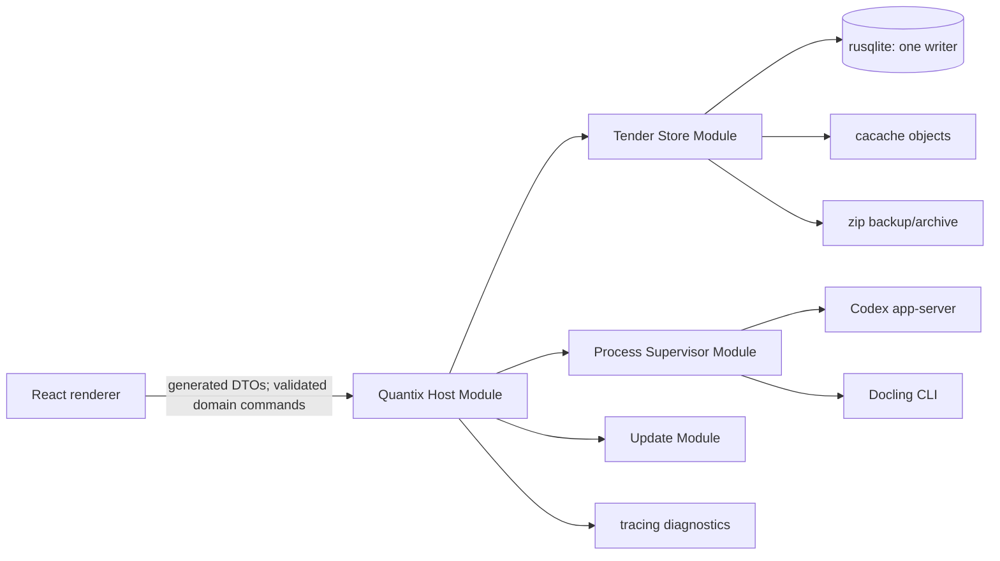

# Smallest mature Rust Host stack for Quantix v0

Status: decision research for GitHub issue #18

Evidence snapshot: 2026-08-06

Current decision: the Engineer User accepted the additional Interface costs identified here and selected this Tauri 2/Rust Host direction on 2026-08-07; see [ADR 0009](../adr/0009-run-one-local-host-over-self-contained-tender-stores.md).

Decision under review: [ADR 0009](../adr/0009-run-one-local-host-over-self-contained-tender-stores.md)

## Answer

A Tauri 2 application with a real Rust Quantix Host can satisfy ADR 0009's
storage, audit, archive, subprocess, recovery, setup, and update requirements
without inventing infrastructure. The current Rust ecosystem has credible,
permissively licensed implementations for every low-level mechanism that the
approved TypeScript Host gets from Node packages.

It does **not**, however, do so with less total Quantix-owned code or lower
Interface cost than the approved Electron/TypeScript Host. Rust removes the
Electron native-module ABI/rebuild problem and gives Quantix direct, compiled
control over SQLite and operating-system process primitives. In exchange it
loses the one-language Host/UI type system, Drizzle's typed relational mapping,
XState's transition grammar, and Execa's single-package process ergonomics. It
also adds generated Rust-to-TypeScript bindings and explicit platform selection
for process groups versus Windows Job Objects. Crash reconciliation, EITL rules,
the filesystem/SQLite commit rule, audit semantics, archive policy, and provider
Adapters remain Quantix code in either architecture.

The result of this ticket is therefore:

- **Feasibility: yes.** There is no missing Rust library that by itself rules out
  a Tauri/Rust Host.
- **Less custom code or fewer Interfaces: no.** On the evidence available before
  the equivalent prototypes, this criterion favors retaining the TypeScript
  Host.
- **Overall desktop decision: still open.** Security, distribution, Codex and
  Docling packaging, and packaged cross-platform prototype evidence belong to
  the sibling research/prototype tickets. This report does not change ADR 0009.

## Method and interpretation of AGENTS.md

The comparison holds the Tender domain, EITL approvals, `~/.quantix`, the
per-Tender source of truth, Codex, Docling, React UI, and the required recovery
semantics fixed. It asks only how much machinery each Host needs to implement
the same behavior.

The dependency evidence uses current official documentation, source repositories,
crates.io release metadata, and CI configurations. Download counts below are
cumulative registry counters, not a quality ranking. They are useful only as an
adoption signal alongside maintenance, license, documentation, and exact fit.

Under the project's [AGENTS.md](../../AGENTS.md), a dependency earns its place
only when it removes more implementation and failure handling than the Interface
it adds. A deep Module hides a substantial mechanism behind a small domain-facing
Interface. A wrapper that merely renames a crate call is not a useful Module.
No compatibility or migration framework is proposed: a v0 build supports one
exact Tender schema and fails closed on any other version.

## Smallest viable Rust stack

If the final decision selects Tauri, use the following stack and pin the complete
Cargo lockfile. Versions and registry counters are the observed releases at the
evidence date, not floating version requirements.

| Concern | Crate/release | Adoption and license evidence | Why it is in the minimum stack |
| --- | --- | --- | --- |
| Desktop Host | [`tauri` 2.11.5](https://crates.io/crates/tauri/2.11.5) | 24.7M downloads; MIT or Apache-2.0 | Rust Host, managed state, commands, packaged desktop lifecycle |
| Single writer | [`tauri-plugin-single-instance` 2.4.3](https://crates.io/crates/tauri-plugin-single-instance/2.4.3) | 5.1M; MIT or Apache-2.0 | Reject a second `~/.quantix` writer and activate the first instance |
| Signed updates | [`tauri-plugin-updater` 2.10.1](https://crates.io/crates/tauri-plugin-updater/2.10.1) | 7.4M; MIT or Apache-2.0 | Signed update download/install primitives behind Quantix's approval gate |
| Async/process I/O | [`tokio` 1.53.1](https://crates.io/crates/tokio/1.53.1) | 857M; MIT | Long-running stdio, cancellation, timers, and bounded tasks |
| Process trees | [`process-wrap` 9.1.0](https://crates.io/crates/process-wrap/9.1.0) | 10.3M; MIT or Apache-2.0 | POSIX process groups/sessions and Windows Job Objects over Tokio |
| SQLite | [`rusqlite` 0.40.1](https://crates.io/crates/rusqlite/0.40.1) | 89.3M; MIT | Current direct SQLite binding with transactions, limits, and online backup |
| Immutable bytes | [`cacache` 13.1.0](https://crates.io/crates/cacache/13.1.0) | 4.1M; Apache-2.0 | Atomic verified content-addressed writes and reads |
| Archive codec | stable [`zip` 8.6.0](https://crates.io/crates/zip/8.6.0) | 232M; MIT | Streaming ZIP/ZIP64, AES-256, and safe-entry inspection |
| Canonical audit JSON | [`serde_json_canonicalizer` 0.3.2](https://crates.io/crates/serde_json_canonicalizer/0.3.2) | 4.3M; MIT | RFC 8785 serialization; avoids a Quantix canonicalizer |
| Hashing | [`sha2` 0.11.0](https://crates.io/crates/sha2/0.11.0) | 815M; MIT or Apache-2.0 | RustCrypto SHA-256 for audit/database/archive digests |
| IPC/external JSON | [`serde` 1.0.229](https://crates.io/crates/serde/1.0.229), [`serde_json` 1.0.151](https://crates.io/crates/serde_json/1.0.151) | More than 1B each; MIT or Apache-2.0 | One owned wire representation and typed decoding with unknown fields denied |
| Rust-to-TS types | [`ts-rs` 12.0.1](https://crates.io/crates/ts-rs/12.0.1) | 11.8M; MIT | Generate checked TypeScript declarations from the Serde DTOs |
| Command validation | [`garde` 0.23.0](https://crates.io/crates/garde/0.23.0) | 3.3M; MIT or Apache-2.0 | Declarative size/range/nesting validation before domain commands |
| External schemas | [`jsonschema` 0.49.6](https://crates.io/crates/jsonschema/0.49.6) | 78.3M; MIT | Compile version-matched, local JSON Schemas for candidate outputs |
| Diagnostics | [`tracing` 0.1.44](https://crates.io/crates/tracing/0.1.44), [`tracing-subscriber` 0.3.23](https://crates.io/crates/tracing-subscriber/0.3.23), [`tracing-appender` 0.2.5](https://crates.io/crates/tracing-appender/0.2.5) | 754M/537M/97.9M; MIT | Structured spans, JSON files, rotation, retention, and flush control |
| Staging | [`tempfile` 3.27.0](https://crates.io/crates/tempfile/3.27.0) | 721M; MIT or Apache-2.0 | Same-parent temporary files/directories and atomic file publication |
| Error implementation | [`thiserror` 2.0.19](https://crates.io/crates/thiserror/2.0.19) | 1.28B; MIT or Apache-2.0 | Typed internal error chains without changing the public Interface |

Use narrow feature sets rather than crate defaults:

- `rusqlite`: `default-features = false`, with `bundled`, `backup`, `cache`,
  and `limits`. Bundling one SQLite build avoids system-version variation and
  Electron-style native ABI rebuilding.
- `cacache`: disable defaults and enable its Tokio runtime (plus `mmap` only if
  the packaged fixtures prove it on every target). Its default async runtime is
  async-std; Quantix should not carry two executors.
- `zip`: pin stable 8.6.0, disable defaults, and enable only `aes-crypto`,
  `deflate-flate2-zlib-rs`, and `time`. ZIP64 is core functionality. Do not ship
  every compression backend before a supported input requires it, and do not
  adopt the 9.0 prerelease.
- `process-wrap`: enable the Tokio frontend and only the process-group/session,
  Job Object, creation-flags, and kill-on-drop wrappers used by the three desktop
  targets.

Do **not** add `directories`, `keyring`, a Tauri SQL plugin, a Tauri shell plugin,
an ORM, or a workflow server in v0. Tauri already exposes the user's home path;
Quantix explicitly requires `~/.quantix` rather than platform application-data
directories. Codex owns its authentication, so Quantix has no v0 secret to put
in a keyring. Renderer-accessible SQL or shell plugins would enlarge the most
security-sensitive Interface.

## Deep Module shape

The Rust implementation should expose one narrow command Interface to the React
renderer. The renderer must not learn SQL, object paths, process commands, audit
ordering, or updater primitives.

The useful external Interfaces are domain-shaped:

- **Quantix Host Module:** execute validated domain commands and return typed
  outcomes; it owns EITL and permission decisions.
- **Tender Store Module:** open/verify a Tender, publish one domain change,
  verify integrity, create/restore a verified backup or archive, and perform
  approved archive/trash/recovery operations.
- **Process Supervisor Module:** start/replace the one Codex process and execute
  one bounded Docling attempt. Codex and Docling Adapters are internal seams,
  because their protocols genuinely differ.
- **Update Module:** check, stage, and install only after the Host supplies a
  proven approval/no-active-run/backup precondition.

`rusqlite`, `cacache`, and `zip` are implementation details inside the Tender
Store Module, not three public repository Interfaces. Tests exercise publication,
verification, backup, restore, and crash outcomes through the same Interface as
the Host. This preserves locality and prevents a shallow pass-through layer for
every crate.

## Mechanism-by-mechanism findings

### SQLite, the one-writer rule, and exact schemas

Choose direct `rusqlite`, not SQLx, SeaORM, Diesel, or the Tauri SQL plugin.
`rusqlite` exposes SQLite's [online backup API](https://docs.rs/rusqlite/latest/rusqlite/backup/index.html)
and configurable [runtime limits](https://docs.rs/rusqlite/latest/rusqlite/limits/index.html)
without an ORM seam. Its CI explicitly covers Windows MSVC/GNU, Ubuntu, and
macOS ([workflow](https://github.com/rusqlite/rusqlite/blob/master/.github/workflows/main.yml)).

Keep each open Tender connection in a Host-owned `Mutex<Connection>` and perform
blocking SQLite work through Tauri's
[`spawn_blocking`](https://docs.rs/tauri/latest/tauri/async_runtime/fn.spawn_blocking.html).
The Tender Store Module, not command handlers, owns that lock and transaction.
Long integrity checks and online backups run as explicit storage operations, not
on a webview/event-loop thread. A poisoned lock is a fail-closed Tender recovery
condition, not something to ignore.

SQLx is mature, but its SQLite connection already introduces a background worker
thread and channel because SQLite is blocking
([`SqliteConnection`](https://docs.rs/sqlx/latest/sqlx/struct.SqliteConnection.html)).
It supplies pools, async transactions, and migrations but no first-class native
online-backup Interface. SeaORM is another layer over that same SQLx pool
([SQLite connector](https://docs.rs/sea-orm/1.1.14/sea_orm/struct.SqlxSqliteConnector.html)).
Diesel provides excellent typed queries but would still need separate low-level
SQLite integration for the required backup path. Those layers solve server/database
portability that a single local SQLite writer does not need.

`tokio-rusqlite` is an attractive dedicated-thread wrapper, but current 0.7.0
depends on `rusqlite` 0.37 and does not forward its backup/bundled features
([crate dependencies](https://crates.io/crates/tokio-rusqlite/0.7.0/dependencies)).
Depending on the older binding again merely to unify features is less direct than
one current `rusqlite` behind the deep Tender Store Module.

Do not add `rusqlite_migration`. Although it is maintained and its migrations are
atomic, its documented purpose is to move through a sequence stored in
`user_version` ([documentation](https://docs.rs/rusqlite_migration/latest/rusqlite_migration/)).
That contradicts the v0 rule: create one exact schema, record its version, and
fail closed if an existing database is newer, older, or otherwise mismatched.

The safe publication order remains unchanged from ADR 0009:

1. finish and verify the content-addressed write;
2. lock the Tender writer and begin one SQLite transaction;
3. register the immutable version, advance its logical pointer, and append the
   Audit Event;
4. commit, then return the domain result.

SQLite cannot atomically commit a filesystem rename. No Rust crate removes this
coordination rule. A crash may leave an unreferenced valid object, but a committed
row must never name unfinished bytes.

### Content-addressed storage

Rust [`cacache`](https://docs.rs/cacache/latest/cacache/) is a genuine reusable
implementation, not a placeholder. It supports hash-addressed operations that
skip its index, large streaming writes committed only on `commit`, verified reads,
atomic writes, deduplication, corruption tolerance, and Windows/case-insensitive
filesystems. Its project CI covers Ubuntu, macOS, and Windows
([workflow](https://github.com/zkat/cacache-rs/blob/main/.github/workflows/ci.yml)).

Configure SHA-256 and use hash-addressed operations. SQLite remains canonical for
digest, size, media type, provenance, and logical version. Do not expose cache
keys, index metadata, clear, or unbounded garbage collection through the Tender
Store Interface. This is functional parity with the approved npm `cacache`, not
a Rust advantage.

### Audit and crash recovery

Use [`serde_json_canonicalizer`](https://docs.rs/serde_json_canonicalizer/latest/serde_json_canonicalizer/)
for RFC 8785 bytes and RustCrypto [`sha2`](https://docs.rs/sha2/latest/sha2/)
for incremental SHA-256. The canonicalizer explicitly warns that RFC 8785 numbers
are IEEE-754 doubles; Quantix audit payloads should encode exact money, identifiers,
and large integers as domain strings or bounded integers, never arbitrary JSON
numbers.

The previous hash, canonical payload, and current hash are inserted with the
domain change in one `rusqlite` transaction. SQLite triggers reject update and
delete. This is the same small Quantix-owned append rule as the TypeScript design;
Rust changes its type checking, not its threat model.

Startup recovery also remains domain code. SQLite rolls back incomplete
transactions; `cacache` prevents partial objects from becoming valid objects;
staging paths are noncanonical. The Host must still reconcile persisted operation
facts, classify interrupted Docling work as failed, resume only a proven exact
Codex turn, quarantine indeterminate provider outcomes, and block a Tender whose
database, audit chain, or registered content fails verification. Neither Tauri
nor a state-machine crate knows those rules.

### Workflow/state-machine options

Do not add a Rust state-machine dependency initially. [`statig`](https://docs.rs/statig/latest/statig/)
is a maintained MIT-licensed hierarchical state-machine crate with sync and async
handlers, entry/exit actions, and about 4.5M registry downloads. It is credible,
but its handlers still contain the event matching and domain guards, and it does
not make SQLite facts plus Audit Events one durable transaction. Persisting an
opaque machine snapshot would recreate the compatibility/replay risks that ADR
0009 intentionally avoids for XState.

For the smallest Rust Host, define typed domain states/events and pure transition
functions adjacent to each domain command. Persist explicit facts in the command
transaction. Add Statig only if a packaged end-to-end slice demonstrates real
hierarchical dispatch that reduces repeated logic; adding it in anticipation
would be speculative. This means the Rust option owns more transition grammar
than the approved TypeScript option, where XState already supplies that mechanism.

### Renderer types and validation

Tauri commands deserialize Serde types, but serialization alone does not enforce
Quantix Safety Limits or keep TypeScript declarations synchronized. Derive
[`garde`](https://github.com/jprochazk/garde) validation on command DTOs, including
length, range, collection, and nested limits, then convert them into domain types.
Use `#[serde(deny_unknown_fields)]` on owned wire DTOs.
Generate TypeScript declarations with [`ts-rs`](https://github.com/Aleph-Alpha/ts-rs)
and fail CI when regeneration changes committed bindings.

Do not adopt `tauri-specta` for v0 while its current Tauri 2 line is still a 2.0
release candidate ([release metadata](https://crates.io/crates/tauri-specta)).
`ts-rs` generates types but not the command implementation: Quantix still owns
one narrow renderer function per domain operation and maps typed Host errors into
stable UI outcomes. Electron can share TypeScript/Zod definitions directly, so
this generated-binding seam is real additional coordination in the Rust option.

For official external JSON, compile an embedded, version-matched schema once with
[`jsonschema`](https://docs.rs/jsonschema/latest/jsonschema/). Do not resolve
network references during a Tender operation. Deserialize a validated candidate
into strict Serde types and apply domain validation before publication. Schema
validation is not permission to write canonical state.

### Subprocess supervision

Tokio provides piped stdin/stdout, cancel-safe waiting, and `kill_on_drop`, but its
own documentation says kill-on-drop is off by default and warns that Unix children
must still be reaped ([Tokio process documentation](https://docs.rs/tokio/latest/tokio/process/struct.Command.html)).
Use [`process-wrap`](https://docs.rs/process-wrap/latest/process_wrap/) rather than
custom Windows APIs or signals: wrap children in a Windows Job Object and a POSIX
process group/session, with kill-on-drop. Its CI tests macOS, Ubuntu, and Windows
([workflow](https://github.com/watchexec/process-wrap/blob/main/.github/workflows/test.yml)).

The two platform branches are small but unavoidable:

- Windows: Job Object, optionally with an explicit no-window creation flag;
- macOS/Linux: a new process group or session.

The Process Supervisor Module must still own bounded JSONL framing, request
correlation, stderr capture/redaction, graceful shutdown timeout, forced group
termination, exit classification, and persisted recovery facts. Job Objects give
strong parent-lifetime behavior on Windows. A POSIX process group improves tree
termination but does not by itself guarantee cleanup after an uncatchable parent
crash, so the packaged macOS/Linux prototypes must prove the chosen orphan
strategy. This is not a reason to invent a daemon in the research phase.

Do not use Tauri's shell plugin from the renderer. Its capability system is useful
for renderer-initiated commands, but Quantix has no reason to expose arbitrary or
allowlisted process launching across IPC. Rust should launch only the bundled
Codex/uv locations and the installed Docling environment from inside the Host.

### Backup and portable archives

`rusqlite`'s backup feature wraps SQLite's official online backup API. Run it into
a same-filesystem staging directory, verify the snapshot, and only then stream
the database, referenced objects, and canonical manifest into stable
[`zip` 8.6.0](https://docs.rs/zip/8.6.0/zip/). That release supports ZIP64,
stream-mode writing, and AES reading/writing; its CI covers Ubuntu, macOS, and
Windows ([workflow](https://github.com/zip-rs/zip2/blob/master/.github/workflows/ci.yaml)).

The codec does not implement Quantix archive policy. Restore must iterate entries,
use [`enclosed_name`](https://docs.rs/zip/latest/zip/read/struct.ZipFile.html)
rather than a raw name, reject symlinks and unsupported methods, enforce entry,
compressed, expanded, ratio, nesting, time, memory, and disk limits, and extract
only into staging. The crate's convenience extraction is explicitly non-atomic;
Quantix must not publish its partial output. Verify every digest, the SQLite
database, event count, and chain head before one same-filesystem rename.

The stable Rust codec now closes an important capability gap with zip.js. Archive
policy and restore verification remain equal custom code on both sides.

### Setup, paths, logs, and updates

Resolve Tauri's native home path and append `.quantix`; create every other path
under it. Do not use `ProjectDirs`, because its documented Windows/macOS/Linux
locations intentionally differ from the product's fixed home-root requirement
([directories behavior](https://github.com/dirs/directories-rs)). The Host must
still validate ownership/permissions, free space, and device-protection status
with platform-specific checks. This work exists in Node too.

Use `tracing` spans and newline-delimited JSON through `tracing-subscriber`.
`tracing-appender` can rotate daily and retain a bounded number of files with
`max_log_files` ([rolling appender](https://docs.rs/tracing-appender/latest/tracing_appender/rolling/struct.Builder.html)).
Keep its `WorkerGuard` for normal/panic flush and choose explicitly between lossy
and backpressure behavior; the default nonblocking writer can drop logs at queue
capacity ([nonblocking writer](https://docs.rs/tracing-appender/latest/tracing_appender/non_blocking/)).
Operational logs remain redacted diagnostics, never the audit source of truth.

The official updater plugin supports Windows, Linux, and macOS and refuses
unsigned updater artifacts: signature verification cannot be disabled
([Tauri updater](https://v2.tauri.app/plugin/updater/)). The Rust Update Module
must call it only after EITL approval, no active Agent Run, and any required
verified backup. The plugin signature is not a replacement for platform installer
signing/notarization. Private updater and platform signing keys belong in release
CI, not `~/.quantix` or the application binary.

## Interface and custom-code comparison

Both candidates can keep the renderer sandboxed and the Host in the desktop main
process. The important comparison is therefore not Rust versus JavaScript syntax;
it is what callers, maintainers, release CI, and recovery code must know.

| Concern | Electron + TypeScript Host | Tauri 2 + Rust Host | Lower total cost |
| --- | --- | --- | --- |
| Renderer seam | Preload IPC; TypeScript/Zod types can be shared directly | Tauri commands plus Serde/Garde and generated `ts-rs` declarations | Electron |
| Workflow grammar | Reuse XState v5; persist explicit SQLite facts | Own typed transition functions; Statig does not remove durable coordination | Electron |
| Typed relational work | Drizzle plus reviewed SQL | Direct `rusqlite` row mapping and reviewed SQL; ORMs obstruct backup or add layers | Electron |
| SQLite distribution | `better-sqlite3` native ABI rebuild/unpack for Electron | One bundled SQLite compiled into the Rust binary | Tauri |
| SQLite backup/limits | Mature binding methods | Mature direct native methods | Equal |
| Immutable content | npm `cacache` | Rust `cacache` | Equal |
| Child process trees | Execa plus any proven tree-lifetime handling | Tokio plus process-wrap and two explicit platform branches | Approximately equal |
| Audit hash chain | Canonicalize + Node crypto + transaction rule | serde canonicalizer + sha2 + the same transaction rule | Equal |
| ZIP64/AES archive | zip.js plus Quantix policy | zip 8.6 plus the same Quantix policy | Equal |
| Structured logs | Pino and its transports/rotation | tracing + subscriber + appender | Electron by dependency/interface count |
| Setup and recovery | Quantix-owned | Quantix-owned | Equal |
| Signed updater primitive | Electron packaging/updater choice | Official Tauri plugin with mandatory signatures | Tauri mechanism; release comparison pending |
| Required release builds | Electron per target/arch and native module | Rust/Tauri per target/arch, bundled native Host | Neither removes target-native CI |

The following implementations are irreducibly Quantix-owned in both designs:

- domain commands, lifecycle rules, EITL gates, permissions, and Safety Limits;
- renderer command allowlist and stable error outcomes;
- relational schema and domain mapping;
- content-write/SQLite-transaction ordering and orphan reconciliation;
- Codex and Docling protocol Adapters;
- audit payload schema, sequence, triggers, and hash rule;
- backup/archive manifest, bounded extraction, verification, and publication;
- startup recovery classification, Recovery Required, and Recovery Quarantine;
- updater preconditions and first-run/device-protection decisions.

Rust therefore improves several implementations but does not delete a Quantix
Module or collapse a seam. By the deletion test, the added Rust-to-TypeScript
binding generation and platform process wrappers are real Interface cost. The
approved TypeScript stack retains greater leverage from one Host/UI language and
its existing focused packages.

## Maintenance and packaging risks to prove

The proposed Rust dependencies are active and permissively licensed, but a few
risks matter more than headline popularity:

- The stack's practical MSRV is at least Rust 1.88 because stable zip 8.6 requires
  it; pin the toolchain in release CI even though Tauri itself supports older Rust.
- Rust `cacache`'s last published stable release is older than most of the stack,
  although its repository has current activity and three-platform CI. Prototype
  its largest files, duplicate ingest, corruption detection, restart, and cleanup
  instead of assuming npm-package parity.
- `zip` is moving quickly and has a 9.0 prerelease. Pin 8.6.0 exactly and exercise
  encrypted ZIP64 interoperability with independent tools on all three targets.
- `process-wrap` states that only its latest stable Rust toolchain is supported
  and MSRV increases need not be major releases
  ([project policy](https://github.com/watchexec/process-wrap)). Pin it and the
  toolchain; test graceful and forced termination, descendants, crashes, and
  installer paths on every platform.
- Direct `rusqlite` means Quantix writes more explicit SQL/row mapping than with
  Drizzle. Fixture tests must open a real on-disk Tender Store and assert only
  through the deep Tender Store Interface.
- Tauri updater signatures, Windows signing, macOS signing/notarization, Linux
  packaging trust, Codex resources, and the uv/Docling environment are distinct
  release artifacts. A successful `cargo build` is not the acceptance test.

## Evidence required from the equivalent prototypes

The Rust prototype should use this minimum stack rather than a Node sidecar or a
mocked persistence path. In addition to the shared prototype contract, it must
prove:

1. a packaged Tauri command crosses `ts-rs`/Serde/Garde without exposing raw
   paths, SQL, or process commands;
2. current bundled `rusqlite` opens one per-Tender writer, enforces PRAGMAs and
   limits, publishes content/audit atomically, injects crashes, and performs a
   verified online backup;
3. Rust `cacache` and stable zip 8.6 handle the same large/duplicate/corrupt and
   encrypted ZIP64 fixtures on Windows, macOS, and Linux;
4. Tokio/process-wrap supervises the real packaged child topology, kills the
   entire tree on normal cancellation and forced replacement, and has an explicit
   outcome for parent crashes on each OS;
5. daily JSON logs rotate/retain without becoming audit state, and crash-near
   diagnostics have a documented flush/loss behavior;
6. an update signed with non-production test keys cannot bypass the Host's EITL,
   active-run, and backup gates.

If those fixtures expose a material reliability or packaging advantage that
outweighs the binding/workflow/SQL cost, the final decision can rationally select
Rust. Without that evidence, this research supplies no AGENTS.md-based reason to
replace the simpler approved TypeScript Host.

## Primary sources

- [Tauri commands and managed state](https://v2.tauri.app/develop/calling-rust/)
- [Tauri updater and mandatory signatures](https://v2.tauri.app/plugin/updater/)
- [Tauri single-instance plugin](https://v2.tauri.app/plugin/single-instance/)
- [Tokio process module](https://docs.rs/tokio/latest/tokio/process/)
- [process-wrap platform wrappers](https://docs.rs/process-wrap/latest/process_wrap/)
- [rusqlite backup](https://docs.rs/rusqlite/latest/rusqlite/backup/index.html)
- [SQLite online backup](https://www.sqlite.org/backup.html)
- [SQLite WAL](https://www.sqlite.org/wal.html)
- [Rust cacache guarantees and APIs](https://docs.rs/cacache/latest/cacache/)
- [zip 8.6 capabilities](https://docs.rs/zip/8.6.0/zip/)
- [RFC 8785](https://www.rfc-editor.org/rfc/rfc8785.html)
- [serde_json_canonicalizer](https://docs.rs/serde_json_canonicalizer/latest/serde_json_canonicalizer/)
- [jsonschema](https://docs.rs/jsonschema/latest/jsonschema/)
- [tracing-appender](https://docs.rs/tracing-appender/latest/tracing_appender/)
- [crates.io first-party release metadata](https://crates.io/)
