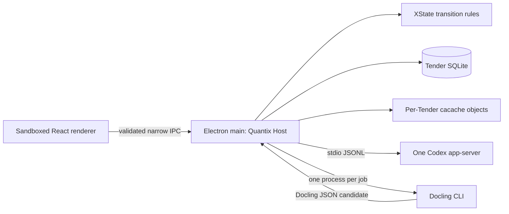

# Quantix v0 runtime, storage, and process landscape

Status: decision research for GitHub issue #13
Evidence snapshot: 2026-08-06

## Decision in one page

Keep the accepted Electron architecture. Tauri is an excellent framework, but it
does not simplify this product: a proper Tauri design would move the trusted Host
into Rust, while Quantix would still need TypeScript/React, a long-running Codex
process, and Python/Docling. Keeping the Host in TypeScript under Tauri would make
Rust a mostly-glue process and add another IPC boundary. Electron lets the
sandboxed renderer and the trusted TypeScript Host live in one application while
Codex and Docling remain isolated children.

Use this stack, pinned to exact versions and upgraded deliberately:

| Concern | Adopt | Boundary |
| --- | --- | --- |
| Desktop runtime | [Electron](https://github.com/electron/electron) with [Electron Forge](https://github.com/electron/forge), Vite, React, TypeScript, and Electron fuses | Sandboxed renderer -> narrow preload IPC -> trusted main-process Quantix Host |
| Workflow | [XState v5](https://github.com/statelyai/xstate) | Transition grammar and guards only; SQLite facts and Audit Events remain canonical |
| Relational store | SQLite through [better-sqlite3](https://github.com/WiseLibs/better-sqlite3) and stable [Drizzle ORM](https://github.com/drizzle-team/drizzle-orm) | One writer in the Quantix Host; one database per Tender |
| Immutable bytes | [cacache](https://github.com/npm/cacache), configured for SHA-256, behind a Tender Blob Store adapter | SQLite stores the returned SRI digest and provenance; `cacache`'s index is not the domain source of truth |
| Child processes | [Execa](https://github.com/sindresorhus/execa), which wraps Node `child_process` | One long-running Codex app-server; one disposable Docling CLI process per parsing job |
| Document parsing | [Docling](https://github.com/docling-project/docling), installed reproducibly with [uv](https://github.com/astral-sh/uv) | Official CLI and lossless Docling JSON; no custom Python daemon or RPC protocol |
| Portable archives | [zip.js](https://github.com/gildas-lormeau/zip.js) | Streaming ZIP/ZIP64 codec behind a Tender Archive adapter |
| Audit hashing | Node core `crypto` plus RFC 8785 [canonicalize](https://github.com/erdtman/canonicalize) | Small Quantix-owned append rule; no custom cryptographic primitive |

Do not add a local HTTP server, a separate Node service, Docker, PM2, Temporal,
an event-store server, IPFS, or a generic provider/plugin runtime to v0.



The main process must stay a deep module: UI code asks for domain operations,
never for raw SQL, raw paths, arbitrary process execution, or arbitrary IPC.
Electron's security guide requires context isolation, renderer sandboxing, narrow
`contextBridge` APIs, and IPC sender validation; exposing `ipcRenderer` wholesale
is explicitly unsafe ([security guide](https://www.electronjs.org/docs/latest/tutorial/security),
[process model](https://www.electronjs.org/docs/latest/tutorial/process-model)).

## Why Electron wins this comparison

Both leading choices are healthy and widely adopted. At the evidence date,
[Electron](https://api.github.com/repos/electron/electron) had about 122,400 stars
and [Tauri](https://api.github.com/repos/tauri-apps/tauri) about 110,000, with
same-day repository activity. Star count does not separate them; fit does.

| Criterion | Electron | Tauri 2 |
| --- | --- | --- |
| Quantix Host | Runs the TypeScript Host directly in Electron main | Either rewrite the Host in Rust or add a Node Host sidecar |
| Codex | Direct long-running stdio child and generated TypeScript schemas | Rust stdio client or a Node sidecar behind Tauri IPC |
| Docling | Direct Python child process | Sidecar plus target-triple packaging and capability configuration |
| UI consistency | Bundled Chromium; larger installer and frequent security updates | Smaller binary using WebView2/WKWebView/WebKitGTK, so platform behavior varies |
| Privilege model | Secure when the renderer is sandboxed and IPC is narrowly exposed | Strong capability/permission system by default |
| Native SQLite | Mature Node binding; Forge handles rebuilds | Excellent Rust libraries, but only beneficial if the Host is Rust |
| v0 complexity | TypeScript + Python + Codex | Rust + TypeScript + Python + Codex, or an extra Node process |

Tauri's own process-model documentation says its privileged core is Rust and its
WebViews are supplied by the operating system; the smaller bundle therefore comes
with platform-WebView differences ([Tauri process model](https://v2.tauri.app/concept/process-model/)).
Its official sidecar mechanism is good, including bidirectional stdin/stdout, but
requires a binary for every target triple and explicit execution capabilities
([sidecars](https://v2.tauri.app/develop/sidecar/)). Those are valuable tradeoffs
when Rust owns meaningful product behavior. They are additional seams here.

Credible alternatives fare worse. [Wails](https://github.com/wailsapp/wails)
(about 35,700 stars) substitutes Go for Rust but creates the same extra-language
problem. [Neutralinojs](https://github.com/neutralinojs/neutralinojs) (about 8,600
stars) is small, but has a much narrower ecosystem and no compensating advantage
for Codex, SQLite, or Python supervision.

### Electron hardening and packaging

Adopt Electron Forge instead of custom build scripts. Electron's official
packaging guide calls Forge its all-in-one packaging and distribution tool, and
Forge automatically rebuilds native modules for Electron
([packaging](https://www.electronjs.org/docs/latest/tutorial/tutorial-packaging),
[native modules](https://www.electronjs.org/docs/latest/tutorial/using-native-node-modules/)).
Apply the same official hardening pattern used by the Goose desktop application:

- `sandbox: true`, `contextIsolation: true`, `nodeIntegration: false`;
- a strict Content Security Policy and no remote content in privileged windows;
- sender validation on every privileged IPC handler;
- an allowlisted preload API with one method per domain operation;
- Forge's native-module unpack plugin;
- Electron fuses disabling RunAsNode, `NODE_OPTIONS`, and CLI inspection, and
  enabling ASAR integrity and app-only-from-ASAR;
- `app.requestSingleInstanceLock()` so exactly one Host writes `~/.quantix`;
- signed Windows installers and a defined Electron security-update cadence.

[Goose](https://github.com/aaif-goose/goose) is useful precedent rather than code
to copy: its [desktop manifest](https://github.com/aaif-goose/goose/blob/main/ui/desktop/package.json)
uses Electron Forge, React, Vite, the native-unpack plugin, and fuses, while its
[Forge configuration](https://github.com/aaif-goose/goose/blob/main/ui/desktop/forge.config.ts)
ships a backend binary as an extra resource.

## Workflow and durable state

Adopt XState v5, pinned to a stable release. Its repository had about 30,000 stars
and current releases at the evidence date. XState can deeply persist and restore
actors, but its own documentation warns that restored actions do not rerun while
invocations restart, and that serialized snapshots can become incompatible with
changed machine logic ([XState persistence](https://stately.ai/docs/persistence)).

Therefore:

- use XState machines to define legal Tender lifecycle states, transitions, and
  guards;
- persist explicit domain state, approval facts, outstanding work, and Audit
  Events in SQLite in the same command transaction;
- reconstruct the actor from those facts after a restart;
- never make an opaque XState actor snapshot the only record of completed work;
- never put an external side effect in an action that can be replayed or restarted
  without an idempotency key.

This uses a mature state-machine engine without turning XState into an accidental
workflow database. [Temporal](https://github.com/temporalio/temporal) is also
popular (about 22,100 stars), but its service, workers, persistence, deployment,
and distributed-failure model solve a problem that a single local Tender Office
does not have. A custom state-machine framework would recreate XState badly.

## Tender Store

The accepted topology should be concrete:

```text
~/.quantix/
  installation.sqlite
  tenders/<tender-id>/
    tender.sqlite
    objects/                 # cacache internal layout
    work/                    # disposable agent workspaces
    tmp/                     # recoverable staging only
  runtime/docling/           # uv-managed Python and environment
  models/docling/            # prefetched model artifacts
  backups/<tender-id>/
  exports/
  logs/
  trash/
```

`installation.sqlite` contains first-run state, non-secret settings, and a
rebuildable Tender catalog. Each Tender directory is self-contained. Codex auth,
configuration, and thread storage remain Codex-owned outside `~/.quantix`; Quantix
stores only provider/thread references and normalized results.

### SQLite layer

Use `better-sqlite3` as the binding. At the evidence date it had about 7,400 stars,
37.5 million npm downloads in the preceding 30 days, a same-day v13.0.3 release,
transactions, WAL support, and an online backup API
([repository](https://github.com/WiseLibs/better-sqlite3),
[API](https://github.com/WiseLibs/better-sqlite3/blob/master/docs/api.md),
[npm usage](https://api.npmjs.org/downloads/point/last-month/better-sqlite3)).
Electron native ABI rebuilds are a real operational risk, so installer CI must
exercise the packaged binary for every supported Windows architecture.

Use stable Drizzle ORM for ordinary typed schema, queries, and migrations. It had
about 35,400 stars and directly supports `better-sqlite3`
([SQLite support](https://github.com/drizzle-team/drizzle-orm/blob/main/drizzle-orm/src/sqlite-core/README.md)).
Pin stable 0.45.x while its 1.0 line and SQLite rewrite remain release candidates;
do not adopt an RC in the durable store. Keep explicit reviewed SQL for SQLite
features that an ORM should not obscure: FTS5, audit immutability triggers,
PRAGMAs, integrity checks, and carefully ordered transaction statements.

Open each Tender with one writer connection in the Host and at least:

- `PRAGMA foreign_keys = ON`;
- WAL mode and an explicit busy timeout;
- a measured synchronous policy appropriate for durable local writes;
- startup `quick_check`, with full `integrity_check` for repair/backup workflows;
- no direct DB access from renderer, Codex, or Docling.

SQLite documents WAL concurrency and its online backup API; use the backup API,
not a filesystem copy of a live database
([WAL](https://www.sqlite.org/wal.html),
[online backup](https://www.sqlite.org/backup.html)). Node's built-in
[`node:sqlite`](https://nodejs.org/download/release/latest-v24.x/docs/api/sqlite.html)
is still Stability 1.2, Release Candidate, so it is not the durable v0 binding.
The former [node-sqlite3](https://github.com/TryGhost/node-sqlite3) repository is
archived.

### Immutable source and artifact bytes

Use `cacache` as the storage implementation behind one narrow Tender Blob Store
adapter. Although its repository has only about 300 stars, it is maintained by
npm/GitHub, recorded about 208 million npm downloads in the preceding 30 days,
and already provides streaming content addressing, SRI verification,
deduplication, corruption detection, race-safe writes, temporary directories,
and garbage collection
([guarantees and API](https://github.com/npm/cacache),
[npm usage](https://api.npmjs.org/downloads/point/last-month/cacache)). This is a
better adoption signal than reimplementing atomic blob writes.

Configure SHA-256 and store the returned SRI digest, byte length, media type,
original path, original name, and source package identity in SQLite. Do not use
the `cacache` key index as canonical metadata and do not expose its delete or GC
operations outside the adapter.

The safe write order is:

1. stream bytes into `cacache` and verify the digest;
2. start one SQLite transaction;
3. insert the immutable Artifact Version, update the current pointer, and append
   the corresponding Audit Event;
4. commit.

A crash between steps 1 and 2 leaves an unreferenced, valid blob that a later
reconciliation pass may remove. A committed database row never points at a blob
that had not finished writing. This small coordination rule is unavoidable
because SQLite cannot atomically commit a filesystem write; it is domain glue,
not a replacement storage engine.

## Process model

### Codex

Run exactly one supervised `codex app-server` for the Quantix application over
local stdio. OpenAI describes app-server as a long-running child process with a
bidirectional stdio channel, thread manager, and stable UI-ready events
([architecture](https://openai.com/index/unlocking-the-codex-harness/)). Its
official protocol is newline-delimited JSON over stdio and can generate
version-exact TypeScript or JSON schemas
([app-server README](https://github.com/openai/codex/blob/main/codex-rs/app-server/README.md)).

Use those generated schemas directly. Do not hand-copy protocol types, enable
experimental methods, open a WebSocket port, or expose raw app-server messages to
the domain/UI. The small custom Codex adapter must only:

- launch and terminate the official binary;
- perform the one-time initialization handshake;
- correlate JSONL requests, responses, notifications, and control requests;
- normalize them into the already-approved Quantix AI Provider Contract;
- record protocol/version mismatch as a fail-closed Provider Failure;
- recover persistent thread references after replacing the process.

Execa is appropriate process plumbing: it has about 7,600 stars, over 600 million
downloads in the preceding 30 days, progressive stdout/stderr iteration, input
streams, Windows handling, cancellation, graceful termination, and child cleanup
([repository](https://github.com/sindresorhus/execa),
[npm usage](https://api.npmjs.org/downloads/point/last-month/execa)). A PM2 daemon
would create a hidden background service and introduces AGPL-licensed machinery;
plain unsupervised shell calls lose lifecycle and cancellation behavior.

### Docling

Do not build a custom resident Python worker. Invoke the official Docling CLI once
per parsing job through the same process adapter. Docling had about 64,300 stars,
an MIT license, current releases, broad document support, and a lossless Docling
JSON representation ([repository](https://github.com/docling-project/docling),
[formats](https://docling-project.github.io/docling/usage/supported_formats/)).
Its CLI already supplies JSON output, document timeouts, thread/device limits,
batch settings, and model-download commands
([CLI reference](https://docling-project.github.io/docling/reference/cli/)).

Use uv, not bespoke virtual-environment scripts. uv had about 88,400 stars and
supports exact synchronization from a cross-platform lockfile. `uv sync` is exact
by default, and `--locked`/`--frozen` prevent surprise resolution changes
([locking and sync](https://docs.astral.sh/uv/concepts/projects/sync/)). Package a
pinned uv binary with the application; on first setup, create the Python/runtime
environment under `~/.quantix/runtime/docling`, then run jobs without re-syncing.
Set uv's environment, cache, and Python-install paths under `~/.quantix`.

Prefetch Docling models into `~/.quantix/models/docling` and always pass that
artifacts path. Docling officially supports this offline model flow
([model prefetching](https://docling-project.github.io/docling/usage/advanced_options/)).
The parser receives a staged immutable source and writes candidate JSON to a
staging directory; it never writes the Tender database or canonical objects.
Quantix validates and registers its result afterward.

This removes a custom Python RPC protocol, daemon health checks, reconnection
logic, and state synchronization. Process startup cost is acceptable beside
model-heavy document conversion and buys clean crash/memory isolation.

## Audit, backup, archive, and deletion

### Audit

No established embedded TypeScript/SQLite audit-log library matches the required
transactional model. The mature alternatives are services or licensed databases:

- [immudb](https://github.com/codenotary/immudb) has about 9,000 stars and strong
  cryptographic proofs, but is a database/service under the Business Source
  License with embedded/competitive-use conditions
  ([license](https://github.com/codenotary/immudb/blob/master/LICENSE));
- [KurrentDB](https://github.com/kurrent-io/KurrentDB) is an event-store server
  under a custom license;
- [Trillian](https://github.com/google/trillian) is an Apache-licensed verifiable
  log, but its normal deployment includes log servers and MySQL rather than an
  embedded desktop library.

The simplest defensible implementation is an append-only `audit_event` table in
the same Tender database transaction as each successful state change. Update and
delete triggers abort writes to that table. Denied and failed attempts use an
audit-only transaction, so they are recorded without changing domain state.

Each row contains a monotonically increasing sequence, previous event hash, event
type, actor, subject, timestamp, canonical payload, result, and current event
hash. Canonicalize the payload with RFC 8785 before SHA-256 hashing; the standard
exists specifically to make JSON hashing repeatable
([RFC 8785](https://www.rfc-editor.org/rfc/rfc8785.html)). Use the Apache-licensed
reference package by an RFC author rather than writing a canonicalizer
([canonicalize](https://github.com/erdtman/canonicalize)).

This is tamper-evident, not tamper-proof: it detects row modification, insertion,
and reordering, but a malicious local administrator controlling every file could
roll back a database and its local head together. Every verified backup/export
therefore records the chain head in its manifest, creating comparison anchors.
Do not add signing keys, a blockchain, or a transparency service unless a later
threat model requires protection from a malicious machine owner.

### Backup and portable archive

Use `better-sqlite3.backup()` to create a consistent database snapshot in a
staging directory while the one-writer rule remains in force. Read the snapshot's
referenced blob digests, then stream the database, blobs, and a canonical manifest
into a ZIP64 archive with zip.js. zip.js is BSD-3-Clause, active, has about 3,900
stars, and directly supports streaming, archives over 4 GB, Zip64, split files,
and incremental writing ([zip.js](https://github.com/gildas-lormeau/zip.js)).

The manifest contains Tender identity, schema version, creation time, source and
artifact digests/sizes, database digest, Audit Event count, and audit-chain head.
Read the completed archive back and verify all hashes before atomically renaming
it into `backups/` or `exports/`. Restore extracts into a fresh staging directory,
rejects absolute/parent/symlink paths and configured size/entry-count limits,
verifies every digest and SQLite integrity, then publishes the Tender directory.
Those validation policies are Quantix domain/security code; the ZIP codec is not.

Archive is a lifecycle state that makes a Tender read-only; it is not deletion.
Keep current records, retained revisions, and the complete audit chain indefinitely
unless the engineer performs an explicit whole-Tender deletion. A safe deletion
closes the database, requires EITL confirmation, atomically moves the directory to
`trash/`, records an installation-level tombstone, and uses a separately confirmed
purge action. Only `tmp/`, disposable workspaces, rotated logs, and unreferenced CAS
objects are eligible for automatic cleanup.

## Exact reuse-versus-custom boundary

### Reuse directly

- Electron runtime, Forge packaging/makers/native rebuild, and Electron fuses;
- XState statecharts/guards/actor execution;
- SQLite, `better-sqlite3` transactions/backup, and stable Drizzle schema/query
  tooling;
- `cacache` streaming writes, digests, integrity checks, deduplication, and safe
  temporary storage;
- Execa subprocess streams, cancellation, termination, and Windows normalization;
- official Codex binary, generated app-server schemas, and Codex-owned auth/thread
  persistence;
- uv's locked Python environment and official Docling CLI/models/schema;
- zip.js compression/decompression/ZIP64 streaming;
- RFC 8785 canonicalization and Node core SHA-256.

### Quantix must own

- domain commands, lifecycle rules, EITL gates, and permission decisions;
- the small validated renderer IPC contract;
- relational domain schema and the mapping between current records, retained
  revisions, evidence, and Audit Events;
- the four-step CAS/SQLite commit coordination and crash reconciliation;
- the thin Codex adapter that maps official protocol messages to the Quantix AI
  Provider Contract;
- the thin Docling adapter that validates candidate Docling JSON;
- audit-event payload schema and previous-hash rule;
- portable Tender manifest, archive path/size policy, retention, and restore
  verification.

These pieces express Quantix's domain invariants. Replacing them with a generic
workflow server, event store, agent framework, or document platform would move
rather than remove the custom behavior and would expose a much larger interface.

## Comparable open-source applications

Current AI desktop applications confirm that both shells work, but also show why
the product's own dependency shape matters:

| Application | Snapshot | Relevant signal |
| --- | --- | --- |
| [Goose](https://github.com/aaif-goose/goose) | about 52,500 stars, Apache-2.0 | Electron Forge/React/Vite with a bundled backend binary and security fuses: close to Quantix's UI-plus-supervised-engine topology |
| [Dyad](https://github.com/dyad-sh/dyad) | about 21,100 stars; mixed Apache/FSL areas | Its [manifest](https://github.com/dyad-sh/dyad/blob/main/package.json) uses Electron Forge, better-sqlite3, Drizzle, and native unpacking: strong component-level precedent, but FSL areas must not be copied |
| [Cherry Studio](https://github.com/CherryHQ/cherry-studio) | about 49,900 stars, AGPL-3.0 | Its [manifest](https://github.com/CherryHQ/cherry-studio/blob/main/package.json) uses Electron, Vite, better-sqlite3, and Drizzle; architectural evidence only, not reusable source under Quantix's likely distribution model |
| [Jan](https://github.com/janhq/jan) | about 43,900 stars, Apache-2.0 | Tauri is justified by Jan's substantial Rust/local-inference, llama.cpp, vector, hardware, and mobile stack; Quantix v0 has none of those needs ([manifest](https://github.com/janhq/jan/blob/main/src-tauri/Cargo.toml)) |
| [Cline](https://github.com/cline/cline) | about 65,800 stars, Apache-2.0 | Strong TypeScript agent precedent, but it is an IDE extension rather than a standalone Tender system of record |

Do not clone an application repository wholesale. Popular applications carry
unrelated product behavior and sometimes reciprocal or source-available licenses.
Reuse their focused permissively licensed dependencies and proven boundary
patterns. That satisfies the requirement to avoid custom infrastructure without
turning Quantix into a fork it cannot safely maintain.

## Risks and controls

| Risk | Control |
| --- | --- |
| Chromium/Electron security cadence | Pin exact versions, track supported Electron releases, code-sign installers, and ship security updates promptly |
| Native `better-sqlite3` ABI | Forge rebuild/unpack support; packaged smoke tests on Windows x64/arm64; upgrade Electron and binding together |
| Drizzle pre-1.0 churn | Pin the stable 0.45 line; review generated SQL; do not take the 1.0 RC/SQLite rewrite until stable and fixture-tested |
| `cacache` is a cache implementation | Hide it behind one adapter, keep SQLite canonical, persist SRI digests, prohibit unmanaged GC, and test logical export/restore |
| Docling/PyTorch size and model variance | uv lock, explicit CPU/GPU policy, prefetched versioned models, time/memory limits, and acceptance fixtures; audit transitive and model licenses before distribution |
| Archive bombs/path traversal | Entry-count, expanded-size, compression-ratio, path, symlink, and nesting limits before extraction; stage and verify before publish |
| Main-process blocking | Keep DB transactions short; parsing and AI are children; add a worker only after measured blocking, not preemptively |
| Local hash-chain limit | State the threat model honestly and anchor chain heads in independently retained verified exports/backups |
| Third-party product licenses | Use only permissive component packages; Cherry/Chatbox/Open WebUI/GitButler and similar repositories are evidence, not source dependencies |
| Codex service entitlement/support | Keep the already-approved provider boundary and resolve commercial/support terms separately; an Apache-licensed client does not grant service entitlement |

## Rejected additions

- **Tauri/Rust, Wails/Go, Neutralino:** no reduction in required engines or domain
  code; add a language/process or lose ecosystem depth.
- **Temporal:** distributed durable-execution service for a local single-writer app.
- **PM2/Forever:** hidden daemon or stale process-manager machinery; Execa plus the
  Electron lifecycle is enough.
- **IPFS/Kubo:** networking, daemon, routing, and repository semantics for a local
  immutable-blob problem.
- **Restic as the Tender Store:** excellent optional future backup adapter, but it
  adds its own repository, locks, encryption keys, prune policy, and CLI; use the
  SQLite backup API and logical Tender archive first.
- **immudb/KurrentDB/Trillian/Rekor:** services and/or restrictive licenses for an
  append-only audit requirement that fits one SQLite transaction and a hash chain.
- **A custom Python parsing service:** the Docling CLI already supplies the needed
  conversion, structured output, timeouts, and model controls.
- **A custom blob store, ZIP codec, process manager, workflow engine, ORM, or JSON
  canonicalizer:** mature focused libraries already cover these mechanisms.

## Implementation gate

Before committing the stack to product code, build one packaged Windows fixture
that proves the risky seams together:

1. launch the signed/packaged Electron app and enforce a second-instance handoff;
2. create a Tender, ingest duplicate and large files through `cacache`, restart,
   and verify hashes;
3. commit a current-record revision and Audit Event atomically, inject crashes at
   each boundary, and reconcile safely;
4. run one real Docling PDF through the uv-managed environment and restore its
   candidate result after app restart;
5. launch one Codex app-server over stdio, resume a persistent thread after forced
   process replacement, and fail closed on schema mismatch;
6. create, verify, restore, and compare a ZIP64 Tender archive;
7. run the same fixture from the packaged installer, not only development mode.

If that fixture passes, the architecture is deep enough for v0. Add another
process, adapter, database, or platform only when a second real implementation or
measured failure creates a genuine seam.
